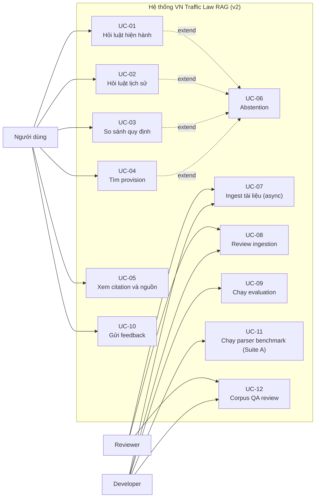

# 02. Phân Tích và Đặc Tả Yêu Cầu

> **Giai đoạn SDLC**: 2 - Phân tích và đặc tả yêu cầu  
> **Ngày tạo**: 16/06/2026  
> **Ngày cập nhật thiết kế**: 19/07/2026 - thiết kế lại v2  
> **Hạn hoàn thành**: 12/09/2026  
> **Ngày bảo vệ**: 14/09/2026  
> **Tài liệu quyết định nguồn**: [00-scope-and-decisions.md](00-scope-and-decisions.md)  
> **Tên đề tài**: Xây dựng hệ thống RAG nhận biết cấu trúc và thời gian hiệu lực để hỗ trợ tra cứu pháp luật giao thông Việt Nam với trích dẫn có thể kiểm chứng  
> **English title**: A Structure-Aware and Temporal RAG System for Vietnamese Traffic Law Question Answering with Verifiable Citations

---

## 2.1. Mục tiêu hệ thống và mục tiêu nghiên cứu

### Mục tiêu hệ thống

Xây dựng hệ thống RAG nhận biết cấu trúc, nhận biết quan hệ tham chiếu và nhận biết thời gian hiệu lực cho tra cứu pháp luật giao thông đường bộ Việt Nam, với các đặc tính:

- định tuyến parser qua **Parser Router**: Docling là parser chính, MinerU là parser phụ và fallback/challenger, quyết định dựa trên đặc tính tài liệu và quality gate;
- biểu diễn tài liệu parser-neutral qua **Canonical Document IR** (`ParsedDocument`, `ParsedPage`, `DocumentElement`), cô lập phân tích pháp lý khỏi định dạng đầu ra của Docling/MinerU;
- trích xuất cấu trúc pháp lý qua **Legal Structure Extractor** của riêng VNLRAG: Chương, Mục, Điều, Khoản, Điểm, Phụ lục, bảng pháp lý, điều khoản chuyển tiếp, hỗ trợ nhãn Điểm tiếng Việt a) b) c) d) đ) e) và short-Point retention;
- mô hình hóa quan hệ tham chiếu chéo cấp provision (`PARENT_OF`, `REFERS_TO`, `SIBLING_OF`, `PENALTY_COMPANION`) và cấp văn bản (`AMENDS`, `REPEALS`, `SUPERSEDES`, `CORRECTS`, `GUIDES`, `RELATED_TO`) trong bảng PostgreSQL;
- mô hình hóa khoảng hiệu lực `[effective_from, effective_to)` và áp dụng đúng phiên bản văn bản tại thời điểm được hỏi;
- retrieval đa tầng: exact legal lookup, dense, sparse BM25, RRF fusion, reranking, mở rộng ngữ cảnh pháp lý theo quan hệ;
- evidence planning và **Evidence Completeness Gate** trước khi sinh câu trả lời, không trả lời nửa vời cho câu hỏi đa bằng chứng;
- sinh câu trả lời có cấu trúc theo schema cấp claim, gắn từng claim với `provision_id` và giá trị số chuẩn hóa;
- verification xác định sáu tầng (schema, citation ID, temporal, numeric grounding, claim support, evidence completeness) với bất biến API **Returned Invalid Citation Rate = 0**;
- verified-or-abstain với failure-aware repair có giới hạn; từ chối trả lời khi thiếu căn cứ;
- background ingestion qua Redis + Dramatiq và lưu trữ đối tượng qua MinIO;
- observability qua Langfuse Cloud (trace, prompt management, experiment), không nằm trên đường tới hạn tính đúng đắn;
- feedback người dùng cuối Useful / Not Useful lưu PostgreSQL và gửi về Langfuse;
- evaluation tái lập được với bốn suite A-D và gold set 200 câu;
- RAGFlow chỉ làm baseline so sánh bên ngoài trong môi trường benchmark riêng.

Hệ thống không tự tìm kiếm Internet để tạo câu trả lời pháp lý. Tài liệu mới chỉ được sử dụng sau khi hoàn tất ingestion, quality gate và review.

> **Ghi chú lịch sử**: thiết kế v1 dựa trên UDEF và traffic-law domain pack (pipeline `PDF -> UDEF -> Docling -> CDM`). Phiên bản v2 loại bỏ hoàn toàn UDEF khỏi mọi pipeline và thay thế bằng Parser Router (Docling/MinerU), Canonical Document IR và Legal Structure Extractor do dự án sở hữu. Mọi yêu cầu trong tài liệu này được viết theo thiết kế v2; chi tiết lý do loại bỏ tại [00-scope-and-decisions.md](00-scope-and-decisions.md).

### Mục tiêu nghiên cứu

1. **Chất lượng parser là mục tiêu evaluation hạng nhất**: đo lường Docling (P1), MinerU (P2) và Parser Router (P3) trên cấu trúc pháp luật Việt Nam, từ đó quyết định routing và quality gate bằng bằng chứng thực nghiệm.
2. **Structure-aware retrieval**: đánh giá ảnh hưởng của trích xuất cấu trúc pháp lý, ranh giới pháp lý trùng ranh giới trích dẫn và parent-context enrichment đối với retrieval.
3. **Cross-reference-aware retrieval**: đánh giá ảnh hưởng của mô hình quan hệ tham chiếu chéo và legal context expansion đối với độ đầy đủ bằng chứng.
4. **Temporal correctness**: đánh giá ảnh hưởng của temporal filtering, amendment boundary và sửa đổi từng phần đối với độ đúng của văn bản được sử dụng.
5. **Evidence completeness**: đánh giá ảnh hưởng của evidence planning và Evidence Completeness Gate đối với mức đầy đủ của câu trả lời đa bằng chứng.
6. **Verification xác định**: đánh giá ảnh hưởng của verification sáu tầng (citation ID, temporal, numeric grounding, claim support, evidence completeness) đối với invalid citation và unsupported claim.
7. **Xây dựng bộ gold set có thể tái sử dụng**: 200 câu đã review, chia 40 development / 40 validation / 120 final test, version hóa và đóng băng trước final evaluation.

### Ranh giới hệ thống

**Trong phạm vi:**

- pháp luật giao thông đường bộ Việt Nam;
- 20 đến 30 văn bản chính thống, có ít nhất 5 chuỗi sửa đổi, thay thế hoặc bãi bỏ;
- current, historical và comparison query;
- Parser Router (Docling chính, MinerU phụ/fallback) với quality gate và parser comparison cho bảng phức tạp;
- Canonical Document IR parser-neutral;
- trích xuất cấu trúc pháp lý và mô hình quan hệ tham chiếu chéo;
- mô hình thời gian hiệu lực và sửa đổi từng phần;
- PostgreSQL 18 làm nguồn chân lý và Qdrant v1.19 làm index retrieval;
- Redis + Dramatiq cho background ingestion;
- MinIO cho object storage;
- LangGraph controlled workflow (không phải autonomous agent);
- verification sáu tầng và verified-or-abstain;
- evaluation bốn suite A-D với gold set 200 câu;
- giao diện web phục vụ demo;
- Langfuse Cloud cho observability;
- RAGFlow làm baseline so sánh bên ngoài trong môi trường benchmark riêng.

**Ngoài phạm vi:**

- tư vấn pháp lý cá nhân hóa có tính kết luận;
- open web search để sinh câu trả lời;
- toàn bộ hệ thống pháp luật Việt Nam; phạm vi đã xác thực là pháp luật giao thông đường bộ Việt Nam trong corpus 20-30 văn bản đã review;
- multi-agent hoặc autonomous agent;
- Neo4j hoặc knowledge graph;
- mobile app;
- voice;
- fine-tuning LLM;
- local LLM;
- microservices và Kubernetes;
- RAGFlow làm nền tảng chính (chỉ là external baseline);
- tóm tắt mọi loại tài liệu.

---

## 2.2. Sơ đồ ngữ cảnh (Context Diagram)

Sơ đồ ngữ cảnh xác định ranh giới giữa hệ thống, người dùng, reviewer, nguồn dữ liệu, hạ tầng nội bộ và provider bên ngoài.

```mermaid
graph TB
    subgraph SYS["HỆ THỐNG RAG PHÁP LUẬT GIAO THÔNG (VNLRAG v2)"]
        VLAW["Structure-Aware and Temporal RAG"]
    end

    USER["Người dùng cuối"]
    REVIEWER["Corpus Reviewer"]
    DEV["Nhà phát triển"]
    OFFICIAL["Nguồn văn bản pháp luật chính thống"]
    GEN["LLM Provider"]
    EMB["Embedding Provider"]
    JUDGE["Judge LLM (chỉ trong evaluation)"]
    LANG["Langfuse Cloud"]
    MINIO["MinIO (Object Storage)"]
    REDIS["Redis + Dramatiq Worker"]

    subgraph BENCH["Môi trường benchmark riêng"]
        RAGF["RAGFlow (baseline so sánh)"]
    end

    USER -->|"Câu hỏi, ngày áp dụng, loại phương tiện"| VLAW
    VLAW -->|"Verified answer hoặc abstention, citation, passage nguồn"| USER

    REVIEWER -->|"Upload PDF + manifest, accept/reject, sửa metadata"| VLAW
    VLAW -->|"Review item và corpus QA report"| REVIEWER

    DEV -->|"Ingest, evaluation, cấu hình, bảo trì"| VLAW
    VLAW -->|"Metrics, logs, experiment report"| DEV

    OFFICIAL -->|"PDF và metadata được tải offline"| VLAW
    VLAW -->|"Structured generation request"| GEN
    GEN -->|"Structured answer"| VLAW
    VLAW -->|"Text embedding request"| EMB
    EMB -->|"Dense vectors"| VLAW
    VLAW -->|"Evaluation judge request (chỉ khi chạy evaluation)"| JUDGE
    JUDGE -->|"Judgement thứ cấp"| VLAW

    VLAW -->|"Trace bất đồng bộ, ngoài đường tới hạn"| LANG
    VLAW -->|"Đọc/ghi PDF nguồn, parser output, artifact"| MINIO
    VLAW -->|"Enqueue job; theo dõi job status"| REDIS

    RAGF -->|"Cùng corpus và eval queries, chỉ số baseline"| DEV
```



### Giải thích sơ đồ

- **Người dùng cuối** chỉ tương tác với corpus đã được chấp nhận; có thể gửi feedback cho câu trả lời.
- **Corpus Reviewer** tham gia review trong ingestion pipeline (accept, reject, sửa metadata), không duyệt từng câu trả lời trong online query.
- **Nhà phát triển** quản lý corpus, evaluation, deployment, regression test và baseline RAGFlow.
- **Nguồn chính thống** cung cấp PDF và metadata cho offline ingestion.
- **LLM Provider** chỉ sinh structured answer từ context được cung cấp.
- **Embedding Provider** tạo dense vector; không chịu trách nhiệm về nội dung pháp lý.
- **Judge LLM** chỉ được gọi trong evaluation cho các metric thứ cấp, không nằm trong online query path.
- **Langfuse Cloud** nhận trace bất đồng bộ; nếu không khả dụng, query vẫn hoạt động.
- **MinIO** lưu PDF nguồn, đầu ra parser, ảnh trang và artifact; PostgreSQL lưu object key.
- **Redis + Dramatiq Worker** thực hiện ingestion phía sau hàng đợi; không parse PDF đồng bộ trong request handler.
- **RAGFlow** chạy trong môi trường benchmark riêng, dùng cùng corpus và cùng bộ câu hỏi evaluation để so sánh baseline; không nằm trong compose production.
- Không có web search actor trong online query path.

---

## 2.3. Xác định Actor (Use Case Analysis)

| ID | Actor | Loại | Mục tiêu |
|---|---|---|---|
| A1 | Người dùng cuối | Primary | Hỏi luật hiện hành, luật lịch sử, so sánh quy định, tìm provision, xem citation và gửi feedback |
| A2 | Corpus Reviewer | Primary | Kiểm tra metadata, hierarchy, provenance, quan hệ, hiệu lực và quyết định index |
| A3 | Nhà phát triển | Secondary | Vận hành ingestion, evaluation, deployment, bảo trì và baseline RAGFlow |
| A4 | Nguồn văn bản pháp luật chính thống | External | Cung cấp PDF, metadata và trạng thái văn bản |
| A5 | LLM Provider | External dependency | Sinh structured answer từ retrieved context |
| A6 | Embedding Provider | External dependency | Sinh dense embedding cho document và query |
| A7 | PostgreSQL | Internal infrastructure | Nguồn chân lý metadata, version, relation, review, audit và feedback |
| A8 | Qdrant | Internal infrastructure | Lưu dense/sparse vector, payload filter và thực hiện RRF retrieval |
| A9 | Redis + Dramatiq Worker | Internal infrastructure | Broker và worker cho background ingestion |
| A10 | MinIO | Internal infrastructure | Object storage cho PDF nguồn, parser output, ảnh trang và artifact |
| A11 | Langfuse Cloud | External dependency | Observability, prompt management, trace, feedback (ngoài đường tới hạn) |
| A12 | RAGFlow | External baseline | Môi trường benchmark riêng để so sánh baseline |

### Phân quyền

| Chức năng | Người dùng | Reviewer | Developer |
|---|---|---:|---:|---:|
| Hỏi đáp và tìm kiếm | Có | Có | Có |
| Xem citation và passage nguồn | Có | Có | Có |
| Gửi feedback cho câu trả lời | Có | Có | Không bắt buộc |
| Upload tài liệu | Không | Có | Có |
| Accept hoặc reject ingestion | Không | Có | Có |
| Xem corpus QA report | Không | Có | Có |
| Chạy evaluation (Suite A-D, baseline RAGFlow) | Không | Không | Có |
| Thay model hoặc retrieval config | Không | Không | Có |
| Quản lý prompt version (Langfuse) | Không | Không | Có |
| Xem trace và feedback | Không | Không | Có |
| Xem audit log kỹ thuật | Không | Có giới hạn | Có |

---

## 2.4. Yêu cầu chức năng (Functional Requirements)

> Mỗi yêu cầu phải có input, output và tiêu chí kiểm chứng.  
> P0 là phạm vi bắt buộc. P1 chỉ được triển khai sau khi P0 ổn định.  
> Tên model cụ thể không được hardcode trong yêu cầu chức năng; model ID nằm trong cấu hình.

### FR-01: Parser Router (Docling | MinerU)

| Thuộc tính | Mô tả |
|---|---|
| Mô tả | Quyết định parser cho từng tài liệu dựa trên đặc tính tài liệu và quality gate: PDF searchable có text layer và layout chuẩn dùng Docling trước; tài liệu scan hoặc layout lỗi dùng Docling trước, nếu quality gate không đạt thì chuyển MinerU; bảng phức tạp so sánh đầu ra hai parser khi cần |
| Input | PDF, manifest, đặc tính tài liệu (text layer, layout, born-digital hay scan) |
| Output | Quyết định routing, đầu ra parser kèm `source_parser`, `parser_version`, kết quả quality gate |
| Tiêu chí kiểm chứng | Quy tắc routing chạy đúng trên ma trận fixture với quyết định mong đợi: `PDF searchable -> Docling`; `PDF scan -> Docling -> quality gate fail -> MinerU`; `bảng phức tạp -> so sánh đầu ra hai parser`; quality gate kích hoạt fallback parser khi cần; không khẳng định parser nào vượt trội tuyệt đối; quyết định và parser version được ghi vào Document IR |
| Use Case | UC-07, UC-11 |
| Priority | P0 |
### FR-02: Canonical Document IR parser-neutral

| Thuộc tính | Mô tả |
|---|---|
| Mô tả | Chuyển đầu ra Docling/MinerU sang biểu diễn trung gian do dự án sở hữu: `ParsedDocument` chứa `ParsedPage[]`, mỗi trang chứa `DocumentElement[]`; cô lập việc phân tích pháp lý khỏi định dạng đầu ra của từng parser |
| Input | Đầu ra parser (DoclingDocument hoặc output MinerU) |
| Output | `ParsedDocument` với `DocumentElement` đầy đủ field |
| Tiêu chí kiểm chứng | Legal Structure Extractor chỉ đọc IR, không đọc định dạng parser; thêm adapter cho parser mới không làm thay đổi extractor; mọi element có `element_id`, `element_type`, `text`, `page_number`, `bbox`, `reading_order`, `parent_element_id`, `table_html` (khi có), `source_parser`, `parser_version`, `parser_confidence`, `raw_reference` |
| Use Case | UC-07, UC-11 |
| Priority | P0 |
### FR-03: Legal Structure Extractor

| Thuộc tính | Mô tả |
|---|---|
| Mô tả | Nhận diện cấu trúc pháp luật Việt Nam từ Canonical Document IR: Chương, Mục, Điều, Khoản, Điểm, Phụ lục, bảng pháp lý, điều khoản chuyển tiếp, tiêu đề, đánh số văn bản và biến thể do OCR; bắt buộc hỗ trợ nhãn Điểm a) b) c) d) đ) e) và short-Point retention |
| Input | `ParsedDocument` |
| Output | `LegalProvision` với toàn bộ field: `provision_id`, `document_version_id`, `chapter`, `section`, `article`, `clause`, `point`, `heading`, `source_text`, `retrieval_text`, `parent_context`, `effective_from`, `effective_to`, `status`, `page_number`, `bbox`, `source_element_ids`, `content_hash`, `version`, `review_status` |
| Tiêu chí kiểm chứng | Fixture Luật, Nghị định, Thông tư nhận diện đúng phân cấp; nhãn `đ)` và `d)` không bị lẫn; Điểm ngắn hợp lệ không bị loại bỏ; `source_text` giữ nguyên văn bản gốc; `provision_id` ổn định theo quy tắc `{loai-van-ban}-{so}-{nam}__dieu-{n}__khoan-{n}__diem-{chu-cai}` (ví dụ `nd-168-2024__dieu-7__khoan-4__diem-b`); fixture xác minh stable-ID phân biệt `diem-d` (Điểm d)) và `diem-đ` (Điểm đ)): ký tự tiếng Việt `đ` được giữ nguyên trong ID, không va chạm với `d` |
| Use Case | UC-07, UC-11, UC-12 |
| Priority | P0 |
### FR-04: Parent-context enrichment

| Thuộc tính | Mô tả |
|---|---|
| Mô tả | Bổ sung ngữ cảnh cha vào `retrieval_text` của Điểm/Khoản khi phục vụ retrieval (câu mở đầu của Khoản, tiêu đề Điều); `source_text` không bao giờ bị biến đổi |
| Input | `LegalProvision` sau Legal Structure Extractor |
| Output | `retrieval_text` kế thừa `parent_context`; `source_text` nguyên vẹn |
| Tiêu chí kiểm chứng | Trích dẫn vẫn trỏ tới provision thực tế (Điểm); hash `source_text` không đổi sau enrichment; parent-context coverage được đo trong corpus QA |
| Use Case | UC-07, UC-11 |
| Priority | P0 |
### FR-05: Legal Reference Resolver (quan hệ tham chiếu chéo)

| Thuộc tính | Mô tả |
|---|---|
| Mô tả | Trích xuất và lưu quan hệ cấp provision (`PARENT_OF`, `REFERS_TO`, `SIBLING_OF`, `PENALTY_COMPANION`) và cấp văn bản (`AMENDS`, `REPEALS`, `SUPERSEDES`, `CORRECTS`, `GUIDES`, `RELATED_TO`) trong bảng PostgreSQL, xử lý bằng application logic |
| Input | `LegalProvision`, manifest, đầu ra trích xuất văn bản |
| Output | Bản ghi `ProvisionReference` và `DocumentRelation`; unresolved reference được ghi nhận |
| Tiêu chí kiểm chứng | Quan hệ trích được khớp fixture với relation ID mong đợi; precision/recall của trích xuất quan hệ được báo cáo trong corpus QA; reference không giải quyết được ghi rõ và định tuyến review, không suy đoán quan hệ; không dùng Neo4j |
| Use Case | UC-07, UC-12 |
| Priority | P0 |
### FR-06: Temporal and Amendment Resolver

| Thuộc tính | Mô tả |
|---|---|
| Mô tả | Xác định khoảng hiệu lực `[effective_from, effective_to)` cho văn bản và provision từ manifest, `LegalEffectEvent` và review; hỗ trợ biên sửa đổi, sửa đổi từng phần, thay thế, bãi bỏ; trường hợp hiệu lực không chắc chắn định tuyến sang review |
| Input | Manifest, `LegalEffectEvent`, quyết định reviewer |
| Output | `effective_from`, `effective_to`, trạng thái hiệu lực, review item khi không chắc chắn |
| Tiêu chí kiểm chứng | Provision hợp lệ cho ngày `d` khi: `effective_from <= d` VÀ (`effective_to IS NULL` HOẶC `d < effective_to`) VÀ `review_status = ACCEPTED`; không có hai phiên bản active chồng lấn ngoài trường hợp được ghi rõ |
| Use Case | UC-01, UC-02, UC-03, UC-07, UC-08 |
| Priority | P0 |
### FR-07: Background ingestion qua hàng đợi

| Thuộc tính | Mô tả |
|---|---|
| Mô tả | Ingest tài liệu qua Redis + Dramatiq; `POST /documents` trả `202 Accepted` kèm `ingestion_job_id`; worker chạy pipeline `parse -> normalize -> legal extract -> reference resolve -> temporal resolve -> quality gates -> review -> embed -> index`; không parse PDF đồng bộ trong request handler |
| Input | PDF, manifest |
| Output | `ingestion_job_id`, trạng thái job, `IngestionRun`, `IngestionArtifact` |
| Tiêu chí kiểm chứng | Upload trả 202 ngay; job status truy vấn được; actor idempotent và chạy lại an toàn khi worker fail; `MAX_INGESTION_WORKERS = 1` |
| Use Case | UC-07 |
| Priority | P0 |
### FR-08: Object storage qua MinIO

| Thuộc tính | Mô tả |
|---|---|
| Mô tả | Lưu PDF nguồn, đầu ra parser, ảnh trang, artifact ingestion/review/evaluation trong MinIO (S3-compatible); PostgreSQL lưu object key và metadata |
| Input | File và artifact cần lưu |
| Output | Object key trong bucket tương ứng |
| Tiêu chí kiểm chứng | Bucket riêng theo loại artifact; round-trip put/get hoạt động; backup bằng replication hoặc `mc mirror`/`mc cp` sang nơi lưu trữ độc lập |
| Use Case | UC-07, UC-08 |
| Priority | P0 |
### FR-09: Review routing trước khi index

| Thuộc tính | Mô tả |
|---|---|
| Mô tả | Phân loại kết quả ingestion thành `accepted`, `needs_review` hoặc `dropped` dựa trên quality gate; chỉ `accepted` được index tự động |
| Input | Quality gate result, extraction report |
| Output | Review item hoặc quyết định index |
| Tiêu chí kiểm chứng | Chỉ `accepted` được index; `needs_review` cần quyết định reviewer; `dropped` không bao giờ được index; mọi quyết định có reviewer identity và timestamp |
| Use Case | UC-08 |
| Priority | P0 |
### FR-10: Corpus QA

| Thuộc tính | Mô tả |
|---|---|
| Mô tả | Báo cáo/dashboard chất lượng corpus với các chỉ số: document count, article count, clause count, point count, Point coverage, short-Point retention, tỷ lệ phát hiện nhãn đ), orphan Point count, orphan Clause count, duplicate provision count, parent-context coverage, provenance coverage, table coverage, unresolved cross-reference count, unknown effective date count, temporal conflict count; structural QA có mục tiêu cho văn bản quan trọng (ví dụ Nghị định 168) |
| Input | Dữ liệu pháp lý trong PostgreSQL, parsed documents |
| Output | Corpus quality report |
| Tiêu chí kiểm chứng | Báo cáo có đủ các chỉ số nêu trên; số liệu là kế hoạch đo lường trong evaluation, không phải kết quả thực nghiệm đã đạt |
| Use Case | UC-12 |
| Priority | P0 |
### FR-11: Query Understanding và evidence planning

| Thuộc tính | Mô tả |
|---|---|
| Mô tả | Phân tích câu hỏi thành `QueryUnderstanding`: intent, effective date, comparison dates, vehicle type, số văn bản, số Điều/Khoản/Điểm, thực thể pháp lý, normalized query và danh sách loại bằng chứng cần thiết (evidence plan) |
| Input | `question`, `query_date?`, `compare_to_date?`, `vehicle_type?` |
| Output | `QueryUnderstanding` gồm intent, dates, refs, normalized query, evidence plan |
| Tiêu chí kiểm chứng | Fixture current, historical, comparison và out-of-scope được route đúng; date parsing không tự bịa ngày trừ khi áp dụng đúng chính sách canonical date (xem bên dưới) và ngày áp dụng luôn được hiển thị trong response; evidence plan liệt kê đúng loại bằng chứng (ví dụ câu hỏi mức phạt + điểm trừ phải có cả `monetary_penalty` và `license_points`) |
| Use Case | UC-01, UC-02, UC-03, UC-04, UC-06 |
| Priority | P0 |

Các intent bắt buộc:

```text
CURRENT
HISTORICAL
COMPARISON
SOURCE_SEARCH
OUT_OF_SCOPE
```

Các loại bằng chứng (evidence types) ví dụ:

```text
violation_definition
monetary_penalty
license_points
license_suspension
exception
procedure
legal_condition
```

Chính sách xử lý ngày lịch sử (canonical date):

- câu hỏi chỉ có năm và không có sự kiện pháp lý nào làm thay đổi hiệu lực trong năm đó: hệ thống có thể áp dụng một ngày chuẩn được ghi rõ trong tài liệu (ví dụ `01/07` của năm đó) và BẮT BUỘC hiển thị ngày đã áp dụng trong response;
- nếu có sự kiện thay đổi hiệu lực xảy ra trong năm: yêu cầu ngày cụ thể hoặc trả ABSTAIN với lý do `MISSING_QUERY_DATE`;
- hệ thống không dùng văn bản hiện hành làm mặc định cho câu hỏi lịch sử.

### FR-12: Query Expansion

| Thuộc tính | Mô tả |
|---|---|
| Mô tả | Mở rộng query cho retrieval: luôn giữ câu hỏi gốc của người dùng; tạo normalized query, multi-query rewrite và conditional HyDE (HyDE chỉ bật khi câu ngắn, khẩu ngữ, ngữ nghĩa yếu hoặc bằng chứng chưa đủ, không bật luôn) |
| Input | Câu hỏi gốc, `QueryUnderstanding` |
| Output | Tập query variants có đánh dấu nguồn (original, normalized, rewrite, hyde) |
| Tiêu chí kiểm chứng | Câu hỏi gốc luôn được retain trong tập query; HyDE chỉ bật có điều kiện; số lượt rewrite có giới hạn, không có vòng lặp vô hạn |
| Use Case | UC-01, UC-02, UC-03, UC-04 |
| Priority | P0 |
### FR-13: Exact legal lookup

| Thuộc tính | Mô tả |
|---|---|
| Mô tả | Tra cứu chính xác theo định danh pháp lý: số hiệu văn bản (`168/2024/NĐ-CP`), `Điều 7`, `Khoản 4`, `Điểm a`. Dense và sparse được hợp nhất bằng RRF; candidate exact lookup được giữ nguyên và kết hợp với tập đã fusion theo chính sách candidate sau fusion rõ ràng (ví dụ exact match được ưu tiên giữ lại, loại trùng lặp theo `provision_id`) |
| Input | `QueryUnderstanding` có document number, article/clause/point refs |
| Output | Candidate provisions khớp định danh |
| Tiêu chí kiểm chứng | Định danh chính xác trả đúng provision tương ứng số văn bản, Điều, Khoản, Điểm; candidate exact được bảo toàn sau fusion và loại trùng lặp theo `provision_id` |
| Use Case | UC-01, UC-02, UC-03, UC-04 |
| Priority | P0 |
### FR-14: Dense + sparse retrieval và RRF fusion

| Thuộc tính | Mô tả |
|---|---|
| Mô tả | Chạy song song dense semantic và sparse BM25 trong Qdrant, hợp nhất bằng Reciprocal Rank Fusion; áp dụng temporal filter theo ngày áp dụng |
| Input | Query variants, temporal filter |
| Output | Candidate provisions có rank, score, method và payload metadata |
| Tiêu chí kiểm chứng | Dense, sparse và RRF chạy độc lập trong thí nghiệm; config tái tạo được từng variant; kết quả từng variant (R1-R10) được lưu và so sánh trên gold set; Recall@5/10/20, MRR@10, nDCG@10 đo được trên gold set |
| Use Case | UC-01, UC-02, UC-03, UC-04 |
| Priority | P0 |
### FR-15: Reranking

| Thuộc tính | Mô tả |
|---|---|
| Mô tả | Rerank candidate từ hybrid retrieval bằng model phụ trước khi mở rộng ngữ cảnh; Jina Reranker v3 là ứng viên chính; reranking là stage chuẩn của pipeline, không phải việc tương lai |
| Input | Candidate list từ RRF fusion, query |
| Output | Candidate list được xếp hạng lại |
| Tiêu chí kiểm chứng | Reranker chạy như stage chuẩn trong pipeline; Suite C (R6) đo tác động tăng thêm của reranker; không khẳng định reranker cải thiện chất lượng trước khi có kết quả benchmark |
| Use Case | UC-01, UC-02, UC-03, UC-04 |
| Priority | P0 |
### FR-16: Legal context expansion theo quan hệ

| Thuộc tính | Mô tả |
|---|---|
| Mô tả | Mở rộng ngữ cảnh quanh seed provision mạnh theo parent, sibling, tham chiếu trực tiếp, penalty companion và quy định liên quan sửa đổi/thay thế; mỗi provision mở rộng ghi lý do vào context |
| Input | Seed provisions, `ProvisionReference`, `DocumentRelation` |
| Output | Context mở rộng kèm metadata `{"provision_id": "...", "added_by": "CROSS_REFERENCE", "source_id": "...", "depth": 1}` |
| Tiêu chí kiểm chứng | Chỉ mở rộng quanh seed mạnh; độ sâu (depth) có giới hạn, tránh mở rộng đồ thị vô hạn; mọi provision mở rộng ghi đúng lý do |
| Use Case | UC-01, UC-02, UC-03 |
| Priority | P0 |
### FR-17: Evidence Completeness Gate

| Thuộc tính | Mô tả |
|---|---|
| Mô tả | Kiểm tra mọi loại bằng chứng trong evidence plan đã được thu thập; nếu `INCOMPLETE` thì chạy targeted retrieval hoặc mở rộng theo quan hệ rồi kiểm tra lại trước khi sinh câu trả lời; không âm thầm trả lời một nửa dễ của câu hỏi đa bằng chứng |
| Input | Evidence plan, context hiện có |
| Output | `evidence_status` = `COMPLETE` hoặc `INCOMPLETE`, kèm hướng bổ sung |
| Tiêu chí kiểm chứng | Câu hỏi yêu cầu mức phạt + điểm trừ mà chỉ tìm được mức phạt bị đánh dấu `INCOMPLETE` và được xử lý bổ sung trước khi gọi generator |
| Use Case | UC-01, UC-02, UC-03, UC-06 |
| Priority | P0 |

---

### FR-18: Hỏi đáp quy định hiện hành

| Thuộc tính | Mô tả |
|---|---|
| Mô tả | Trả lời theo văn bản có hiệu lực tại ngày request hoặc ngày được truyền rõ ràng |
| Input | Câu hỏi và optional `query_date` |
| Output | Verified answer hoặc abstention |
| Tiêu chí kiểm chứng | Không sử dụng provision ngoài khoảng hiệu lực; mọi claim pháp lý có citation hợp lệ |
| Use Case | UC-01 |
| Priority | P0 |
### FR-19: Hỏi đáp quy định tại thời điểm lịch sử

| Thuộc tính | Mô tả |
|---|---|
| Mô tả | Trả lời câu hỏi tại một ngày hoặc giai đoạn lịch sử; chỉ dùng provision hợp lệ tại mốc được hỏi; văn bản bị thay thế vẫn được dùng cho câu hỏi lịch sử |
| Input | Câu hỏi có năm, ngày hoặc `query_date` |
| Output | Answer, ngày áp dụng, citation của phiên bản phù hợp |
| Tiêu chí kiểm chứng | Temporal Validity Accuracy được tính trên gold set lịch sử; không dùng văn bản hiện hành làm mặc định cho câu hỏi có thể là lịch sử |
| Use Case | UC-02 |
| Priority | P0 |
### FR-20: So sánh quy định giữa hai thời điểm

| Thuộc tính | Mô tả |
|---|---|
| Mô tả | Truy xuất hai temporal contexts độc lập và trình bày điểm giống, khác hoặc chưa đủ dữ liệu |
| Input | Câu hỏi và hai mốc thời gian |
| Output | Structured comparison với citation riêng cho từng giai đoạn |
| Tiêu chí kiểm chứng | Mỗi phía của so sánh chỉ cite provision hợp lệ tại thời điểm tương ứng; không gộp citation giữa hai giai đoạn |
| Use Case | UC-03 |
| Priority | P0 |
### FR-21: Tìm kiếm provision

| Thuộc tính | Mô tả |
|---|---|
| Mô tả | Tìm Điều, Khoản, Điểm theo từ khóa, câu tự nhiên hoặc số hiệu; search chạy độc lập, không bắt buộc gọi LLM generator |
| Input | Query, filter ngày, loại văn bản, loại phương tiện |
| Output | Danh sách `LegalProvision` xếp hạng, snippet và provenance |
| Tiêu chí kiểm chứng | API trả top-k kèm `provision_id`, hierarchy, hiệu lực, page và source reference |
| Use Case | UC-04 |
| Priority | P0 |
### FR-22: Sinh câu trả lời có cấu trúc (structured generation)

| Thuộc tính | Mô tả |
|---|---|
| Mô tả | LLM sinh answer theo schema cấp claim; citation hiển thị được dựng từ metadata tin cậy, không phải chuỗi citation do LLM gõ tự do |
| Input | Câu hỏi, `QueryUnderstanding`, context đã kiểm tra tính đầy đủ bằng chứng |
| Output | Structured answer theo Pydantic/JSON schema |
| Tiêu chí kiểm chứng | Model chỉ được tham chiếu provision ID nằm trong context; parse schema fail thì fail rõ ràng hoặc chuyển sang repair |
| Use Case | UC-01, UC-02, UC-03 |
| Priority | P0 |

Schema tối thiểu:

```json
{
  "answer_summary": "string",
  "claims": [
    {
      "claim": "string",
      "claim_type": "MONETARY_PENALTY",
      "provision_ids": ["string"],
      "numbers": ["4.000.000", "6.000.000"]
    }
  ],
  "missing_information": [],
  "should_abstain": false
}
```

> Ví dụ trong schema mang tính minh họa cấu trúc dữ liệu, không phải khẳng định về giá trị thực tế của bất kỳ văn bản nào.

### FR-23: Verification sáu tầng

| Thuộc tính | Mô tả |
|---|---|
| Mô tả | Kiểm tra trước khi trả lời: L1 schema; L2 citation ID (provision tồn tại, đã được retrieve hoặc mở rộng hợp lệ, `review_status = ACCEPTED`, metadata citation có thẩm quyền); L3 temporal validity; L4 numeric grounding (mức phạt, số điểm trừ, ngày, tuổi, thời hạn, số lượng khớp giá trị bằng chứng đã chuẩn hóa); L5 claim support (quy tắc xác định trước, LLM judge độc lập chỉ cho trường hợp ngữ nghĩa); L6 evidence completeness |
| Input | DraftAnswer, `QueryUnderstanding`, context |
| Output | `VerificationResult` và verified response |
| Tiêu chí kiểm chứng | Invalid citation không được trả cho người dùng (Returned Invalid Citation Rate = 0); citation UI dựng từ database; claim số liệu sai bị chặn bởi L4 |
| Use Case | UC-01, UC-02, UC-03, UC-06, UC-09 |
| Priority | P0 |

Tiêu chí kiểm chứng theo từng tầng:

- L1 Schema: output không đúng schema bị fail rõ ràng hoặc được sửa qua đường repair;
- L2 Citation ID: provision không tồn tại, không nằm trong retrieved context hoặc chưa có `review_status = ACCEPTED` đều bị chặn;
- L3 Temporal: provision không hợp lệ tại ngày được hỏi bị loại, dẫn đến repair (truy xuất phiên bản đúng) hoặc abstain;
- L4 Numeric grounding: mức phạt, số điểm trừ, ngày, tuổi, thời hạn, số lượng sai so với bằng chứng đã chuẩn hóa đều bị fail;
- L5 Claim support: quy tắc xác định fail thì claim bị chặn; LLM judge độc lập chỉ được dùng cho các trường hợp ngữ nghĩa;
- L6 Evidence completeness: một loại bằng chứng bắt buộc thiếu trong claim cuối thì fail.

### FR-24: Failure-aware repair và abstention

| Thuộc tính | Mô tả |
|---|---|
| Mô tả | Sửa lỗi theo loại cụ thể: thiếu bằng chứng - targeted retrieval rồi dựng lại context và regenerate; claim không được hỗ trợ - regenerate từ bằng chứng hiện có hoặc targeted retrieval nếu thiếu; schema sai - regenerate structured output; xung đột thời gian - truy xuất phiên bản thời gian đúng. Tất cả nhánh repair cùng tính vào `MAX_REPAIR_ATTEMPTS`, là hằng số cấu hình hữu hạn; sau khi cạn `MAX_REPAIR_ATTEMPTS`: ABSTAIN |
| Input | `VerificationResult` fail, context, `QueryUnderstanding` |
| Output | Verified answer hoặc abstention kèm lý do |
| Tiêu chí kiểm chứng | Mỗi loại lỗi có đường sửa riêng, không chỉ regenerate; `MAX_REPAIR_ATTEMPTS` là config có thể chỉnh, không hardcode, và mọi nhánh repair cùng tính vào giới hạn này; test khẳng định trạng thái kết thúc là ABSTAIN khi cạn `MAX_REPAIR_ATTEMPTS`; không có vòng lặp vô hạn; không có đường nào trả answer kèm citation invalid hoặc cảnh báo "citation chưa verified" |
| Use Case | UC-01, UC-02, UC-03, UC-06 |
| Priority | P0 |

Các lý do abstain chuẩn:

```text
OUT_OF_SCOPE
MISSING_QUERY_DATE
INSUFFICIENT_EVIDENCE
NO_VALID_PROVISION
TEMPORAL_CONFLICT
CITATION_VERIFICATION_FAILED
CORPUS_NOT_COVERED
```

### FR-25: Hiển thị disclaimer và phạm vi áp dụng

| Thuộc tính | Mô tả |
|---|---|
| Mô tả | Hiển thị thông báo giới hạn của hệ thống ở mọi answer và abstention |
| Input | Verified answer hoặc abstention response |
| Output | Disclaimer tách biệt khỏi nội dung pháp lý |
| Tiêu chí kiểm chứng | UI và API luôn có `disclaimer`; test contract fail khi field bị thiếu |
| Use Case | UC-01, UC-02, UC-03, UC-06 |
| Priority | P0 |
### FR-26: Observability qua Langfuse

| Thuộc tính | Mô tả |
|---|---|
| Mô tả | Trace từng giai đoạn pipeline qua Langfuse: `legal_query` với các span `analyze_query`, `normalize_query`, `rewrite_query`, `hyde`, `exact_lookup`, `dense_retrieval`, `sparse_retrieval`, `rrf_fusion`, `reranker`, `reference_expansion`, `evidence_check`, `generate`, `citation_verify`, `numeric_verify`, `claim_verify`; hỗ trợ quản lý prompt và phiên bản prompt, experiment, dataset, LLM-as-judge, annotation và feedback |
| Input | Sự kiện pipeline, prompt version |
| Output | Trace, token usage, cost, latency, prompt version |
| Tiêu chí kiểm chứng | Trace ghi lại được cho query thử nghiệm; Langfuse không nằm trên đường tới hạn tính đúng đắn - nếu không khả dụng, query vẫn hoạt động; bật/tắt qua config |
| Use Case | UC-01, UC-02, UC-03, UC-04, UC-07, UC-09 |
| Priority | P0 |
### FR-27: Feedback người dùng cuối

| Thuộc tính | Mô tả |
|---|---|
| Mô tả | Cho phép người dùng đánh giá câu trả lời Useful / Not Useful kèm danh mục báo cáo: sai trích dẫn, thiếu thông tin, sai ngày hiệu lực, sai mức phạt, câu trả lời không đầy đủ, khác; lưu trong PostgreSQL và gửi điểm số về Langfuse; feedback sau review có thể trở thành ứng viên bổ sung cho gold set |
| Input | Phản hồi của người dùng trên một answer cụ thể |
| Output | Bản ghi `QueryFeedback` gắn với `QueryTrace` |
| Tiêu chí kiểm chứng | Round-trip create/read hoạt động; feedback gắn đúng trace_id; danh mục báo cáo đầy đủ |
| Use Case | UC-10 |
| Priority | P0 |
### FR-28: Đánh giá và ablation (evaluation)

| Thuộc tính | Mô tả |
|---|---|
| Mô tả | Chạy bốn suite thí nghiệm trên gold set 200 câu (40 development / 40 validation / 120 final test). Ma trận thí nghiệm: Suite A parser (P1-P3: Docling, MinerU, Parser Router) với chỉ số Article/Clause/Point P/R/F1, Short Point Recall, Vietnamese đ) Recall, Parent Context Completeness, Table Preservation, Header/Footer Leakage, Provenance Coverage; Suite B embedding (E1-E3: Gemini Embedding 2, Jina Embeddings v5 text-nano, Jina Embeddings v5 text-small) với Recall@10, MRR@10, nDCG@10, latency, cost; Suite C retrieval (R1-R10) với các cấu hình tích lũy; Suite D generation và verification (G1-G7). Mỗi run lưu đầy đủ run metadata để tái lập; run bất biến; final test set không dùng để tuning |
| Input | Gold set version, corpus version, experiment config, model config |
| Output | JSON/CSV report, per-query result, aggregate metrics và cost |
| Tiêu chí kiểm chứng | Mỗi run lưu `run_id`, `git_commit`, corpus version/hash, gold-set version/hash, model IDs, prompt versions, retrieval config, parser version và raw output; điều kiện replay (cùng config, model ID, prompt version, corpus hash) và dung sai được ghi rõ trong evaluation config; có thể tái lập kết quả |
| Use Case | UC-09, UC-11 |
| Priority | P0 |

Gold set gồm 200 câu đã review, chia 40 development / 40 validation / 120 final test, với danh mục câu hỏi:

```text
CURRENT
HISTORICAL
COMPARISON
EXACT_REFERENCE
PENALTY
LICENSE_POINTS
CONDITION
EXCEPTION
PROCEDURE
CROSS_REFERENCE
MULTI_PROVISION
MULTI_DOCUMENT
COLLOQUIAL_QUERY
AMBIGUOUS
MISSING_INFORMATION
OUT_OF_SCOPE
ADVERSARIAL_CITATION
```

Bản ghi gold set phải chứa:

```text
expected_provision_ids
acceptable_provision_ids
required_evidence
must_include_facts
must_not_include_facts
temporal_metadata
review_status
gold_version
hash
```

### FR-29: Lưu lịch sử truy vấn

| Thuộc tính | Mô tả |
|---|---|
| Mô tả | Lưu query, response, citations và trace ID để xem lại |
| Input | Câu hỏi, response, citations và `trace_id` của mỗi query |
| Output | Bản ghi lịch sử truy vấn truy xuất lại được |
| Tiêu chí kiểm chứng | Round-trip create/read hoạt động; retention job xóa record hết hạn |
| Use Case | UC-01, UC-02, UC-03, UC-05 |
| Priority | P1 |
### FR-30: Admin review UI

| Thuộc tính | Mô tả |
|---|---|
| Mô tả | Giao diện xem extraction report, provenance, corpus QA và accept/reject |
| Input | Review item, extraction report và provenance |
| Output | Quyết định accept/reject kèm audit |
| Tiêu chí kiểm chứng | Thao tác accept/reject trong UI ghi đúng audit; chỉ sau accept provision mới được index |
| Use Case | UC-08 |
| Priority | P1 |
| Fallback P0 | Reviewer dùng CLI và JSON report |

### FR-31: Chạy benchmark đối chiếu RAGFlow

| Thuộc tính | Mô tả |
|---|---|
| Mô tả | Chạy benchmark so sánh với RAGFlow làm baseline bên ngoài trong môi trường benchmark riêng; bốn variant bắt buộc: RAGFlow default, RAGFlow + Docling, RAGFlow + MinerU và pipeline VNLRAG custom legal-aware, trên cùng một corpus và cùng bộ câu hỏi evaluation |
| Input | Corpus đã chốt, bộ câu hỏi evaluation, cấu hình variant baseline |
| Output | Bảng so sánh chỉ số giữa các variant baseline và pipeline VNLRAG |
| Tiêu chí kiểm chứng | Cả bốn variant chạy trên cùng corpus và cùng bộ câu hỏi evaluation; chỉ số so sánh tối thiểu gồm Recall@10, citation correctness, temporal leakage và evidence completeness; RAGFlow chạy trong môi trường benchmark riêng, không nằm trong compose production; không ghi kết quả baseline như kết quả thực nghiệm của VNLRAG |
| Use Case | UC-09 |
| Priority | P0 |

### FR-32: Hiển thị answer và citation từ metadata

| Thuộc tính | Mô tả |
|---|---|
| Mô tả | Hiển thị câu trả lời và trích dẫn trong UI: citation được dựng từ metadata đã lưu (không phải chuỗi LLM gõ tự do); passage viewer mở snippet nguồn kèm trang; hiển thị ngày áp dụng; chỉ render nội dung đã verified, không stream draft chưa verify; kèm disclaimer |
| Input | Verified answer, citation metadata, passage source và applied date |
| Output | View answer có citation card, passage viewer, ngày áp dụng và disclaimer |
| Tiêu chí kiểm chứng | Citation luôn dựng từ database metadata; passage viewer mở đúng trang; applied date hiển thị rõ; không hiển thị draft chưa verify; contract test đảm bảo các field hiển thị đầy đủ |
| Use Case | UC-01, UC-02, UC-03, UC-05 |
| Priority | P0 |

> **Ghi chú**: yêu cầu VLM fallback cho PDF scan trong v1 (FR-17 cũ) đã được loại bỏ. Năng lực xử lý tài liệu scan được thay bằng Parser Router (FR-01) với MinerU là parser phụ/fallback, kết hợp quality gate; không còn yêu cầu riêng về VLM.

---

## 2.5. Yêu cầu phi chức năng (Non-Functional Requirements)

### NFR-01: Độ đúng và an toàn thông tin

| Tiêu chí | Yêu cầu |
|---|---|
| Invalid citation returned | Bằng 0 trong test contract (Returned Invalid Citation Rate = 0) |
| Unverified answer | Không được trả |
| Temporal validity | Mọi citation phải hợp lệ tại ngày áp dụng (verifier L3) |
| Numeric mismatch | Claim có số liệu sai so với bằng chứng bị chặn bởi verifier L4 |
| Unsupported claim | Bị chặn bởi verifier L5, sửa lỗi hoặc dẫn đến abstention |
| Web-generated legal answer | Không được phép |
| Disclaimer | Bắt buộc trong mọi response |

### NFR-02: Hiệu năng

Các ngưỡng là mục tiêu kỹ thuật trong môi trường test được mô tả, không phải kết quả thực nghiệm đã đạt.

| Metric | Mục tiêu |
|---|---|
| Retrieval P95 | Không quá 2 giây trên corpus mục tiêu |
| End-to-end P50 | Không quá 12 giây |
| End-to-end P95 | Không quá 20 giây |
| Search API P95 | Không quá 3 giây |
| Ingestion | Không yêu cầu real-time; có tiến trình và timeout rõ ràng |
| Concurrent ingestion workers | `MAX_INGESTION_WORKERS = 1` trong scope khóa luận |
| Background job timeout | Actor Dramatiq phải có time limit tường minh phù hợp với thời lượng mỗi bước ingestion, không dùng giá trị mặc định 10 phút cho bước dài mà không xem xét |

### NFR-03: Khả dụng và khả năng demo

| Tiêu chí | Yêu cầu |
|---|---|
| Local deployment | Toàn bộ hạ tầng dữ liệu (backend, worker, PostgreSQL, Qdrant, Redis, MinIO) chạy bằng Docker Compose |
| Defense mode | Không phụ thuộc VPS |
| Health checks | Backend, PostgreSQL, Qdrant, Redis, MinIO và worker có health endpoint |
| External model failure | Trả lỗi hoặc abstention rõ ràng, không âm thầm đổi model làm thay đổi kết quả ngoài kiểm soát |
| Langfuse unavailable | Query vẫn hoạt động vì Langfuse không nằm trên đường tới hạn |
| Backup demo | Có corpus cache, database backup, Qdrant snapshot, MinIO backup, evaluation report và video backup |

### NFR-04: Bảo mật

| Tiêu chí | Yêu cầu |
|---|---|
| Secret storage | `.env` hoặc secret store, không commit |
| Admin endpoint | Bearer token |
| Input validation | Pydantic cho request và response |
| Upload | MIME, extension, size, filename và hash validation |
| Path traversal | Bị chặn |
| Log | Không ghi API key hoặc nội dung nhạy cảm |
| HTTPS | Bắt buộc khi public deployment |
| Rate limiting | Cấu hình theo deployment, không hardcode theo free-tier quota |
| Prompt injection defense | Nội dung pháp lý được retrieve/upload được xử lý là dữ liệu, không phải instruction; tách biệt khỏi system instructions; output bị giới hạn bởi structured output schema |
| Prompt injection regression | PDF hoặc nội dung chứa chỉ dẫn kiểu "ignore previous instructions" không được làm thay đổi hành vi; verifier từ chối claim không được hỗ trợ |

### NFR-05: Quyền riêng tư

| Tiêu chí | Yêu cầu |
|---|---|
| PII | Không yêu cầu người dùng cung cấp PII |
| Conversation retention | Mặc định 30 ngày nếu bật history (FR-29, P1) |
| Delete job | Có test |
| Provider policy | Ghi rõ dữ liệu nào được gửi đến provider |
| Evaluation data | Không chứa thông tin cá nhân thực |
| Feedback | Không yêu cầu PII trong phản hồi |

Hệ thống không tuyên bố "tuân thủ hoàn toàn" một quy định pháp luật nếu chưa có legal compliance review. Tài liệu chỉ mô tả các biện pháp giảm thiểu dữ liệu cá nhân.

### NFR-06: Khả bảo trì

| Tiêu chí | Yêu cầu |
|---|---|
| Module boundary | Parser, Document IR, extraction, data, retrieval, workflow, verification và evaluation tách biệt |
| Provider abstraction | Đổi provider qua config và adapter |
| Parser version migration | Pin version parser; khi thay parser chỉ cần adapter mới vào Document IR, không viết lại Legal Structure Extractor |
| Database migration | Alembic |
| Embedding migration | Đổi embedding model phải re-embed toàn bộ collection |
| Qdrant rebuild | Qdrant là index dẫn xuất, dựng lại được từ PostgreSQL |
| Code quality | Ruff, type checking và type hints |
| Documentation | ADR, API docs, runbook và experiment docs |

### NFR-07: Khả kiểm thử

| Tiêu chí | Yêu cầu |
|---|---|
| Unit test | Core deterministic modules có coverage mục tiêu tối thiểu 80% |
| Integration test | Ingestion (queue, parser, MinIO), PostgreSQL, Qdrant, Redis và API |
| Contract test | Request/response, citation và abstention |
| Regression test | Retrieval, temporal filter, evidence gate và verifier |
| E2E | Current, historical, comparison, abstention, ingestion review và feedback |
| CI | Lint, type check, unit, integration smoke và regression subset |

Coverage không được dùng thay thế cho test chất lượng. Các invariant pháp lý và citation phải có test riêng.

### NFR-08: Tái lập thí nghiệm

Mỗi evaluation run phải lưu:

```text
run_id
git_commit
corpus_version
corpus_hash
gold_set_version
gold_set_hash
experiment_variant
retrieval_config
parser_versions
document_ir_schema_version
legal_parser_version
relation_extraction_version
embedding_model_id
reranker_model_id
generator_model_id
judge_model_id
prompt_versions
timestamp
token_usage
estimated_cost
raw_results_path
```

Quy tắc:

- run bất biến: raw output được giữ, không chỉnh sửa sau khi chạy;
- final test set đóng băng, không dùng để tuning;
- không chỉnh sửa gold set sau khi xem final test result; thay đổi phải tạo version mới;
- các trường hợp fail vẫn nằm trong error analysis;
- kết quả metric chỉ được ghi nhận sau khi chạy thực nghiệm, không ghi kết quả giả định.

### NFR-09: Chất lượng dữ liệu và provenance

| Tiêu chí | Yêu cầu |
|---|---|
| Indexed provision | Phải thuộc document accepted |
| Provenance | Có page; bounding box khi parser cung cấp; `source_element_ids` truy vết về Document IR |
| File identity | Có SHA-256 |
| Manifest | Bắt buộc cho từng tài liệu |
| Parser source | Mỗi element ghi `source_parser` và `parser_version` |
| Effective interval | Không bỏ trống khi văn bản được dùng cho temporal query |
| Review audit | Có reviewer, timestamp và decision |
| Duplicate | Dựa trên stable ID và content hash |

### NFR-10: Khả sử dụng

| Tiêu chí | Yêu cầu |
|---|---|
| Ngôn ngữ | Tiếng Việt |
| Citation | Hiển thị tên văn bản, Điều, Khoản, Điểm, hiệu lực và page; dựng từ metadata, không phải chuỗi LLM |
| Passage viewer | Mở được snippet nguồn kèm trang |
| Date context | Hiển thị ngày hệ thống đã áp dụng |
| Abstention | Nêu lý do và thông tin còn thiếu |
| Responsive | Dùng được trên desktop và mobile |
| Loading | Hiển thị trạng thái retrieval/generation theo tiến trình, không stream draft chưa verify |

---

## 2.6. Use Case Diagram



---

## 2.7. Use Case chi tiết

### UC-01: Hỏi quy định hiện hành

| Thuộc tính | Mô tả |
|---|---|
| Mã UC | UC-01 |
| Actor chính | Người dùng |
| Tiền điều kiện | Corpus có ít nhất một document accepted |
| Input | Câu hỏi, optional loại phương tiện và `query_date` |
| Hậu điều kiện | Trả verified answer hoặc abstention |

**Luồng chính:**

| Bước | Actor | Hành động |
|---|---|---|
| 1 | User | Gửi câu hỏi |
| 2 | System | Tạo `trace_id`, validate input |
| 3 | System | Query Understanding xác định intent CURRENT, `effective_date` là ngày request, xây evidence plan |
| 4 | System | Temporal Resolution gắn ngày áp dụng |
| 5 | System | Query Expansion tạo variants (luôn giữ câu hỏi gốc) |
| 6 | System | Parallel Multi-Recall: exact legal lookup + dense + sparse; RRF fusion |
| 7 | System | Reranking candidate |
| 8 | System | Legal Context Expansion quanh seed mạnh (parent, sibling, cross-reference, penalty companion) |
| 9 | System | Evidence Completeness Gate kiểm tra evidence plan; nếu `INCOMPLETE` chạy targeted retrieval rồi kiểm tra lại |
| 10 | System | Context Builder dựng context cuối |
| 11 | System | Generator sinh structured answer theo schema cấp claim |
| 12 | System | Verification sáu tầng (L1-L6) |
| 13a | System | Nếu valid, dựng citation từ metadata và trả verified answer |
| 13b | System | Nếu repairable, chạy failure-aware repair theo loại lỗi (bounded) |
| 14 | System | Nếu hết số lần repair, trả abstention kèm lý do |
| 15 | User | Xem answer, ngày áp dụng, citation, source passage; có thể gửi feedback |

### UC-02: Hỏi quy định tại thời điểm lịch sử

| Thuộc tính | Mô tả |
|---|---|
| Mã UC | UC-02 |
| Actor chính | Người dùng |
| Input | Câu hỏi có ngày hoặc năm |
| Hậu điều kiện | Answer chỉ dùng provision hợp lệ tại mốc được hỏi |

**Luồng khác biệt:**

1. Query Understanding trích `effective_date`; intent là HISTORICAL.
2. Temporal Resolution không dùng ngày hiện tại.
3. Retrieval loại văn bản không hợp lệ tại ngày đó; văn bản bị thay thế vẫn có thể được dùng nếu hợp lệ tại mốc hỏi.
4. Verification L3 kiểm tra mọi citation tại ngày hỏi.
5. Response hiển thị rõ: `Áp dụng tại ngày ...`.
6. Nếu chỉ có năm: áp dụng chính sách canonical date - nếu không có sự kiện thay đổi hiệu lực trong năm, dùng ngày chuẩn (ví dụ 01/07) và hiển thị ngày đã áp dụng; nếu có sự kiện thay đổi trong năm, yêu cầu ngày cụ thể hoặc ABSTAIN với lý do `MISSING_QUERY_DATE`. Không dùng văn bản hiện hành làm mặc định.

### UC-03: So sánh quy định

| Thuộc tính | Mô tả |
|---|---|
| Mã UC | UC-03 |
| Actor chính | Người dùng |
| Input | Câu hỏi có hai mốc thời gian |
| Output | Comparison sections và citation riêng cho từng mốc |

**Luồng chính:**

1. Parse hai ngày; intent là COMPARISON.
2. Retrieve context A theo ngày A và context B theo ngày B là hai temporal contexts độc lập.
3. Generate comparison từ hai context tách biệt.
4. Verify citation A và B theo đúng temporal interval của từng mốc.
5. Không gộp citation giữa hai giai đoạn.
6. Nếu sau targeted retrieval và các lần repair có giới hạn một phía vẫn thiếu bằng chứng cần thiết, hệ thống trả ABSTAIN với lý do `INSUFFICIENT_EVIDENCE`; không trả comparison dở dang như thể đã hoàn chỉnh. Phần ghi rõ giới hạn chỉ nằm trong phản hồi abstention.

### UC-04: Tìm provision

| Thuộc tính | Mô tả |
|---|---|
| Mã UC | UC-04 |
| Actor chính | Người dùng |
| Input | Từ khóa, số hiệu, câu tự nhiên và filter |
| Output | Top-k provision cards |
| Không gọi LLM generator | Có, search có thể chạy độc lập |

Mỗi kết quả hiển thị:

```text
provision_id
document_title
document_number
article
clause
point
snippet
effective_from
effective_to
status
page_number
```

### UC-05: Xem citation và passage nguồn

| Thuộc tính | Mô tả |
|---|---|
| Mã UC | UC-05 |
| Actor chính | Người dùng |
| Tiền điều kiện | Có verified answer hoặc search result |
| Output | Citation card và passage source |

Citation được dựng từ database metadata, không phải chuỗi LLM. Passage viewer mở được snippet nguồn kèm trang và provenance. User không nhìn thấy ID nội bộ trừ khi mở chế độ debug.

### UC-06: Abstention

| Thuộc tính | Mô tả |
|---|---|
| Mã UC | UC-06 |
| Actor chính | Người dùng |
| Trigger | Out of scope, thiếu ngày, evidence gate `INCOMPLETE` sau các lần repair, hoặc verification fail không sửa được |
| Output | Lý do từ chối, phạm vi corpus và thông tin cần bổ sung |

Không có nút tìm kiếm web trong giao diện. Mọi abstention có lý do chuẩn (xem FR-24).

### UC-07: Ingest tài liệu

| Thuộc tính | Mô tả |
|---|---|
| Mã UC | UC-07 |
| Actor chính | Reviewer hoặc Developer |
| Input | PDF và manifest |
| Output | Extraction artifacts, job status và review status |
| Auth | Bắt buộc |

**Luồng chính:**

1. Validate file và manifest (MIME, extension, size, filename, hash).
2. Tính SHA-256 và kiểm tra duplicate.
3. `POST /documents` trả `202 Accepted` kèm `ingestion_job_id`; không parse đồng bộ.
4. Worker Dramatiq: Parser Router chọn parser theo đặc tính tài liệu (Docling trước; MinerU nếu quality gate không đạt).
5. Chuyển đầu ra parser sang Canonical Document IR.
6. Legal Structure Extractor nhận diện Chương, Mục, Điều, Khoản, Điểm (bao gồm nhãn đ) và short-Point retention).
7. Legal Context Enricher bổ sung parent context vào `retrieval_text`.
8. Legal Reference Resolver trích `ProvisionReference` và `DocumentRelation`.
9. Temporal and Amendment Resolver xác định khoảng hiệu lực.
10. Quality gates; route `accepted`, `needs_review` hoặc `dropped`.
11. Embed và index provision được chấp nhận vào Qdrant.
12. Job status theo dõi được qua API.

### UC-08: Review ingestion

| Thuộc tính | Mô tả |
|---|---|
| Mã UC | UC-08 |
| Actor chính | Corpus Reviewer hoặc Developer |
| Input | Review item, PDF, extracted values, quality gate result và provenance |
| Output | Accept, reject hoặc request correction |

Mọi quyết định phải có reviewer identity và timestamp. Chỉ sau khi accept, provision mới được index.

### UC-09: Chạy evaluation

| Thuộc tính | Mô tả |
|---|---|
| Mã UC | UC-09 |
| Actor chính | Developer |
| Input | Gold set version, corpus version và experiment config (suite A-D, variant) |
| Output | Metrics, per-query report, cost và raw output |
| Auth | Bắt buộc |

Evaluation không thay đổi production corpus và không ghi đè gold set. Mỗi run bất biến và lưu đầy đủ run metadata (NFR-08).

### UC-10: Gửi feedback

| Thuộc tính | Mô tả |
|---|---|
| Mã UC | UC-10 |
| Actor chính | Người dùng |
| Input | Đánh giá Useful / Not Useful và danh mục báo cáo |
| Output | Bản ghi `QueryFeedback` |
| Auth | Không bắt buộc |

**Luồng chính:**

1. User chọn Useful hoặc Not Useful trên một answer.
2. Nếu Not Useful, user chọn danh mục: sai trích dẫn, thiếu thông tin, sai ngày hiệu lực, sai mức phạt, câu trả lời không đầy đủ, khác.
3. Hệ thống lưu `QueryFeedback` trong PostgreSQL, gắn với `trace_id`.
4. Hệ thống gửi điểm số feedback về Langfuse.
5. Feedback sau review có thể trở thành ứng viên bổ sung cho gold set.

### UC-11: Chạy parser benchmark (Suite A)

| Thuộc tính | Mô tả |
|---|---|
| Mã UC | UC-11 |
| Actor chính | Developer |
| Input | Fixture tài liệu theo loại văn bản (Luật, Nghị định, Thông tư) và cấu trúc gold annotation |
| Output | Chỉ số Article/Clause/Point P/R/F1, Short Point Recall, Vietnamese đ) Recall, Parent Context Completeness, Table Preservation, Header/Footer Leakage, Provenance Coverage |

**Luồng chính:**

1. Chạy P1 (Docling) trên fixture.
2. Chạy P2 (MinerU) trên cùng fixture.
3. Chạy P3 (Parser Router) trên cùng fixture.
4. Tính chỉ số so sánh theo gold annotation.
5. Ghi kết quả vào evaluation report; quyết định routing dựa trên bằng chứng, không khẳng định parser nào vượt trội tuyệt đối trước thực nghiệm.

### UC-12: Corpus QA review

| Thuộc tính | Mô tả |
|---|---|
| Mã UC | UC-12 |
| Actor chính | Corpus Reviewer hoặc Developer |
| Input | Corpus quality report (16 chỉ số, FR-10) |
| Output | Quyết định sửa metadata, gửi review hoặc chấp nhận |

**Luồng chính:**

1. Tạo/xem corpus QA report từ dữ liệu PostgreSQL.
2. Rà soát các chỉ số: orphan Point/Clause, duplicate provision, unresolved cross-reference, unknown effective date, temporal conflict.
3. Với văn bản quan trọng (ví dụ Nghị định 168), thực hiện structural QA có mục tiêu.
4. Các bất thường được sửa hoặc chuyển thành review item.
5. Số liệu là kế hoạch đo lường, không phải kết quả thực nghiệm đã đạt.

---

## 2.8. Kịch bản (Scenario) chi tiết

### Kịch bản 1: Câu hỏi hiện hành có đủ dữ liệu

> **Câu hỏi**: "Hiện nay xe máy vượt đèn đỏ bị xử lý như thế nào?"

**Kỳ vọng:**

1. Intent là CURRENT; ngày áp dụng là ngày request.
2. Vehicle type được xác định là xe máy.
3. Evidence plan liệt kê đủ loại bằng chứng cần thiết.
4. Temporal filter chỉ giữ provision hợp lệ tại ngày áp dụng.
5. Hệ thống retrieve provision đúng theo gold set qua exact lookup, dense, sparse và RRF.
6. Evidence Completeness Gate pass trước khi generate.
7. Generator trả claims có `provision_id` và `numbers`.
8. Verification L1-L6 pass; citation dựng từ metadata.
9. UI hiển thị answer, citation, hiệu lực và source passage.
10. Không có thông tin ngoài retrieved context.

### Kịch bản 2: Câu hỏi lịch sử

> **Câu hỏi**: "Năm 2023 xe máy vượt đèn đỏ bị xử lý như thế nào?"

**Kỳ vọng:**

1. Intent là HISTORICAL. Nếu không có sự kiện thay đổi hiệu lực trong năm 2023, hệ thống áp dụng canonical date (ví dụ 01/07/2023) và hiển thị rõ ngày đã áp dụng; nếu có sự kiện thay đổi trong năm, yêu cầu ngày cụ thể hoặc trả ABSTAIN với lý do `MISSING_QUERY_DATE`.
2. Không sử dụng văn bản chỉ có hiệu lực sau mốc hỏi.
3. Văn bản bị thay thế vẫn được dùng nếu hợp lệ tại mốc hỏi (quan hệ `SUPERSEDES` không xóa provision khỏi temporal view).
4. Verification L3 kiểm tra mọi citation tại ngày hỏi.
5. Response hiển thị ngày áp dụng.
6. Nếu có sự thay đổi pháp luật xảy ra giữa năm, hệ thống yêu cầu ngày cụ thể hoặc trả ABSTAIN với lý do `MISSING_QUERY_DATE`; nếu không có sự thay đổi, áp dụng canonical date và hiển thị rõ trong response.

### Kịch bản 3: So sánh hai giai đoạn

> **Câu hỏi**: "Quy định về hành vi này trước và sau ngày 01/01/2025 khác nhau thế nào?"

**Kỳ vọng:**

1. Intent là COMPARISON.
2. Tạo hai temporal contexts độc lập trước mốc và từ mốc trở đi.
3. Mỗi phần có citation riêng theo đúng khoảng hiệu lực.
4. Nếu sau targeted retrieval và repair có giới hạn một phía vẫn thiếu bằng chứng cần thiết, hệ thống trả ABSTAIN với lý do `INSUFFICIENT_EVIDENCE`; không trả comparison không đầy đủ như thể hoàn chỉnh.
5. `DocumentRelation` (`SUPERSEDES`, `AMENDS`) giúp xác định đúng phiên bản tại mỗi mốc; nếu không có quan hệ đáng tin cậy, hệ thống ghi rõ giới hạn trong phản hồi abstention.

### Kịch bản 4: Câu hỏi ngoài corpus

> **Câu hỏi**: "Luật giao thông của Nhật Bản quy định vấn đề này thế nào?"

**Kỳ vọng:**

1. Intent là OUT_OF_SCOPE.
2. Không gọi web search.
3. Không tạo answer pháp lý.
4. Trả abstention với phạm vi corpus là pháp luật giao thông đường bộ Việt Nam.

### Kịch bản 5: Citation do model tạo không hợp lệ

**Điều kiện giả lập:** generator trả một `provision_id` không nằm trong retrieved context.

**Kỳ vọng:**

1. Verifier L2 đánh dấu `CITATION_NOT_IN_CONTEXT`.
2. Draft không được trả ra UI.
3. Repair: regenerate với whitelist context rõ hơn.
4. Nếu vẫn lỗi, trả `CITATION_VERIFICATION_FAILED`.
5. Invalid citation rate ở API output bằng 0.

### Kịch bản 6: Câu hỏi đa bằng chứng vượt qua Evidence Completeness Gate

> **Câu hỏi**: "Xe máy vượt đèn đỏ bị phạt bao nhiêu và bị trừ bao nhiêu điểm giấy phép?"

**Điều kiện giả lập:** retrieval đầu tiên chỉ tìm thấy provision về mức phạt tiền.

**Kỳ vọng:**

1. Evidence plan yêu cầu cả `monetary_penalty` và `license_points`.
2. Evidence Completeness Gate đánh dấu `INCOMPLETE`, không gọi generator.
3. Targeted retrieval hoặc mở rộng theo quan hệ (`PENALTY_COMPANION`) lấy provision về điểm trừ.
4. Gate kiểm tra lại: `COMPLETE`.
5. Generate answer bao phủ cả hai loại bằng chứng.
6. Verification pass; hệ thống không bao giờ trả lời chỉ một nửa dễ của câu hỏi.

### Kịch bản 7: Numeric grounding fail bị chặn

**Điều kiện giả lập:** generator sinh số tiền phạt không khớp giá trị trong bằng chứng.

**Kỳ vọng:**

1. Verifier L4 phát hiện mismatch giữa `numbers` trong claim và giá trị bằng chứng đã chuẩn hóa.
2. Draft bị chặn, không trả ra UI.
3. Repair: regenerate từ bằng chứng hiện có với ràng buộc số liệu.
4. Nếu vẫn fail, trả abstention; không trả claim số liệu sai kèm citation.
5. Numeric Grounding Accuracy được đo trong Suite D.

### Kịch bản 8: Scan PDF được định tuyến qua Parser Router

**Điều kiện giả lập:** tài liệu scan, không có text layer.

**Kỳ vọng:**

1. Parser Router chạy Docling trước (OCR backend CPU).
2. Quality gate phát hiện: mất cấu trúc, OCR kém hoặc provenance thiếu.
3. Router chuyển MinerU pipeline backend.
4. Chạy lại pipeline; quality gate đạt.
5. Kết quả vẫn được route qua review (`needs_review`) nếu còn chưa chắc chắn.
6. `source_parser` và `parser_version` được ghi vào Document IR.
7. Suite A ghi nhận kết quả so sánh hai parser; không khẳng định parser nào vượt trội tuyệt đối.

### Kịch bản 9: Feedback flow

1. User nhận verified answer.
2. User chọn Not Useful và danh mục "sai mức phạt".
3. Hệ thống lưu `QueryFeedback` trong PostgreSQL, gắn `trace_id`.
4. Điểm số feedback được gửi về Langfuse.
5. Sau review, feedback có thể trở thành ứng viên bổ sung cho gold set.

---

## 2.9. Bảng yêu cầu tổng hợp

### P0 - Bắt buộc trong khóa luận

| ID | Yêu cầu | Use Case | Tiêu chí kiểm chứng chính |
|---|---|---|---|
| FR-01 | Parser Router (Docling/MinerU) | UC-07, UC-11 | Routing theo đặc tính tài liệu; quality gate kích hoạt fallback |
| FR-02 | Canonical Document IR | UC-07, UC-11 | Legal extractor chỉ đọc IR; parser-neutral |
| FR-03 | Legal Structure Extractor | UC-07, UC-11, UC-12 | Hierarchy đúng; nhãn đ) d); short-Point retention |
| FR-04 | Parent-context enrichment | UC-07, UC-11 | `source_text` không đổi; citation trỏ đúng Điểm |
| FR-05 | Legal Reference Resolver | UC-07, UC-12 | Quan hệ provision + văn bản trong PostgreSQL |
| FR-06 | Temporal and Amendment Resolver | UC-01, UC-02, UC-03, UC-07, UC-08 | Điều kiện hiệu lực đúng; không chắc chắn thì review |
| FR-07 | Background ingestion | UC-07 | 202 + `ingestion_job_id`; không parse đồng bộ |
| FR-08 | Object storage (MinIO) | UC-07, UC-08 | Bucket riêng theo loại artifact; backup độc lập |
| FR-09 | Review routing | UC-08 | Chỉ `accepted` được index |
| FR-10 | Corpus QA | UC-12 | Đủ 16 chỉ số; structural QA cho văn bản quan trọng |
| FR-11 | Query Understanding và evidence planning | UC-01, UC-02, UC-03, UC-04, UC-06 | Route intent đúng; evidence plan đúng loại bằng chứng |
| FR-12 | Query Expansion | UC-01, UC-02, UC-03, UC-04 | Giữ câu gốc; HyDE có điều kiện; rewrite có giới hạn |
| FR-13 | Exact legal lookup | UC-01, UC-02, UC-03, UC-04 | Định danh chính xác trả đúng provision |
| FR-14 | Dense + sparse + RRF | UC-01, UC-02, UC-03, UC-04 | Các variant tái lập được |
| FR-15 | Reranking | UC-01, UC-02, UC-03, UC-04 | Stage chuẩn; chưa khẳng định cải thiện trước benchmark |
| FR-16 | Legal context expansion | UC-01, UC-02, UC-03 | `added_by`, depth có giới hạn |
| FR-17 | Evidence Completeness Gate | UC-01, UC-02, UC-03, UC-06 | `INCOMPLETE` chặn generate, chạy targeted retrieval |
| FR-18 | Current law QA | UC-01 | Chỉ dùng provision đang hiệu lực |
| FR-19 | Historical law QA | UC-02 | Chỉ dùng provision hợp lệ tại ngày hỏi |
| FR-20 | Comparison QA | UC-03 | Citation riêng theo từng thời điểm |
| FR-21 | Provision search | UC-04 | Top-k có hierarchy và provenance |
| FR-22 | Structured generation | UC-01, UC-02, UC-03 | Output đúng schema cấp claim |
| FR-23 | Verification sáu tầng | UC-01, UC-02, UC-03, UC-06, UC-09 | Returned Invalid Citation Rate = 0 |
| FR-24 | Failure-aware repair + abstention | UC-01, UC-02, UC-03, UC-06 | Bounded repair qua `MAX_REPAIR_ATTEMPTS`; không vòng lặp vô hạn |
| FR-25 | Disclaimer | UC-01, UC-02, UC-03, UC-06 | Có trong mọi response |
| FR-26 | Observability (Langfuse) | UC-01, UC-02, UC-03, UC-04, UC-07, UC-09 | Trace đầy đủ; query vẫn chạy khi Langfuse không khả dụng |
| FR-27 | Feedback | UC-10 | Lưu PostgreSQL; gửi về Langfuse |
| FR-28 | Evaluation (Suite A-D + gold set) | UC-09, UC-11 | Gold set 200 câu, danh mục và bản ghi đầy đủ; run metadata; run bất biến; replay condition |
| FR-31 | Benchmark đối chiếu RAGFlow | UC-09 | Bốn variant baseline trên cùng corpus và eval queries; Recall@10, citation correctness, temporal leakage, evidence completeness |
| FR-32 | Hiển thị answer và citation từ metadata | UC-01, UC-02, UC-03, UC-05 | Citation dựng từ metadata; không stream draft chưa verify |

### P1 - Chỉ làm khi P0 ổn định

| ID | Yêu cầu | Điều kiện |
|---|---|---|
| FR-29 | Conversation history | P0 workflow ổn định |
| FR-30 | Admin review UI | CLI review đã hoạt động |

### Ngoài phạm vi

| Yêu cầu | Lý do |
|---|---|
| Web fallback cho câu trả lời | Không kiểm soát nguồn và hiệu lực |
| Autonomous agent hoặc multi-agent | LangGraph là controlled workflow, không cần agent |
| Knowledge graph hoặc Neo4j | Quan hệ được lưu bằng bảng PostgreSQL |
| RAGFlow làm nền tảng chính | Chỉ là baseline so sánh bên ngoài |
| Tóm tắt mọi loại tài liệu | Làm loãng domain |
| Toàn bộ pháp luật Việt Nam | Phạm vi xác thực là pháp luật giao thông đường bộ Việt Nam, giới hạn trong corpus 20-30 văn bản đã review |
| Fine-tuning | Chi phí và dữ liệu không phù hợp |
| Local LLM | Phần cứng không phù hợp |
| Mobile và voice | Không liên quan đóng góp chính |
| Microservices và Kubernetes | Không cần thiết cho quy mô khóa luận |

---

## 2.10. Acceptance Criteria cấp hệ thống

Hệ thống P0 được xem là hoàn thành khi:

1. Docker Compose khởi động backend, worker, PostgreSQL, Qdrant, Redis và MinIO.
2. Có ít nhất một bộ corpus đã review chứa văn bản hiện hành và lịch sử, có manifest và file hash.
3. Parser Router ingest PDF (Docling hoặc MinerU) tạo Canonical Document IR và `LegalProvision` có provenance; ma trận fixture (FR-01) cho quyết định mong đợi: searchable PDF -> Docling, scan -> Docling -> quality gate fail -> MinerU, bảng phức tạp -> so sánh hai parser; fixture stable-ID (FR-03) phân biệt `diem-d` và `diem-đ` không va chạm.
4. Background ingestion hoạt động: `POST /documents` trả `202 Accepted` kèm `ingestion_job_id`, worker hoàn tất pipeline và job status theo dõi được.
5. Current query chạy end-to-end.
6. Historical query chạy end-to-end.
7. Comparison query chạy end-to-end.
8. Search API trả provision trực tiếp kèm hierarchy và provenance.
9. Invalid citation không thể đi qua response contract (Returned Invalid Citation Rate = 0).
10. Evidence Completeness Gate chặn câu trả lời nửa vời cho câu hỏi đa bằng chứng.
11. Numeric grounding (L4) chặn claim có số liệu sai so với bằng chứng.
12. Out-of-scope và insufficient-evidence query trả abstention kèm lý do.
13. Gold set 200 câu (40 development / 40 validation / 120 final test) và bốn suite A-D chạy bằng config và sinh report.
14. Mỗi evaluation run lưu đầy đủ run metadata và bất biến (NFR-08).
15. Corpus QA report có đủ các chỉ số trong FR-10.
16. Langfuse ghi trace cho pipeline; query vẫn hoạt động khi Langfuse không khả dụng.
17. Feedback Useful / Not Useful lưu được trong PostgreSQL và gửi về Langfuse.
18. Benchmark RAGFlow (FR-31): cả bốn variant baseline (RAGFlow default, RAGFlow + Docling, RAGFlow + MinerU, VNLRAG custom legal-aware) chạy trên cùng corpus và cùng bộ câu hỏi evaluation trong môi trường benchmark riêng; so sánh Recall@10, citation correctness, temporal leakage và evidence completeness.
19. Local defense mode hoạt động không cần VPS; health check cho toàn bộ hạ tầng.
20. Không có kết quả metric giả định được ghi như kết quả thực nghiệm.
21. FR-32 hoạt động: citation dựng từ metadata, passage viewer mở đúng trang, applied date hiển thị rõ, không stream draft chưa verify.
22. Chính sách canonical date (FR-11, UC-02): câu hỏi chỉ có năm áp dụng canonical date và hiển thị ngày đã áp dụng, hoặc trả ABSTAIN `MISSING_QUERY_DATE` khi có sự kiện thay đổi hiệu lực trong năm.

---

## 2.11. Traceability Matrix

| Mục tiêu nghiên cứu | Functional Requirements | Evaluation |
|---|---|---|
| Chất lượng parser (first-class) | FR-01, FR-02, FR-03, FR-04, FR-10 | Suite A (P1-P3); Article/Clause/Point P/R/F1, Short Point Recall, Vietnamese đ) Recall, Parent Context Completeness, Table Preservation, Header/Footer Leakage, Provenance Coverage |
| Structure-aware retrieval | FR-03, FR-04, FR-14, FR-21 | Suite C (R1-R7); Recall@5/10/20, MRR@10, nDCG@10 |
| Cross-reference-aware retrieval | FR-05, FR-16, FR-17 | Suite C (R8, R10); Cross-reference Resolution Recall, Multi-hop Evidence Completeness |
| Temporal correctness | FR-06, FR-11, FR-19, FR-20 | Suite C (R9); Temporal Validity Accuracy, Temporal Leakage Rate, Current/Historical Separation Accuracy, Comparison Separation Accuracy |
| Evidence completeness | FR-11, FR-17, FR-22, FR-23 | Suite C (R8, R10), Suite D (G7); Evidence Set Recall, All Required Evidence@10, Multi-hop Evidence Completeness, Answer Evidence Completeness |
| Verification xác định | FR-22, FR-23, FR-24 | Suite D (G1-G7); Citation Precision/Recall/F1, Invalid Citation Rate, Numeric Grounding Accuracy, Unsupported Claim Rate, Claim Support Precision |
| Abstention | FR-24 | Abstention Precision/Recall/F1 |
| Xây dựng bộ gold set có thể tái sử dụng | FR-28, NFR-08 | Chia 40/40/120, đóng băng, version hóa và hash; kiểm chứng split, gold version và hash |
| Tái lập thí nghiệm | FR-28, NFR-08 | Run metadata completeness, replay condition và repeatability |
| Benchmark baseline RAGFlow | FR-31 | Recall@10, citation correctness, temporal leakage, evidence completeness trên cùng corpus và eval queries |

> Tài liệu liên quan: [00-scope-and-decisions.md](00-scope-and-decisions.md), [01-phan-tich-kha-thi.md](01-phan-tich-kha-thi.md).
