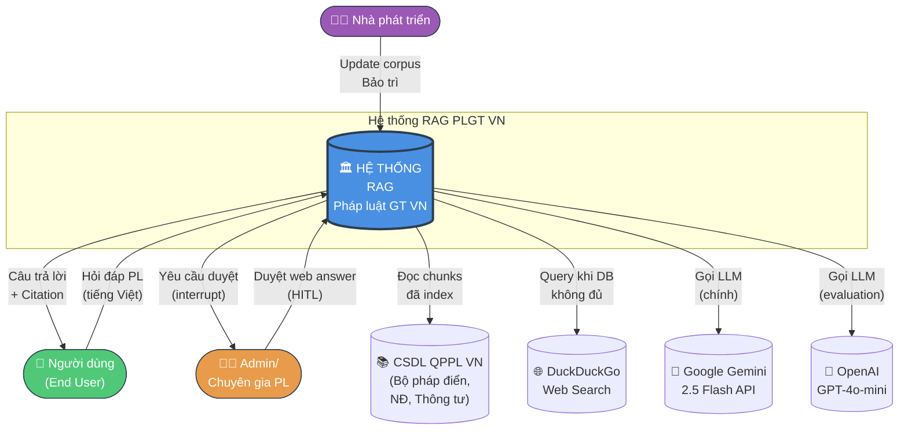
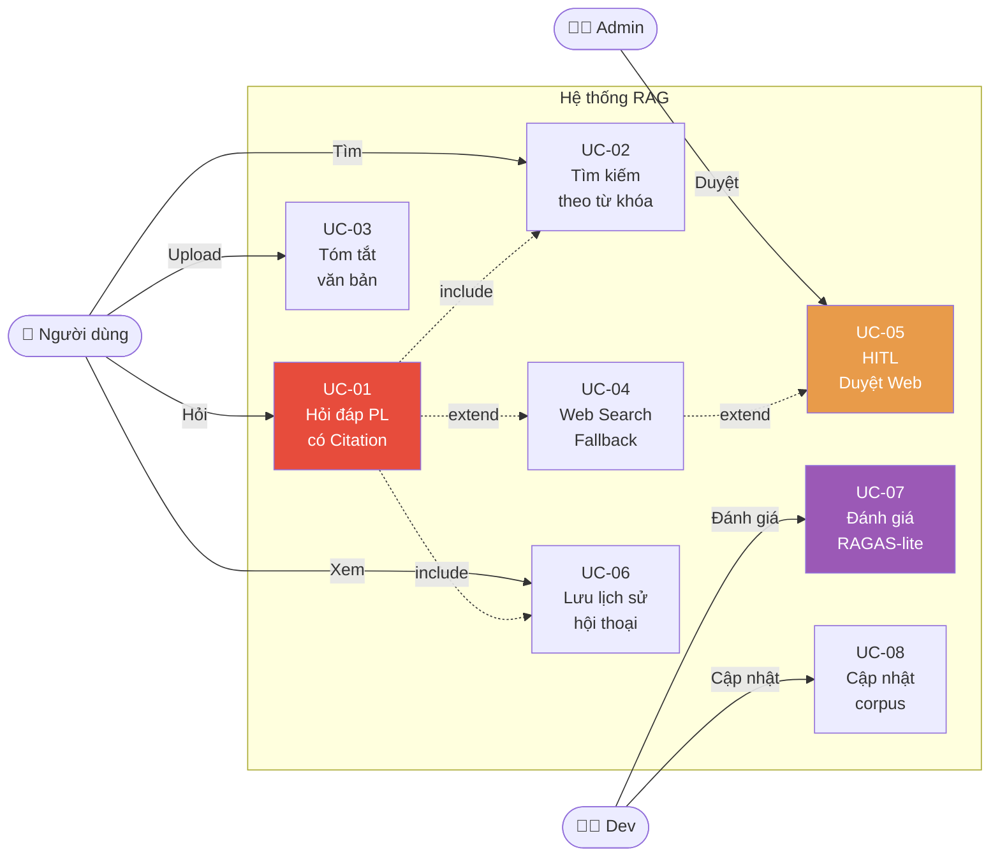

# 02. Phân Tích & Đặc Tả Yêu Cầu

> **Giai đoạn SDLC**: 2 — Phân tích và đặc tả yêu cầu
> **Ngày tạo**: 16/06/2026

---

## 2.1. Mục tiêu hệ thống

Xây dựng hệ thống **RAG** giúp người dùng hỏi đáp về pháp luật giao thông Việt Nam với câu trả lời có trích dẫn chính xác (Điều/Khoản/Điểm), sử dụng kiến trúc Agent để tự quyết định khi nào cần truy xuất thêm từ web với sự phê duyệt của con người.

---

## 2.2. Sơ đồ ngữ cảnh (Context Diagram)

Sơ đồ ngữ cảnh xác định **ranh giới hệ thống** và các **tác nhân bên ngoài**.

### Giải thích sơ đồ

- **Hệ thống ở trung tâm**, các actor bên ngoài xung quanh
- **Người dùng (End User)** là actor chính, tương tác 2 chiều (hỏi → trả lời)
- **Admin** tham gia vào luồng HITL khi hệ thống cần web search
- **CSDL QPPL** là nguồn dữ liệu đã được ingest sẵn (offline pipeline)
- **External APIs** (Gemini, OpenAI, DuckDuckGo) chỉ là dependency, không phải actor

---

## 2.3. Xác định Actor (Use Case Analysis)

| ID | Actor | Loại | Mục tiêu |
|----|-------|------|----------|
| A1 | **Người dùng (End User)** | Primary | Đặt câu hỏi pháp luật, nhận câu trả lời có trích dẫn |
| A2 | **Admin / Chuyên gia** | Primary | Duyệt kết quả web search khi hệ thống yêu cầu (HITL) |
| A3 | **Nhà phát triển** | Secondary | Cập nhật corpus, sửa lỗi, theo dõi metrics |
| A4 | **Hệ thống CSDL QPPL** | External | Cung cấp dữ liệu pháp luật (offline) |
| A5 | **Google Gemini API** | External | LLM chính (free tier) |
| A6 | **OpenAI API** | External | LLM phụ (evaluation) |
| A7 | **DuckDuckGo** | External | Web search fallback (no API key) |

---

## 2.4. Yêu cầu chức năng (Functional Requirements) — MVP SCOPE (Post-Review)

> **Lưu ý quan trọng (A7)**: Sau Falsification Review, đã thu hẹp MVP xuống **4 FR cốt lõi** (FR-01, FR-02, FR-04, FR-07 + FR-09 mới). FR-03, FR-05, FR-08 được **defer sang Phase 2** (sau khóa luận).
>
> **Nguyên tắc**: Mỗi yêu cầu phải **có thể kiểm chứng** (verifiable) — có thể đo lường/test được.

### FR-01: Hỏi đáp pháp luật với citation chính xác *(P0 — MVP)*

| Thuộc tính | Mô tả |
|------------|--------|
| Mô tả | Hệ thống nhận câu hỏi tiếng Việt **đơn** (không kèm lịch sử), trả về câu trả lời có trích dẫn |
| Input | Câu hỏi tự nhiên (text) — **single-turn only** trong MVP |
| Output | Câu trả lời + danh sách citations `[Nghị định 168/2024, Điều 6, Khoản 2, Điểm a]` |
| **Tiêu chí kiểm chứng** | **Citation Correctness ≥ 0.7** trên gold set 30 câu (đo bằng exact match doc_id+dieu+khoan+diem); refusal đúng với adversarial |
| Use Case | UC-01 |
| Priority | **Cao (P0) — MVP** |

> **Đã thay đổi sau review (A1, B8)**: 
> - Bỏ yêu cầu "có thể kèm lịch sử hội thoại" (multi-turn chưa implement trong MVP)
> - Citation Correctness trở thành **headline metric** thay vì "100% có citation" (vô nghĩa nếu citation sai)

### FR-02: Tìm kiếm theo từ khóa

| Thuộc tính | Mô tả |
|------------|--------|
| Mô tả | Người dùng tìm kiếm văn bản/điều luật theo từ khóa |
| Input | Từ khóa (text) |
| Output | Danh sách chunks (Điều/Khoản/Điểm) liên quan, có highlight |
| **Tiêu chí kiểm chứng** | Recall@10 ≥ 0.4 trên gold set (≥ 30 câu test) |
| Use Case | UC-02 |
| Priority | Cao (P0) |

### FR-03: ~~Tóm tắt văn bản luật~~ — **DEFERRED (P3)**

> **Đã defer (A7)**: FR-03 không có node, không có test, không có UI trong MVP. Đưa vào "Future Work" trong báo cáo.

### FR-04: Fallback Web Search *(P0 — MVP, POST-REVIEW)*

> **Đã fix (3rd review)**: DDG bị chặn trên VPS IP. Thêm SerpAPI fallback thông qua config.
> **Vấn đề**: DuckDuckGo chặn IP datacenter (Oracle Cloud, Vultr, etc.) — FR-04 sẽ FAIL nếu không có fallback.

| Thuộc tính | Mô tả |
|------------|--------|
| Mô tả | Khi **relevance_score** < threshold (0.4), hệ thống tự động tìm web |
| Input | Câu hỏi của user, relevance_score từ LLM grade node |
| Output | Web search results (top 3-5 URLs) |
| Backend | **DuckDuckGo** (mặc định, free) + **SerpAPI** (fallback, $0-5/tháng) chọn qua env var `SEARCH_BACKEND` |
| **Tiêu chí kiểm chứng** | Khi relevance_score < 0.4 → 100% trigger web search; retry 3× + fallback nếu primary fail |
| Use Case | UC-04 |
| Priority | Cao (P0) |

### FR-05: ~~Human-in-the-Loop (HITL)~~ — **DEFERRED (P3)**

> **Đã defer (A7)**: HITL có giá trị học thuật nhưng độ phức tạp cao (LangGraph interrupt + Admin UI + thread mapping). Trong MVP, web fallback trả về kèm **disclaimer "nguồn web chưa qua kiểm duyệt"** thay vì HITL. Document chi tiết trong báo cáo như "hướng phát triển tiếp".

### FR-06: Lưu lịch sử hội thoại *(P1 — MVP, simplified)*

| Thuộc tính | Mô tả |
|------------|--------|
| Mô tả | Lưu message (query + answer + citations) vào SQLite để xem lại |
| Input | Mỗi request chat |
| Output | GET /api/conversations/{thread_id} trả lịch sử |
| **Tiêu chí kiểm chứng** | 100% request có record trong DB; round-trip đọc lại được |
| Use Case | UC-06 |
| Priority | Trung bình (P1) |

> **Đã thu hẹp (A7)**: Bỏ yêu cầu "≥ 90% session resume được sau restart" vì cần LangGraph checkpointer phức tạp. Trong MVP, chỉ lưu DB thông thường (không dùng cho resume).

### FR-07: Đánh giá hệ thống (RAGAS-lite) *(P0 — MVP, **CRITICAL FIX**)*

| Thuộc tính | Mô tả |
|------------|--------|
| Mô tả | Tính **5 metrics** trên gold set với **generation ON** (không retrieval-only) |
| Metrics | (1) **Citation Correctness** (headline), (2) Faithfulness, (3) Answer Relevancy, (4) Context Precision, (5) Context Recall |
| Input | Gold set 30-50 câu (bao gồm cả câu từ chối trả lời + câu ngoài corpus) |
| Output | JSON báo cáo + bảng ablation |
| **Tiêu chí kiểm chứng** | 5 metrics × 3 variants (V1 dense, V2 BM25, V3 hybrid) = 15 số |
| Use Case | UC-07 |
| Priority | **Cao (P0) — MVP** |

> **Đã thay đổi sau review (A1, A2, A3, A4)**:
> - **Thêm Citation Correctness** = exact match (doc_id + dieu + khoan + diem) — làm headline metric
> - **Generation MUST run** trong eval (không hardcode `answer: None`)
> - **Judge FORCED to GPT-4o-mini** dù variant dùng LLM nào (chống circularity)
> - **Robust score parsing**: dùng regex `r"[-+]?\d*\.?\d+"` thay vì `float()` trực tiếp
> - **Variants V4-V7 collapsed** xuống 3: V1 (Dense), V2 (BM25), V3 (Hybrid) — bỏ reranker vì MX330 không khả thi

### FR-08: ~~Cập nhật corpus qua API~~ — **DEFERRED (P3)**

> **Đã defer (A7)**: Trong MVP, cập nhật corpus chỉ qua **CLI script offline** (`scripts/ingest_corpus.py`), không qua API. Việc này đơn giản hơn nhiều, vẫn đáp ứng FR-08 về mặt chức năng.

---

## 2.5. Yêu cầu phi chức năng (Non-Functional Requirements)

### NFR-01: Hieu nang (Performance) — POST-REVIEW C9 + Machine Update (17/06)

> **Machine constraint (17/06)**: i5-1035G1 (4C/8T, boost 3.6GHz) — embedding cham hon ~1.5x so voi i5-10400 design goc. Embedding time relaxed accordingly.

| Metric | Tieu chi |
|--------|---------|
| Latency P50 (response time) | ≤ 12 giay |
| Latency P95 | ≤ **20 giay** (relaxed tu 15s, math 4 LLM calls × ~3s + retrieval ~2s) |
| Throughput | ≥ 2 queries/phut (single user, single worker) |
| Embedding time | ≤ 1.5 giay/query (relaxed: i5-1035G1 CPU-only, cache sau lan dau) |
| Retrieval time | ≤ 2 giay/query |

### NFR-02: Khả dụng (Availability)

| Metric | Tiêu chí |
|--------|---------|
| Uptime | ≥ 95% (cho phép restart trong bảo trì) |
| Graceful degradation | Khi Gemini lỗi → fallback OpenAI |
| Cold start time | ≤ 30 giây |

### NFR-03: Bảo mật (Security) — POST-REVIEW B9, B10

| Metric | Tiêu chí |
|--------|---------|
| API key storage | Lưu trong `.env`, KHÔNG commit lên Git |
| HTTPS | Bắt buộc cho production (Let's Encrypt) |
| Input validation | Sử dụng Pydantic cho tất cả API inputs |
| **Rate limit** | **6 req/min/IP** (B10 fix: aligned với Gemini 10 RPM, slowapi + X-Real-IP) |
| **Admin auth** | **Bearer token** (B9 fix: `ADMIN_TOKEN` env var) |
| **Retention** | **30 ngày** (NFR-07 fix: PDPA compliance) |

### NFR-04: Khả mở (Maintainability) — POST-REVIEW C13

| Metric | Tiêu chí |
|--------|---------|
| Modularity | Tách rõ 3 tầng (Presentation, Business, Data) |
| Đổi LLM | Chỉ thay config, không sửa code (provider abstraction) |
| **Đổi embedding model** | **CẦN re-ingest** (C13 fix: dimension thay đổi, e.g. e5-small 384d vs SBERT 768d) |
| Code style | Black + Ruff + Type hints đầy đủ |
| Documentation | README + API docs (auto) |

### NFR-05: Khả dụng (Usability)

| Metric | Tiêu chí |
|--------|---------|
| UI language | Tiếng Việt (mặc định) |
| Mobile responsive | Tailwind breakpoints |
| Streaming response | SSE (Server-Sent Events) |
| Citation display | Highlight + tooltip |
| Loading states | Skeleton + progress bar |

### NFR-06: Kiểm thử (Testability)

| Metric | Tiêu chí |
|--------|---------|
| Unit test coverage | ≥ 70% cho core modules |
| Integration tests | ≥ 80% cho API endpoints |
| Regression test | File `test_retrieval_regression.py` (bắt buộc) |
| CI/CD | GitHub Actions chạy smoke + regression |

---

## 2.6. Use Case Diagram

---

## 2.7. Use Case chi tiết

### UC-01: Hỏi đáp pháp luật có Citation *(POST-REVIEW)*

| Thuộc tính | Mô tả |
|------------|--------|
| **Mã UC** | UC-01 |
| **Tên** | Hỏi đáp pháp luật với citation chính xác |
| **Actor chính** | Người dùng (A1) |
| **Mô tả** | Người dùng đặt câu hỏi tiếng Việt (single-turn) về pháp luật giao thông, hệ thống trả lời có trích dẫn + disclaimer + status hiệu lực |
| **Tiền điều kiện** | Corpus đã được ingest, hệ thống đang chạy |
| **Hậu điều kiện** | Câu trả lời được lưu vào SQLite |

**Luồng chính (POST-REVIEW — fix A5, A6, A8, B3)**:

| Bước | Actor | Hành động |
|------|-------|-----------|
| 1 | User | Nhập câu hỏi vào chat box |
| 2 | System | Tạo `query_id`, lưu message user vào SQLite |
| 3 | System | Gọi LangGraph với state = `{query, query_id, rewrite_count: 0, iterations: 0}` |
| 4 | System | (Node: rewrite) Tối ưu hóa câu hỏi — **tăng rewrite_count += 1** |
| 5 | System | (Node: retrieve) Hybrid search: Dense (e5-small + "query: " prefix) + BM25 (pyvi) → RRF → top-10 |
| 6 | System | (Node: grade) LLM chấm điểm **relevance_score (0-1)** — đây là score DUY NHẤT dùng để route |
| 7a | System | Nếu **relevance_score ≥ 0.7** VÀ `iterations < 3` → Generate |
| 7b | System | Nếu **0.4 ≤ relevance_score < 0.7** VÀ `iterations < 3` → quay lại bước 4 |
| 7c | System | Nếu **relevance_score < 0.4** HOẶC `iterations ≥ 3` → Web Search (UC-04) |
| 8 | System | (Node: generate) **BUFFER** sinh câu trả lời với Legal Reasoning Prompt + disclaimer + status |
| 9 | System | (Node: validate_citation) Check citation có trong context không |
| 10a | System | Nếu valid → **stream toàn bộ** câu trả lời qua SSE |
| 10b | System | Nếu invalid → regenerate, **max 2 lần**; nếu vẫn fail → trả về câu trả lời kèm cảnh báo "citation chưa verified" |
| 11 | System | Lưu message assistant + citations vào SQLite |
| 12 | User | Đọc câu trả lời + citations + disclaimer |

**Loop guard (fix A5)**:
- `iterations` KHÔNG BAO GIỜ vượt 3 (terminate)
- `rewrite_count` KHÔNG BAO GIỜ vượt 2 (terminate → web search)

**Yêu cầu đặc biệt (POST-REVIEW)**:
- Response time ≤ **20 giây** (P95)
- Câu trả lời **BẮT BUỘC** có ≥ 1 citation với status hiệu lực (FR-10)
- **BẮT BUỘC** có disclaimer (FR-09)
- Streaming: **buffer → validate → stream** (fix A6) — KHÔNG stream từng phần rồi retract
- Citation format: `[Tên văn bản, Điều X, Khoản Y, Điểm Z, status]`

### UC-05: ~~HITL Duyệt Web Answer~~ — **DEFERRED (Phase 2)**

> **POST-REVIEW (A7)**: HITL đã defer. Trong MVP, web fallback trả về câu trả lời kèm disclaimer:
> > "Nguồn: Web (chưa qua kiểm duyệt). Vui lòng xác minh trước khi áp dụng."
> 
> Use case chi tiết cho HITL sẽ được mô tả trong chương "Hướng phát triển tương lai" của báo cáo.

---

## 2.8. Kịch bản (Scenario) chi tiết

### Kịch bản 1: Câu hỏi đơn giản trong corpus

> **Câu hỏi**: "Vượt đèn đỏ bị phạt bao nhiêu tiền năm 2025?"

**Kỳ vọng hệ thống**:
1. Classify intent: `PHẠT`
2. Retrieve top-5 chunks có chứa "đèn đỏ", "vượt", "phạt tiền"
3. Top-1 chunk: `Nghị định 168/2024, Điều 6, Khoản 2, Điểm a` → "Phạt tiền từ 4.000.000 đồng đến 6.000.000 đồng"
4. Generate answer:
   > "Theo Nghị định 168/2024/NĐ-CP, **Điều 6, Khoản 2, Điểm a**, hành vi không chấp hành tín hiệu đèn điều khiển giao thông (vượt đèn đỏ) bị phạt tiền từ **4.000.000 đồng đến 6.000.000 đồng**."
   >
   > 📚 Nguồn: [NĐ 168/2024, Điều 6, Khoản 2, Điểm a]

### Kịch bản 2: Câu hỏi tình huống

> **Câu hỏi**: "Tôi đi xe máy va chạm với ô tô tại ngã tư không có đèn, ai có lỗi?"

**Kỳ vọng hệ thống**:
1. Classify: `TÌNH_HUỐNG` (lỗi của ai)
2. Retrieve chunks về quy tắc giao thông ngã tư, ưu tiên
3. Top-1: `Luật 36/2024, Điều 10` (quy tắc nhường đường)
4. Top-2: `NĐ 168/2024, Điều 5` (lỗi hỗn hợp)
5. Apply Legal Reasoning Prompt (4 bước):
   - Liệt kê hành vi: xe máy + ô tô, ngã tư, không đèn
   - Đối chiếu: chưa rõ hướng đi, có vạch sang đường không
   - Kết luận: Không thể kết luận ai lỗi
   - Lưu ý: Tỷ lệ % lỗi cuối cùng phải do CSGT xác định
6. Generate answer:
   > "Dựa trên Luật 36/2024 và NĐ 168/2024, việc xác định lỗi trong vụ va chạm này cần xem xét thêm các yếu tố... ⚠️ Tỷ lệ % lỗi cuối cùng phải do CSGT xác định tại hiện trường."

### Kịch bản 3: Câu hỏi ngoài corpus

> **Câu hỏi**: "Năm 2026 có luật mới về xe điện không?"

**Kỳ vọng hệ thống**:
1. Classify: `KHÁC`
2. Retrieve score < 0.4 (không có trong corpus)
3. Trigger web search (UC-04)
4. DuckDuckGo → top 3 URLs
5. Nếu bật HITL: dừng, đợi admin duyệt
6. Sau duyệt, generate answer với citation `[URL1, URL2]`

---

## 2.9. Bảng yêu cầu tổng hợp (POST-REVIEW)

### MVP Scope (P0) — Phải có trong khóa luận

| ID | Yêu cầu | Priority | Use Case | Tiêu chí kiểm chứng |
|----|---------|----------|----------|---------------------|
| FR-01 | Hỏi đáp có citation chính xác | **P0** | UC-01 | **Citation Correctness ≥ 0.85** trên gold set |
| FR-02 | Tìm kiếm từ khóa | **P0** | UC-02 | Recall@10 ≥ 0.4 |
| FR-04 | Web fallback (không HITL) | **P0** | UC-04 | 100% trigger khi LLM relevance score < 0.4 |
| FR-07 | Evaluation (5 metrics, 3 variants) | **P0** | UC-07 | **Citation Correctness + 4 RAGAS-lite × V1/V2/V3** |
| FR-09 | Disclaimer bắt buộc | **P0** | UC-01 | 100% responses có disclaimer |
| FR-10 | Hiển thị trạng thái hiệu lực | **P0** | UC-01 | 100% citations có status |

### Phase 1.5 (P1) — Nên có nhưng có thể đơn giản hóa

| ID | Yêu cầu | Priority | Use Case | Tiêu chí |
|----|---------|----------|----------|----------|
| FR-06 | Lưu lịch sử (no resume) | P1 | UC-06 | 100% request có record; round-trip OK |

### Deferred (P3) — Làm sau khóa luận, ghi vào "Future Work"

| ID | Yêu cầu | Priority | Lý do defer |
|----|---------|----------|-------------|
| FR-03 | Tóm tắt văn bản | P3 | Không có node/test/UI trong MVP |
| FR-05 | HITL với admin duyệt | P3 | Quá phức tạp, có thể thay bằng disclaimer |
| FR-08 | Cập nhật corpus qua API | P3 | CLI script đủ dùng |

### Non-Functional Requirements (updated)

| ID | Yêu cầu | Priority | Tiêu chí |
|----|---------|----------|----------|
| NFR-01 | Hiệu năng | P0 | P95 latency ≤ 20s (relaxed từ 15s) |
| NFR-02 | Khả dụng | P1 | Uptime ≥ 95% |
| NFR-03 | Bảo mật | **P0** | API key an toàn, HTTPS, **Bearer token cho admin/ingest/eval** |
| NFR-04 | Khả mở | P1 | Modularity cao |
| NFR-05 | UX | P0 | UI TV, responsive, streaming có buffer→validate |
| NFR-06 | Kiểm thử | P0 | Coverage ≥ 70% core modules + **regression test BẮT BUỘC** |
| **NFR-07** | **PDPA / Privacy** | **P0** | Xem FR section trên |

### FR-09: Disclaimer bắt buộc cho mọi câu trả lời *(P0 — MVP, **NEW after A8**)*

| Thuộc tính | Mô tả |
|------------|--------|
| Mô tả | Mọi câu trả lời **phải** kèm disclaimer: "Đây không phải tư vấn pháp lý chính thức. Vui lòng liên hệ cơ quan có thẩm quyền để được tư vấn chính thức." |
| Output | Disclaimer xuất hiện ở cuối mỗi response, riêng biệt với phần trả lời |
| **Tiêu chí kiểm chứng** | 100% responses phải có disclaimer; auto-fail nếu thiếu |
| Priority | **Cao (P0) — MVP** |

> **Tại sao P0 (A8)**: Hệ thống đưa thông tin pháp luật — bắt buộc có disclaimer. Đây là trách nhiệm cơ bản của một legal-adjacent system.

### FR-10: Hiển thị trạng thái hiệu lực của văn bản *(P0 — MVP, **NEW after A8**)*

| Thuộc tính | Mô tả |
|------------|--------|
| Mô tả | Mỗi citation phải kèm trạng thái: `(còn hiệu lực)` / `(hết hiệu lực từ dd/mm/yyyy)` / `(chưa có hiệu lực)` |
| **Tiêu chí kiểm chứng** | 100% citation có status field; nếu status = HET_HIEU_LUC thì câu trả lời phải có cảnh báo |
| Priority | **Cao (P0) — MVP** |

> **Tại sao P0 (A8)**: Vấn đề chính của bài toán là "văn bản cập nhật liên tục, người dân không nắm" — phải giải quyết triệt để.

### NFR-07: Bảo mật & Quyền riêng tư *(P0 — MVP, **NEW after A8**)*

| Thuộc tính | Mô tả |
|------------|--------|
| Mô tả | Tuân thủ Nghị định 13/2023/NĐ-CP (PDPA Việt Nam) về bảo vệ dữ liệu cá nhân |
| Yêu cầu | (1) Không lưu PII ngoài thread_id, (2) Retention policy: xóa conversation > 30 ngày, (3) Admin auth bằng **Bearer token** (env var ADMIN_TOKEN), (4) Ingest/eval endpoints yêu cầu Bearer token, (5) Không ghi log query PII |
| **Tiêu chí kiểm chứng** | Code review pass; có test cho auth middleware |
| Priority | **Cao (P0) — MVP** |

> **Tại sao P0 (A8, B9)**: Hệ thống public trên VPS, không có auth = bất kỳ ai cũng trigger eval (tốn tiền) hoặc upload PDF (RCE-adjacent).
