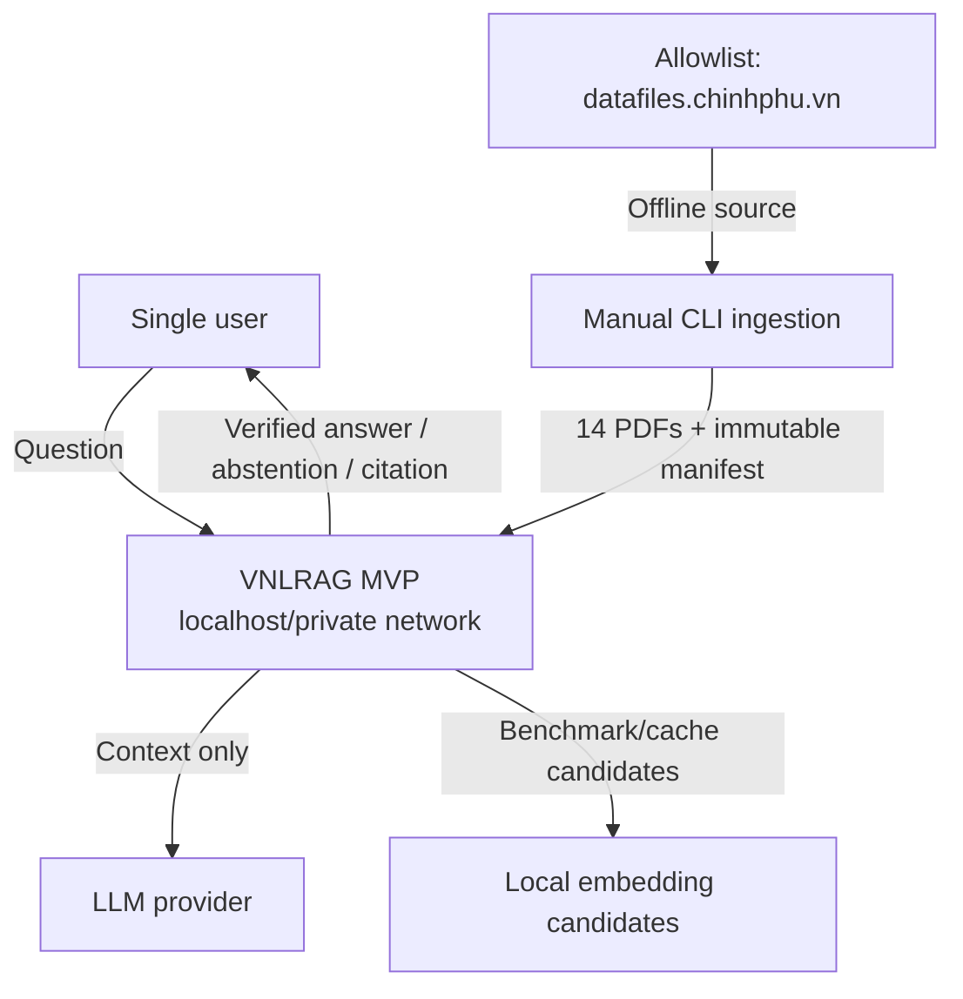
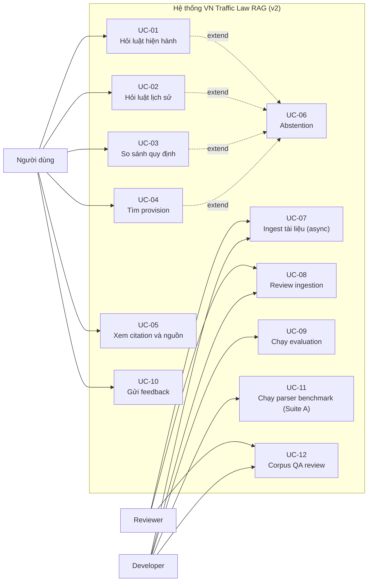

> **MVP đã phê duyệt — 10/09/2026**: Release dùng đúng **14 PDF đã khử trùng lặp theo document/hash**, chỉ từ allowlist chính xác `datafiles.chinhphu.vn`. Đây là hệ thống single-user localhost/private network, không auth, không admin/reviewer role/API/UI. Ingestion chỉ chạy manual CLI; quality/provenance/temporal gates tự động, snapshot/hash bất biến, không human approval. Query-time chỉ tìm trong corpus đã phục vụ, không web. Gold gate chạy toàn bộ 200 câu risk-weighted thuộc 17 category; feedback chỉ LIKE/DISLIKE ẩn danh tối thiểu, không comments/raw prompt-answer/PII và không phải release gate.
>
> **Chính sách embedding**: benchmark nhỏ các ứng viên local đã cài/cache, sau đó mới rebuild index; không invent model name hoặc numeric threshold khi chưa có evidence.
# 02. Phân Tích và Đặc Tả Yêu Cầu

> **Giai đoạn SDLC**: 2 - Phân tích và đặc tả yêu cầu  
> **Ngày tạo**: 16/06/2026  
> **Ngày baseline v1**: 19/07/2026  
> **Ngày thiết kế lại v2**: 08/08/2026  
> **Hạn hoàn thành**: 12/09/2026  
> **Ngày bảo vệ**: 14/09/2026  
> **Tài liệu quyết định nguồn**: [00-scope-and-decisions.md](00-scope-and-decisions.md)  
> **Tên đề tài**: Xây dựng hệ thống RAG nhận biết cấu trúc và thời gian hiệu lực để hỗ trợ tra cứu pháp luật giao thông Việt Nam với trích dẫn có thể kiểm chứng  
> **English title**: A Structure-Aware and Temporal RAG System for Vietnamese Traffic Law Question Answering with Verifiable Citations

---

## 2.1. Mục tiêu hệ thống và mục tiêu nghiên cứu

### Mục tiêu hệ thống

- định tuyến parser qua **Parser Router** với quality gate;
- biểu diễn parser-neutral qua **Canonical Document IR**;
- trích xuất cấu trúc pháp lý và provenance đến trang/bounding box;
- mô hình hóa quan hệ tham chiếu và khoảng hiệu lực `[effective_from, effective_to)`;
- retrieval exact/dense/sparse chỉ trên corpus MVP đã index;
- evidence planning, Evidence Completeness Gate, verification sáu tầng và verified-or-abstain;
- ingestion thủ công qua CLI cho đúng 14 PDF trong allowlist, khử trùng lặp theo document/hash, snapshot/hash bất biến;
- quality/provenance/temporal gates tự động; index cũ được giữ tới khi rebuild mới đạt gates;
- embedding local benchmark nhỏ giữa các ứng viên đã cài/cache trước khi rebuild;
- feedback chỉ LIKE/DISLIKE ẩn danh tối thiểu;
- gold gate chạy toàn bộ 200 câu risk-weighted thuộc 17 category.

Hệ thống không tự tìm kiếm Internet để tạo câu trả lời pháp lý. Query-time không dùng tài liệu ngoài corpus. Tài liệu không vượt qua gate không được publish; không có reviewer hoặc human approval.

> **Ghi chú lịch sử**: thiết kế v1 dựa trên UDEF và traffic-law domain pack (pipeline `PDF -> UDEF -> Docling -> CDM`). Phiên bản v2 loại bỏ hoàn toàn UDEF khỏi mọi pipeline và thay thế bằng Parser Router (Docling/MinerU), Canonical Document IR và Legal Structure Extractor do dự án sở hữu. Mọi yêu cầu trong tài liệu này được viết theo thiết kế v2; chi tiết lý do loại bỏ tại [00-scope-and-decisions.md](00-scope-and-decisions.md).

### Mục tiêu nghiên cứu

1. **Chất lượng parser là mục tiêu evaluation hạng nhất**: đo lường Docling (P1), MinerU (P2) và Parser Router (P3) trên cấu trúc pháp luật Việt Nam, từ đó quyết định routing và quality gate bằng bằng chứng thực nghiệm.
2. **Structure-aware retrieval**: đánh giá ảnh hưởng của trích xuất cấu trúc pháp lý, ranh giới pháp lý trùng ranh giới trích dẫn và parent-context enrichment đối với retrieval.
3. **Cross-reference-aware retrieval**: đánh giá ảnh hưởng của mô hình quan hệ tham chiếu chéo và legal context expansion đối với độ đầy đủ bằng chứng.
4. **Temporal correctness**: đánh giá ảnh hưởng của temporal filtering, amendment boundary và sửa đổi từng phần đối với độ đúng của văn bản được sử dụng.
5. **Evidence completeness**: đánh giá ảnh hưởng của evidence planning và Evidence Completeness Gate đối với mức đầy đủ của câu trả lời đa bằng chứng.
6. **Verification xác định**: đánh giá ảnh hưởng của verification sáu tầng (citation ID, temporal, numeric grounding, claim support, evidence completeness) đối với invalid citation và unsupported claim.
7. **Xây dựng bộ gold set có thể tái sử dụng**: 200 câu đã review, chia 40 development / 40 validation / 120 final test, version hóa và đóng băng trước final evaluation.

### Ranh giới hệ thống

**Trong phạm vi:**

- pháp luật giao thông đường bộ Việt Nam trong đúng 14 PDF MVP;
- single-user localhost/private network, không auth và không role admin/reviewer;
- manual CLI ingestion, immutable snapshot/hash, tự động quality/provenance/temporal gates;
- current, historical và comparison query trên corpus đã index;
- `CORPUS_NOT_COVERED` cho câu hỏi thuộc miền nhưng không có bằng chứng trong corpus;
- vehicle taxonomy mở rộng; loại xe không chỉ rõ thì chỉ liệt kê các nhóm có bằng chứng;
- date policy: hiện tại dùng ngày hiện tại; year-only dùng `01/07` nếu không có biến cố hiệu lực trong năm, nếu có thì yêu cầu ngày cụ thể hoặc `MISSING_QUERY_DATE`;
- chat UI tối thiểu cho verified answer, citation/passage, applied date, disclaimer và LIKE/DISLIKE;
- toàn bộ 200 gold questions risk-weighted thuộc 17 category chạy trước release.

**Ngoài phạm vi:**

- corpus với quy mô khác ngoài đúng 14 PDF MVP;
- open web search/crawl, nguồn ngoài allowlist hoặc web fallback;
- upload endpoint/UI, background ingestion, reviewer/admin role, approval workflow và human review;
- feedback comments, categories, triage, raw prompt/answer hoặc PII;
- tư vấn pháp lý cá nhân hóa có tính kết luận, toàn bộ pháp luật Việt Nam, mobile, voice, autonomous/multi-agent.



Query-time không gọi nguồn web. Ingestion fail gate không thay thế corpus/index đang phục vụ.

## 2.3. Xác định Actor

| ID | Actor | Loại | Mục tiêu |
|---|---|---|---|
| A1 | Single user | Primary | Hỏi luật, xem citation/passage, gửi LIKE/DISLIKE |
| A2 | Manual CLI operator | Operational | Chạy sync, gate, benchmark và rebuild |
| A3 | Allowlisted official source | External | Cung cấp đúng PDF được phép |
| A4 | LLM/embedding provider | External dependency | Sinh answer từ context hoặc vector benchmark |

Không có auth, admin/reviewer role, upload API/UI hoặc human approval trong MVP.

### Phân quyền

MVP không triển khai authentication hoặc role-based access control. Single user trong localhost/private network có quyền hỏi đáp và gửi LIKE/DISLIKE; manual CLI operator chạy ingestion/evaluation/rebuild. Không có quyền reviewer/admin riêng.

## 2.4. Yêu cầu chức năng (Functional Requirements)
| Tiêu chí kiểm chứng | Legal Structure Extractor chỉ đọc IR, không đọc định dạng parser; thêm adapter cho parser mới không làm thay đổi extractor; mọi element có `element_id`, `element_type`, `text`, `page_number`, `bbox`, `reading_order`, `parent_element_id`, `table_html` (khi có), `source_parser`, `parser_version`, `parser_confidence`, `raw_reference` |
| Use Case | UC-07, UC-11 |
| Priority | P0 |
### FR-03: Legal Structure Extractor

| Thuộc tính | Mô tả |
|---|---|
| Mô tả | Nhận diện cấu trúc pháp luật Việt Nam từ Canonical Document IR: Chương, Mục, Điều, Khoản, Điểm, Phụ lục, bảng pháp lý, điều khoản chuyển tiếp, tiêu đề, đánh số văn bản và biến thể do OCR; bắt buộc hỗ trợ nhãn Điểm a) b) c) d) đ) e) và short-Point retention |
| Input | `ParsedDocument` |
| Output | `LegalProvision` với toàn bộ field: `provision_id`, `document_version_id`, `chapter`, `section`, `article`, `clause`, `point`, `heading`, `source_text`, `retrieval_text`, `parent_context`, `effective_from`, `effective_to`, `status`, `page_number`, `bbox`, `source_element_ids`, `content_hash`, `version`, `review_status` |
| Tiêu chí kiểm chứng | Fixture Luật, Nghị định, Thông tư nhận diện đúng phân cấp; nhãn `đ)` và `d)` không bị lẫn; Điểm ngắn hợp lệ không bị loại bỏ; `source_text` giữ nguyên văn bản gốc; `provision_id` ổn định theo quy tắc `{loai-van-ban}-{so}-{nam}__dieu-{n}__khoan-{n}__diem-{chu-cai}` (ví dụ `nd-168-2024__dieu-7__khoan-4__diem-b`); fixture xác minh stable-ID phân biệt `diem-d` (Điểm d)) và `diem-đ` (Điểm đ)): ký tự tiếng Việt `đ` được giữ nguyên trong ID, không va chạm với `d` |
| Use Case | UC-07, UC-11, UC-12 |
| Priority | P0 |
### FR-04: Parent-context enrichment

| Thuộc tính | Mô tả |
|---|---|
| Mô tả | Bổ sung ngữ cảnh cha vào `retrieval_text` của Điểm/Khoản khi phục vụ retrieval (câu mở đầu của Khoản, tiêu đề Điều); `source_text` không bao giờ bị biến đổi |
| Input | `LegalProvision` sau Legal Structure Extractor |
| Output | `retrieval_text` kế thừa `parent_context`; `source_text` nguyên vẹn |
| Tiêu chí kiểm chứng | Trích dẫn vẫn trỏ tới provision thực tế (Điểm); hash `source_text` không đổi sau enrichment; parent-context coverage được đo trong corpus QA |
| Use Case | UC-07, UC-11 |
| Priority | P0 |
### FR-05: Legal Reference Resolver (quan hệ tham chiếu chéo)

| Thuộc tính | Mô tả |
|---|---|
| Mô tả | Trích xuất và lưu quan hệ cấp provision (`PARENT_OF`, `REFERS_TO`, `SIBLING_OF`, `PENALTY_COMPANION`) và cấp văn bản (`AMENDS`, `REPEALS`, `SUPERSEDES`, `CORRECTS`, `GUIDES`, `RELATED_TO`) trong bảng PostgreSQL, xử lý bằng application logic |
| Input | `LegalProvision`, manifest, đầu ra trích xuất văn bản |
| Output | Bản ghi `ProvisionReference` và `DocumentRelation`; unresolved reference được ghi nhận |
| Tiêu chí kiểm chứng | Quan hệ trích được khớp fixture với relation ID mong đợi; precision/recall của trích xuất quan hệ được báo cáo trong corpus QA; reference không giải quyết được ghi rõ và định tuyến review, không suy đoán quan hệ; không dùng Neo4j |
| Use Case | UC-07, UC-12 |
| Priority | P0 |
### FR-06: Temporal and Amendment Resolver

| Thuộc tính | Mô tả |
|---|---|
| Mô tả | Xác định khoảng hiệu lực `[effective_from, effective_to)` cho văn bản và provision từ manifest, `LegalEffectEvent` và review; hỗ trợ biên sửa đổi, sửa đổi từng phần, thay thế, bãi bỏ; trường hợp hiệu lực không chắc chắn định tuyến sang review |
| Input | Manifest, `LegalEffectEvent`, quyết định reviewer |
| Tiêu chí kiểm chứng | Provision hợp lệ cho ngày `d` khi: `effective_from <= d` VÀ (`effective_to IS NULL` HOẶC `d < effective_to`); temporal gate fail closed nếu thiếu/chồng lấn hiệu lực; không dùng human approval |
### FR-08: Embedding benchmark và rebuild an toàn

| Thuộc tính | Mô tả |
|---|---|
| Mô tả | Benchmark nhỏ các ứng viên embedding local đã cài/cache; chọn ứng viên theo evidence rồi rebuild index |
| Tiêu chí kiểm chứng | Không hardcode model name/threshold chưa được đo; rebuild không làm mất index cũ khi thất bại |
| Priority | P0 |

### FR-09: Query corpus-only và CORPUS_NOT_COVERED

| Thuộc tính | Mô tả |
|---|---|
| Mô tả | Query-time chỉ retrieval từ corpus đã publish; câu hỏi thuộc miền nhưng thiếu căn cứ trả `CORPUS_NOT_COVERED`, không web fallback |
| Tiêu chí kiểm chứng | Không gọi web; không fabricate; phân biệt với `OUT_OF_SCOPE` |
| Priority | P0 |
### FR-10: Corpus QA

| Thuộc tính | Mô tả |
|---|---|
| Mô tả | Báo cáo tự động về hierarchy, short-Point, nhãn đ), provenance, parent context, bảng, cross-reference, duplicate, effective date và temporal conflict |
| Tiêu chí kiểm chứng | Gate report đầy đủ; fail closed khi thiếu provenance/temporal evidence |
| Priority | P0 |
### FR-11: Query Understanding và evidence planning

| Thuộc tính | Mô tả |
|---|---|
| Mô tả | Phân tích câu hỏi thành `QueryUnderstanding`: intent, effective date, comparison dates, vehicle type, số văn bản, số Điều/Khoản/Điểm, thực thể pháp lý, normalized query và danh sách loại bằng chứng cần thiết (evidence plan) |
| Input | `question`, `query_date?`, `compare_to_date?`, `vehicle_type?` |
| Output | `QueryUnderstanding` gồm intent, dates, refs, normalized query, evidence plan |
| Tiêu chí kiểm chứng | Fixture current, historical, comparison và out-of-scope được route đúng; date parsing không tự bịa ngày trừ khi áp dụng đúng chính sách canonical date (xem bên dưới) và ngày áp dụng luôn được hiển thị trong response; evidence plan liệt kê đúng loại bằng chứng (ví dụ câu hỏi mức phạt + điểm trừ phải có cả `monetary_penalty` và `license_points`) |
| Use Case | UC-01, UC-02, UC-03, UC-04, UC-06 |
| Priority | P0 |

Các intent bắt buộc:

```text
CURRENT
HISTORICAL
COMPARISON
SOURCE_SEARCH
OUT_OF_SCOPE
```

Các loại bằng chứng (evidence types) ví dụ:

```text
violation_definition
monetary_penalty
### FR-07: Manual CLI ingestion và immutable snapshots

| Thuộc tính | Mô tả |
|---|---|
| Mô tả | Đồng bộ thủ công đúng 14 PDF từ allowlist `datafiles.chinhphu.vn`; khử trùng lặp theo document/hash; lưu snapshot và hash bất biến; chạy parser, extraction, temporal và tự động quality/provenance gates |
| Input | Allowlisted PDF và manifest |
| Output | Snapshot, gate report, corpus version/hash và trạng thái publish |
| Tiêu chí kiểm chứng | Không có upload endpoint hoặc background queue; gate fail không publish; index cũ giữ nguyên đến khi rebuild mới đạt gate |
| Priority | P0 |

### FR-08: Embedding benchmark và rebuild an toàn

| Thuộc tính | Mô tả |
|---|---|
| Mô tả | Benchmark nhỏ các ứng viên embedding local đã cài/cache; chọn ứng viên theo evidence rồi rebuild index |
| Tiêu chí kiểm chứng | Không hardcode model name/threshold chưa được đo; rebuild không làm mất index cũ khi thất bại |
| Priority | P0 |

### FR-09: Query corpus-only và CORPUS_NOT_COVERED

| Thuộc tính | Mô tả |
|---|---|
| Mô tả | Query-time chỉ retrieval từ corpus đã publish; câu hỏi thuộc miền nhưng thiếu căn cứ trả `CORPUS_NOT_COVERED`, không web fallback |
| Tiêu chí kiểm chứng | Không gọi web; không fabricate; phân biệt với `OUT_OF_SCOPE` |
| Priority | P0 |
| Tiêu chí kiểm chứng | Định danh chính xác trả đúng provision tương ứng số văn bản, Điều, Khoản, Điểm; candidate exact được bảo toàn sau fusion và loại trùng lặp theo `provision_id` |
| Use Case | UC-01, UC-02, UC-03, UC-04 |
| Priority | P0 |
### FR-14: Dense + sparse retrieval và RRF fusion

| Thuộc tính | Mô tả |
|---|---|
| Mô tả | Chạy song song dense semantic và sparse BM25 trong Qdrant, hợp nhất bằng Reciprocal Rank Fusion; áp dụng temporal filter theo ngày áp dụng |
| Input | Query variants, temporal filter |
| Output | Candidate provisions có rank, score, method và payload metadata |
| Tiêu chí kiểm chứng | Dense, sparse và RRF chạy độc lập trong thí nghiệm; config tái tạo được từng variant; kết quả từng variant (R1-R10) được lưu và so sánh trên gold set; Recall@5/10/20, MRR@10, nDCG@10 đo được trên gold set |
| Use Case | UC-01, UC-02, UC-03, UC-04 |
| Priority | P0 |
### FR-15: Reranking

| Thuộc tính | Mô tả |
|---|---|
| Mô tả | Rerank candidate từ hybrid retrieval bằng model phụ trước khi mở rộng ngữ cảnh; Jina Reranker v3 là ứng viên chính; reranking là stage chuẩn của pipeline, không phải việc tương lai |
| Input | Candidate list từ RRF fusion, query |
| Output | Candidate list được xếp hạng lại |
| Tiêu chí kiểm chứng | Reranker chạy như stage chuẩn trong pipeline; Suite C (R6) đo tác động tăng thêm của reranker; không khẳng định reranker cải thiện chất lượng trước khi có kết quả benchmark |
| Use Case | UC-01, UC-02, UC-03, UC-04 |
| Priority | P0 |
### FR-16: Legal context expansion theo quan hệ

| Thuộc tính | Mô tả |
|---|---|
| Mô tả | Mở rộng ngữ cảnh quanh seed provision mạnh theo parent, sibling, tham chiếu trực tiếp, penalty companion và quy định liên quan sửa đổi/thay thế; mỗi provision mở rộng ghi lý do vào context |
| Input | Seed provisions, `ProvisionReference`, `DocumentRelation` |
| Output | Context mở rộng kèm metadata `{"provision_id": "...", "added_by": "CROSS_REFERENCE", "source_id": "...", "depth": 1}` |
| Tiêu chí kiểm chứng | Chỉ mở rộng quanh seed mạnh; độ sâu (depth) có giới hạn, tránh mở rộng đồ thị vô hạn; mọi provision mở rộng ghi đúng lý do |
| Use Case | UC-01, UC-02, UC-03 |
| Priority | P0 |
### FR-17: Evidence Completeness Gate

| Thuộc tính | Mô tả |
|---|---|
| Mô tả | Kiểm tra mọi loại bằng chứng trong evidence plan đã được thu thập; nếu `INCOMPLETE` thì chạy targeted retrieval hoặc mở rộng theo quan hệ rồi kiểm tra lại trước khi sinh câu trả lời; không âm thầm trả lời một nửa dễ của câu hỏi đa bằng chứng |
| Input | Evidence plan, context hiện có |
| Output | `evidence_status` = `COMPLETE` hoặc `INCOMPLETE`, kèm hướng bổ sung |
| Tiêu chí kiểm chứng | Câu hỏi yêu cầu mức phạt + điểm trừ mà chỉ tìm được mức phạt bị đánh dấu `INCOMPLETE` và được xử lý bổ sung trước khi gọi generator |
| Use Case | UC-01, UC-02, UC-03, UC-06 |
| Priority | P0 |

---

### FR-18: Hỏi đáp quy định hiện hành

| Thuộc tính | Mô tả |
|---|---|
| Mô tả | Trả lời theo văn bản có hiệu lực tại ngày request hoặc ngày được truyền rõ ràng |
| Input | Câu hỏi và optional `query_date` |
| Output | Verified answer hoặc abstention |
| Tiêu chí kiểm chứng | Không sử dụng provision ngoài khoảng hiệu lực; mọi claim pháp lý có citation hợp lệ |
| Use Case | UC-01 |
| Priority | P0 |
### FR-19: Hỏi đáp quy định tại thời điểm lịch sử

| Thuộc tính | Mô tả |
|---|---|
| Mô tả | Trả lời câu hỏi tại một ngày hoặc giai đoạn lịch sử; chỉ dùng provision hợp lệ tại mốc được hỏi; văn bản bị thay thế vẫn được dùng cho câu hỏi lịch sử |
| Input | Câu hỏi có năm, ngày hoặc `query_date` |
| Output | Answer, ngày áp dụng, citation của phiên bản phù hợp |
| Tiêu chí kiểm chứng | Temporal Validity Accuracy được tính trên gold set lịch sử; không dùng văn bản hiện hành làm mặc định cho câu hỏi có thể là lịch sử |
| Use Case | UC-02 |
| Priority | P0 |
### FR-20: So sánh quy định giữa hai thời điểm

| Thuộc tính | Mô tả |
|---|---|
| Mô tả | Truy xuất hai temporal contexts độc lập và trình bày điểm giống, khác hoặc chưa đủ dữ liệu |
| Input | Câu hỏi và hai mốc thời gian |
| Output | Structured comparison với citation riêng cho từng giai đoạn |
| Tiêu chí kiểm chứng | Mỗi phía của so sánh chỉ cite provision hợp lệ tại thời điểm tương ứng; không gộp citation giữa hai giai đoạn |
| Use Case | UC-03 |
| Priority | P0 |
### FR-21: Tìm kiếm provision

| Thuộc tính | Mô tả |
|---|---|
| Mô tả | Tìm Điều, Khoản, Điểm theo từ khóa, câu tự nhiên hoặc số hiệu; search chạy độc lập, không bắt buộc gọi LLM generator |
| Input | Query, filter ngày, loại văn bản, loại phương tiện |
| Output | Danh sách `LegalProvision` xếp hạng, snippet và provenance |
| Tiêu chí kiểm chứng | API trả top-k kèm `provision_id`, hierarchy, hiệu lực, page và source reference |
| Use Case | UC-04 |
| Priority | P0 |
### FR-22: Sinh câu trả lời có cấu trúc (structured generation)

| Thuộc tính | Mô tả |
|---|---|
| Mô tả | LLM sinh answer theo schema cấp claim; citation hiển thị được dựng từ metadata tin cậy, không phải chuỗi citation do LLM gõ tự do |
| Input | Câu hỏi, `QueryUnderstanding`, context đã kiểm tra tính đầy đủ bằng chứng |
| Output | Structured answer theo Pydantic/JSON schema |
| Tiêu chí kiểm chứng | Model chỉ được tham chiếu provision ID nằm trong context; parse schema fail thì fail rõ ràng hoặc chuyển sang repair |
| Use Case | UC-01, UC-02, UC-03 |
| Priority | P0 |

Schema tối thiểu:

```json
{
  "answer_summary": "string",
  "claims": [
    {
      "claim": "string",
      "claim_type": "MONETARY_PENALTY",
      "provision_ids": ["string"],
      "numbers": ["4.000.000", "6.000.000"]
    }
  ],
  "missing_information": [],
  "should_abstain": false
}
```

> Ví dụ trong schema mang tính minh họa cấu trúc dữ liệu, không phải khẳng định về giá trị thực tế của bất kỳ văn bản nào.

### FR-23: Verification sáu tầng

| Thuộc tính | Mô tả |
|---|---|
| Mô tả | Kiểm tra trước khi trả lời: L1 schema; L2 citation ID (provision tồn tại, đã được retrieve hoặc mở rộng hợp lệ, `review_status = ACCEPTED`, metadata citation có thẩm quyền); L3 temporal validity; L4 numeric grounding (mức phạt, số điểm trừ, ngày, tuổi, thời hạn, số lượng khớp giá trị bằng chứng đã chuẩn hóa); L5 claim support (quy tắc xác định trước, LLM judge độc lập chỉ cho trường hợp ngữ nghĩa); L6 evidence completeness |
| Input | DraftAnswer, `QueryUnderstanding`, context |
| Output | `VerificationResult` và verified response |
| Tiêu chí kiểm chứng | Invalid citation không được trả cho người dùng (Returned Invalid Citation Rate = 0); citation UI dựng từ database; claim số liệu sai bị chặn bởi L4 |
| Use Case | UC-01, UC-02, UC-03, UC-06, UC-09 |
| Priority | P0 |

Tiêu chí kiểm chứng theo từng tầng:

- L1 Schema: output không đúng schema bị fail rõ ràng hoặc được sửa qua đường repair;
- L2 Citation ID: provision không tồn tại, không nằm trong retrieved context hoặc chưa có `review_status = ACCEPTED` đều bị chặn;
- L3 Temporal: provision không hợp lệ tại ngày được hỏi bị loại, dẫn đến repair (truy xuất phiên bản đúng) hoặc abstain;
- L4 Numeric grounding: mức phạt, số điểm trừ, ngày, tuổi, thời hạn, số lượng sai so với bằng chứng đã chuẩn hóa đều bị fail;
- L5 Claim support: quy tắc xác định fail thì claim bị chặn; LLM judge độc lập chỉ được dùng cho các trường hợp ngữ nghĩa;
- L6 Evidence completeness: một loại bằng chứng bắt buộc thiếu trong claim cuối thì fail.

### FR-24: Failure-aware repair và abstention

| Thuộc tính | Mô tả |
|---|---|
| Mô tả | Sửa lỗi theo loại cụ thể: thiếu bằng chứng - targeted retrieval rồi dựng lại context và regenerate; claim không được hỗ trợ - regenerate từ bằng chứng hiện có hoặc targeted retrieval nếu thiếu; schema sai - regenerate structured output; xung đột thời gian - truy xuất phiên bản thời gian đúng. Tất cả nhánh repair cùng tính vào `MAX_REPAIR_ATTEMPTS`, là hằng số cấu hình hữu hạn; sau khi cạn `MAX_REPAIR_ATTEMPTS`: ABSTAIN |
| Input | `VerificationResult` fail, context, `QueryUnderstanding` |
| Output | Verified answer hoặc abstention kèm lý do |
| Tiêu chí kiểm chứng | Mỗi loại lỗi có đường sửa riêng, không chỉ regenerate; `MAX_REPAIR_ATTEMPTS` là config có thể chỉnh, không hardcode, và mọi nhánh repair cùng tính vào giới hạn này; test khẳng định trạng thái kết thúc là ABSTAIN khi cạn `MAX_REPAIR_ATTEMPTS`; không có vòng lặp vô hạn; không có đường nào trả answer kèm citation invalid hoặc cảnh báo "citation chưa verified" |
| Use Case | UC-01, UC-02, UC-03, UC-06 |
| Priority | P0 |

Các lý do abstain chuẩn:

```text
OUT_OF_SCOPE
MISSING_QUERY_DATE
INSUFFICIENT_EVIDENCE
NO_VALID_PROVISION
TEMPORAL_CONFLICT
CITATION_VERIFICATION_FAILED
CORPUS_NOT_COVERED
```

### FR-25: Hiển thị disclaimer và phạm vi áp dụng

| Thuộc tính | Mô tả |
|---|---|
| Mô tả | Hiển thị thông báo giới hạn của hệ thống ở mọi answer và abstention |
| Input | Verified answer hoặc abstention response |
| Output | Disclaimer tách biệt khỏi nội dung pháp lý |
| Tiêu chí kiểm chứng | UI và API luôn có `disclaimer`; test contract fail khi field bị thiếu |
| Use Case | UC-01, UC-02, UC-03, UC-06 |
| Priority | P0 |
### FR-26: Observability qua Langfuse

| Thuộc tính | Mô tả |
|---|---|
| Mô tả | Trace từng giai đoạn pipeline qua Langfuse: `legal_query` với các span `analyze_query`, `normalize_query`, `rewrite_query`, `hyde`, `exact_lookup`, `dense_retrieval`, `sparse_retrieval`, `rrf_fusion`, `reranker`, `reference_expansion`, `evidence_check`, `generate`, `citation_verify`, `numeric_verify`, `claim_verify`; hỗ trợ quản lý prompt và phiên bản prompt, experiment, dataset, LLM-as-judge, annotation và feedback |
| Input | Sự kiện pipeline, prompt version |
| Output | Trace, token usage, cost, latency, prompt version |
| Tiêu chí kiểm chứng | Trace ghi lại được cho query thử nghiệm; Langfuse không nằm trên đường tới hạn tính đúng đắn - nếu không khả dụng, query vẫn hoạt động; bật/tắt qua config |
| Use Case | UC-01, UC-02, UC-03, UC-04, UC-07, UC-09 |
| Priority | P0 |
### FR-27: Feedback tối thiểu

| Thuộc tính | Mô tả |
|---|---|
| Mô tả | Cho phép người dùng gửi LIKE hoặc DISLIKE ẩn danh cho answer |
| Input | `feedback = LIKE | DISLIKE` |
| Output | Tín hiệu feedback tối thiểu |
| Tiêu chí kiểm chứng | Không comment/category/triage; không raw prompt/answer hoặc PII; không phải release gate |
| Priority | P0 |
### FR-28: Đánh giá và ablation (evaluation)

| Thuộc tính | Mô tả |
|---|---|
| Mô tả | Chạy bốn suite thí nghiệm trên gold set 200 câu (40 development / 40 validation / 120 final test). Ma trận thí nghiệm: Suite A parser (P1-P3: Docling, MinerU, Parser Router) với chỉ số Article/Clause/Point P/R/F1, Short Point Recall, Vietnamese đ) Recall, Parent Context Completeness, Table Preservation, Header/Footer Leakage, Provenance Coverage; Suite B embedding (E1-E3: Gemini Embedding 2, Jina Embeddings v5 text-nano, Jina Embeddings v5 text-small) với Recall@10, MRR@10, nDCG@10, latency, cost; Suite C retrieval (R1-R10) với các cấu hình tích lũy; Suite D generation và verification (G1-G7). Mỗi run lưu đầy đủ run metadata để tái lập; run bất biến; final test set không dùng để tuning |
| Input | Gold set version, corpus version, experiment config, model config |
| Output | JSON/CSV report, per-query result, aggregate metrics và cost |
| Tiêu chí kiểm chứng | Mỗi run lưu `run_id`, `git_commit`, corpus version/hash, gold-set version/hash, model IDs, prompt versions, retrieval config, parser version và raw output; điều kiện replay (cùng config, model ID, prompt version, corpus hash) và dung sai được ghi rõ trong evaluation config; có thể tái lập kết quả |
| Use Case | UC-09, UC-11 |
| Priority | P0 |

Gold set gồm 200 câu đã review, chia 40 development / 40 validation / 120 final test, với danh mục câu hỏi:

```text
CURRENT
HISTORICAL
COMPARISON
EXACT_REFERENCE
PENALTY
LICENSE_POINTS
CONDITION
EXCEPTION
PROCEDURE
CROSS_REFERENCE
MULTI_PROVISION
MULTI_DOCUMENT
COLLOQUIAL_QUERY
AMBIGUOUS
MISSING_INFORMATION
OUT_OF_SCOPE
ADVERSARIAL_CITATION
```

Bản ghi gold set phải chứa:

```text
expected_provision_ids
acceptable_provision_ids
required_evidence
must_include_facts
must_not_include_facts
temporal_metadata
review_status
gold_version
hash
```

### FR-29: Lưu lịch sử truy vấn

| Thuộc tính | Mô tả |
|---|---|
| Mô tả | Lưu query, response, citations và trace ID để xem lại |
| Input | Câu hỏi, response, citations và `trace_id` của mỗi query |
| Output | Bản ghi lịch sử truy vấn truy xuất lại được |
| Tiêu chí kiểm chứng | Round-trip create/read hoạt động; retention job xóa record hết hạn |
| Use Case | UC-01, UC-02, UC-03, UC-05 |
| Priority | P1 |
### FR-30: Không có admin/reviewer UI

Admin/reviewer UI, upload API và approval workflow không thuộc MVP. CLI JSON report là cơ chế vận hành duy nhất.

### FR-31: Chạy evaluation và release gate

| Thuộc tính | Mô tả |
|---|---|
| Mô tả | Chạy toàn bộ 200 gold questions risk-weighted thuộc 17 category trước release |
| Tiêu chí kiểm chứng | 200 câu đều chạy; ghi corpus/gold/config hashes bất biến; chỉ công bố metric có evidence chạy thực tế |
| Priority | P0 |
### FR-32: Hiển thị answer và citation từ metadata

| Thuộc tính | Mô tả |
|---|---|
| Mô tả | Hiển thị verified answer, citation/passage, applied date và disclaimer; LIKE/DISLIKE tối thiểu |
| Tiêu chí kiểm chứng | Citation từ metadata; không render draft chưa verify |
| Priority | P0 |

### FR-32: Hiển thị answer và citation từ metadata

| Thuộc tính | Mô tả |
|---|---|
| Mô tả | Hiển thị câu trả lời và trích dẫn trong UI: citation được dựng từ metadata đã lưu (không phải chuỗi LLM gõ tự do); passage viewer mở snippet nguồn kèm trang; hiển thị ngày áp dụng; chỉ render nội dung đã verified, không stream draft chưa verify; kèm disclaimer |
| Input | Verified answer, citation metadata, passage source và applied date |
| Output | View answer có citation card, passage viewer, ngày áp dụng và disclaimer |
| Tiêu chí kiểm chứng | Citation luôn dựng từ database metadata; passage viewer mở đúng trang; applied date hiển thị rõ; không hiển thị draft chưa verify; contract test đảm bảo các field hiển thị đầy đủ |
| Use Case | UC-01, UC-02, UC-03, UC-05 |
| Priority | P0 |

> **Ghi chú**: yêu cầu VLM fallback cho PDF scan trong v1 (FR-17 cũ) đã được loại bỏ. Năng lực xử lý tài liệu scan được thay bằng Parser Router (FR-01) với MinerU là parser phụ/fallback, kết hợp quality gate; không còn yêu cầu riêng về VLM.

---

## 2.5. Yêu cầu phi chức năng (Non-Functional Requirements)

### NFR-01: Độ đúng và an toàn thông tin

| Tiêu chí | Yêu cầu |
|---|---|
| Invalid citation returned | Bằng 0 trong test contract (Returned Invalid Citation Rate = 0) |
| Unverified answer | Không được trả |
| Temporal validity | Mọi citation phải hợp lệ tại ngày áp dụng (verifier L3) |
| Numeric mismatch | Claim có số liệu sai so với bằng chứng bị chặn bởi verifier L4 |
| Unsupported claim | Bị chặn bởi verifier L5, sửa lỗi hoặc dẫn đến abstention |
| Web-generated legal answer | Không được phép |
| Disclaimer | Bắt buộc trong mọi response |

### NFR-02: Hiệu năng

Các ngưỡng là mục tiêu kỹ thuật trong môi trường test được mô tả, không phải kết quả thực nghiệm đã đạt.

| Metric | Mục tiêu |
|---|---|
| Retrieval P95 | Không quá 2 giây trên corpus mục tiêu |
| End-to-end P50 | Không quá 12 giây |
| End-to-end P95 | Không quá 20 giây |
| Search API P95 | Không quá 3 giây |
| Ingestion | Không yêu cầu real-time; có tiến trình và timeout rõ ràng |
| Concurrent ingestion workers | `MAX_INGESTION_WORKERS = 1` trong scope khóa luận |
| Background job timeout | Actor Dramatiq phải có time limit tường minh phù hợp với thời lượng mỗi bước ingestion, không dùng giá trị mặc định 10 phút cho bước dài mà không xem xét |

### NFR-03: Khả dụng và khả năng demo

| Tiêu chí | Yêu cầu |
|---|---|
| Local deployment | Toàn bộ hạ tầng dữ liệu (backend, worker, PostgreSQL, Qdrant, Redis, MinIO) chạy bằng Docker Compose |
| Defense mode | Không phụ thuộc VPS |
### FR-30: Không có admin/reviewer UI

Admin/reviewer UI, upload API và approval workflow không thuộc MVP. CLI JSON report là cơ chế vận hành duy nhất.

### FR-31: Chạy evaluation và release gate

| Thuộc tính | Mô tả |
|---|---|
| Mô tả | Chạy toàn bộ 200 gold questions risk-weighted thuộc 17 category trước release |
| Tiêu chí kiểm chứng | 200 câu đều chạy; ghi corpus/gold/config hashes bất biến; chỉ công bố metric có evidence chạy thực tế |
| Priority | P0 |
| Tiêu chí | Yêu cầu |
|---|---|
| PII | Không yêu cầu người dùng cung cấp PII |
| Conversation retention | Mặc định 30 ngày nếu bật history (FR-29, P1) |
| Delete job | Có test |
| Provider policy | Ghi rõ dữ liệu nào được gửi đến provider |
| Evaluation data | Không chứa thông tin cá nhân thực |
| Feedback | Chỉ LIKE/DISLIKE ẩn danh; không comment/category/raw prompt-answer/PII; không phải release gate |
Hệ thống không tuyên bố "tuân thủ hoàn toàn" một quy định pháp luật nếu chưa có legal compliance review. Tài liệu chỉ mô tả các biện pháp giảm thiểu dữ liệu cá nhân.

### NFR-06: Khả bảo trì

| Tiêu chí | Yêu cầu |
|---|---|
| Module boundary | Parser, Document IR, extraction, data, retrieval, workflow, verification và evaluation tách biệt |
| Provider abstraction | Đổi provider qua config và adapter |
| Parser version migration | Pin version parser; khi thay parser chỉ cần adapter mới vào Document IR, không viết lại Legal Structure Extractor |
| Database migration | Alembic |
| Embedding migration | Đổi embedding model phải re-embed toàn bộ collection |
| Qdrant rebuild | Qdrant là index dẫn xuất, dựng lại được từ PostgreSQL |
| Code quality | Ruff, type checking và type hints |
| Documentation | ADR, API docs, runbook và experiment docs |

### NFR-07: Khả kiểm thử

| Tiêu chí | Yêu cầu |
|---|---|
| Unit test | Core deterministic modules có coverage mục tiêu tối thiểu 80% |
| Integration test | Ingestion (queue, parser, MinIO), PostgreSQL, Qdrant, Redis và API |
| Contract test | Request/response, citation và abstention |
| Regression test | Retrieval, temporal filter, evidence gate và verifier |
| E2E | Current, historical, comparison, abstention, ingestion review và feedback |
| CI | Lint, type check, unit, integration smoke và regression subset |

Coverage không được dùng thay thế cho test chất lượng. Các invariant pháp lý và citation phải có test riêng.

### NFR-08: Tái lập thí nghiệm

Mỗi evaluation run phải lưu:

```text
run_id
git_commit
corpus_version
corpus_hash
gold_set_version
gold_set_hash
experiment_variant
retrieval_config
parser_versions
document_ir_schema_version
legal_parser_version
relation_extraction_version
embedding_model_id
reranker_model_id
generator_model_id
judge_model_id
prompt_versions
timestamp
token_usage
estimated_cost
raw_results_path
```

Quy tắc:

### NFR-04: Bảo mật và private boundary

| Tiêu chí | Yêu cầu |
|---|---|
| Boundary | Single-user localhost/private network; không public deployment trong MVP |
| Authentication | Không triển khai auth; không admin endpoint hoặc reviewer role |
| Input validation | Validate CLI manifest, PDF MIME/extension/hash; chặn path traversal |
| Secret/log | Không commit secret, không log API key hoặc PII |
| Prompt injection | PDF/content là data, không instruction; output bị giới hạn bằng structured schema và verifier |

### NFR-05: Quyền riêng tư

| Tiêu chí | Yêu cầu |
|---|---|
| PII | Không yêu cầu hoặc lưu PII |
| Feedback | Chỉ LIKE/DISLIKE ẩn danh tối thiểu |
| Query history | Không lưu raw prompt/answer trong feedback; history không thuộc MVP release gate |

Hệ thống không tuyên bố "tuân thủ hoàn toàn" một quy định pháp luật nếu chưa có legal compliance review.
| Effective interval | `effective_from`/`effective_to` được kiểm tra bởi temporal gate; gate fail thì không publish, không có review approval |
| Duplicate | Dựa trên document identity và file hash; giữ một bản trong 14-PDF snapshot |

### NFR-10: Khả sử dụng

| Tiêu chí | Yêu cầu |
|---|---|
| Ngôn ngữ | Tiếng Việt |
| Citation | Hiển thị tên văn bản, Điều, Khoản, Điểm, hiệu lực và page; dựng từ metadata, không phải chuỗi LLM |
| Passage viewer | Mở được snippet nguồn kèm trang |
| Date context | Hiển thị ngày hệ thống đã áp dụng |
| Abstention | Nêu lý do và thông tin còn thiếu |
| Responsive | Dùng được trên desktop và mobile |
| Loading | Hiển thị trạng thái retrieval/generation theo tiến trình, không stream draft chưa verify |

---

## 2.6. Use Case Diagram



---

## 2.7. Use Case chi tiết

### UC-01: Hỏi quy định hiện hành

| Thuộc tính | Mô tả |
|---|---|
| Mã UC | UC-01 |
| Actor chính | Người dùng |
| Tiền điều kiện | Corpus có ít nhất một document accepted |
| Input | Câu hỏi, optional loại phương tiện và `query_date` |
| Hậu điều kiện | Trả verified answer hoặc abstention |

**Luồng chính:**

| Bước | Actor | Hành động |
|---|---|---|
| 1 | User | Gửi câu hỏi |
| 2 | System | Tạo `trace_id`, validate input |
| 3 | System | Query Understanding xác định intent CURRENT, `effective_date` là ngày request, xây evidence plan |
| 4 | System | Temporal Resolution gắn ngày áp dụng |
| 5 | System | Query Expansion tạo variants (luôn giữ câu hỏi gốc) |
| 6 | System | Parallel Multi-Recall: exact legal lookup + dense + sparse; RRF fusion |
| 7 | System | Reranking candidate |
| 8 | System | Legal Context Expansion quanh seed mạnh (parent, sibling, cross-reference, penalty companion) |
| 9 | System | Evidence Completeness Gate kiểm tra evidence plan; nếu `INCOMPLETE` chạy targeted retrieval rồi kiểm tra lại |
| 10 | System | Context Builder dựng context cuối |
| 11 | System | Generator sinh structured answer theo schema cấp claim |
| 12 | System | Verification sáu tầng (L1-L6) |
| 13a | System | Nếu valid, dựng citation từ metadata và trả verified answer |
| 13b | System | Nếu repairable, chạy failure-aware repair theo loại lỗi (bounded) |
| 14 | System | Nếu hết số lần repair, trả abstention kèm lý do |
| 15 | User | Xem answer, ngày áp dụng, citation, source passage; có thể gửi feedback |

### UC-02: Hỏi quy định tại thời điểm lịch sử

| Thuộc tính | Mô tả |
|---|---|
| Mã UC | UC-02 |
| Actor chính | Người dùng |
| Input | Câu hỏi có ngày hoặc năm |
| Hậu điều kiện | Answer chỉ dùng provision hợp lệ tại mốc được hỏi |

**Luồng khác biệt:**

1. Query Understanding trích `effective_date`; intent là HISTORICAL.
2. Temporal Resolution không dùng ngày hiện tại.
3. Retrieval loại văn bản không hợp lệ tại ngày đó; văn bản bị thay thế vẫn có thể được dùng nếu hợp lệ tại mốc hỏi.
4. Verification L3 kiểm tra mọi citation tại ngày hỏi.
5. Response hiển thị rõ: `Áp dụng tại ngày ...`.
6. Nếu chỉ có năm: áp dụng chính sách canonical date - nếu không có sự kiện thay đổi hiệu lực trong năm, dùng ngày chuẩn (ví dụ 01/07) và hiển thị ngày đã áp dụng; nếu có sự kiện thay đổi trong năm, yêu cầu ngày cụ thể hoặc ABSTAIN với lý do `MISSING_QUERY_DATE`. Không dùng văn bản hiện hành làm mặc định.

### UC-03: So sánh quy định

| Thuộc tính | Mô tả |
|---|---|
| Mã UC | UC-03 |
| Actor chính | Người dùng |
| Input | Câu hỏi có hai mốc thời gian |
| Output | Comparison sections và citation riêng cho từng mốc |

**Luồng chính:**

1. Parse hai ngày; intent là COMPARISON.
2. Retrieve context A theo ngày A và context B theo ngày B là hai temporal contexts độc lập.
3. Generate comparison từ hai context tách biệt.
4. Verify citation A và B theo đúng temporal interval của từng mốc.
5. Không gộp citation giữa hai giai đoạn.
6. Nếu sau targeted retrieval và các lần repair có giới hạn một phía vẫn thiếu bằng chứng cần thiết, hệ thống trả ABSTAIN với lý do `INSUFFICIENT_EVIDENCE`; không trả comparison dở dang như thể đã hoàn chỉnh. Phần ghi rõ giới hạn chỉ nằm trong phản hồi abstention.

### UC-04: Tìm provision

| Thuộc tính | Mô tả |
|---|---|
| Mã UC | UC-04 |
| Actor chính | Người dùng |
| Input | Từ khóa, số hiệu, câu tự nhiên và filter |
| Output | Top-k provision cards |
| Không gọi LLM generator | Có, search có thể chạy độc lập |

Mỗi kết quả hiển thị:

```text
provision_id
document_title
document_number
article
clause
point
snippet
effective_from
effective_to
status
page_number
```

### UC-05: Xem citation và passage nguồn

| Thuộc tính | Mô tả |
|---|---|
| Mã UC | UC-05 |
| Actor chính | Người dùng |
| Tiền điều kiện | Có verified answer hoặc search result |
| Output | Citation card và passage source |

Citation được dựng từ database metadata, không phải chuỗi LLM. Passage viewer mở được snippet nguồn kèm trang và provenance. User không nhìn thấy ID nội bộ trừ khi mở chế độ debug.

### UC-06: Abstention

| Thuộc tính | Mô tả |
|---|---|
| Mã UC | UC-06 |
| Actor chính | Người dùng |
| Trigger | Out of scope, thiếu ngày, evidence gate `INCOMPLETE` sau các lần repair, hoặc verification fail không sửa được |
| Output | Lý do từ chối, phạm vi corpus và thông tin cần bổ sung |

Không có nút tìm kiếm web trong giao diện. Mọi abstention có lý do chuẩn (xem FR-24).

### UC-07: Manual CLI sync tài liệu

| Thuộc tính | Mô tả |
|---|---|
| Actor chính | Manual CLI operator |
| Input | Allowlisted PDF, manifest |
| Output | Immutable snapshot, gate report, corpus version/hash |

**Luồng chính:**

1. CLI kiểm tra source URL thuộc allowlist `datafiles.chinhphu.vn`.
2. Tính document identity và SHA-256; loại duplicate.
3. Chạy parser/extraction/reference/temporal pipeline.
4. Chạy tự động quality, provenance và temporal gates.
5. Gate fail thì không publish và giữ corpus/index cũ.
6. Gate pass thì tạo snapshot; rebuild index độc lập, chỉ chuyển sang index mới sau khi rebuild pass.
### UC-08: Corpus gate report

| Thuộc tính | Mô tả |
|---|---|
| Actor chính | Manual CLI operator |
| Input | Snapshot artifacts và gate outputs |
| Output | Pass/fail report |

Không có reviewer identity, accept/reject hoặc approval UI/API. Gate fail giữ nguyên corpus/index cũ.
### UC-09: Chạy evaluation

| Thuộc tính | Mô tả |
|---|---|
| Mã UC | UC-09 |
| Actor chính | Developer |
| Input | Gold set version, corpus version và experiment config (suite A-D, variant) |
| Output | Metrics, per-query report, cost và raw output |
| Auth | Bắt buộc |

Evaluation không thay đổi production corpus và không ghi đè gold set. Mỗi run bất biến và lưu đầy đủ run metadata (NFR-08).

### UC-10: Gửi feedback

| Thuộc tính | Mô tả |
|---|---|
| Mã UC | UC-10 |
| Actor chính | Single user |
| Input | LIKE hoặc DISLIKE |
| Output | Tín hiệu anonymous tối thiểu |
| Auth | Không áp dụng trong private boundary |

Không có comment/category/triage; không lưu raw prompt/answer hoặc PII; không phải release gate.


### UC-07: Manual CLI sync tài liệu

| Thuộc tính | Mô tả |
|---|---|
| Actor chính | Manual CLI operator |
| Input | Allowlisted PDF, manifest |
| Output | Immutable snapshot, gate report, corpus version/hash |

**Luồng chính:**

1. CLI kiểm tra source URL thuộc allowlist `datafiles.chinhphu.vn`.
2. Tính document identity và SHA-256; loại duplicate.
3. Chạy parser/extraction/reference/temporal pipeline.
4. Chạy tự động quality, provenance và temporal gates.
5. Gate fail thì không publish và giữ corpus/index cũ.
6. Gate pass thì tạo snapshot; rebuild index độc lập, chỉ chuyển sang index mới sau khi rebuild pass.
1. Intent là COMPARISON.
2. Tạo hai temporal contexts độc lập trước mốc và từ mốc trở đi.
3. Mỗi phần có citation riêng theo đúng khoảng hiệu lực.
4. Nếu sau targeted retrieval và repair có giới hạn một phía vẫn thiếu bằng chứng cần thiết, hệ thống trả ABSTAIN với lý do `INSUFFICIENT_EVIDENCE`; không trả comparison không đầy đủ như thể hoàn chỉnh.
5. `DocumentRelation` (`SUPERSEDES`, `AMENDS`) giúp xác định đúng phiên bản tại mỗi mốc; nếu không có quan hệ đáng tin cậy, hệ thống ghi rõ giới hạn trong phản hồi abstention.

### Kịch bản 4: Câu hỏi ngoài corpus

> **Câu hỏi**: "Luật giao thông của Nhật Bản quy định vấn đề này thế nào?"
### UC-08: Corpus gate report

| Thuộc tính | Mô tả |
|---|---|
| Actor chính | Manual CLI operator |
| Input | Snapshot artifacts và gate outputs |
| Output | Pass/fail report |

Không có reviewer identity, accept/reject hoặc approval UI/API. Gate fail giữ nguyên corpus/index cũ.
### Kịch bản 7: Numeric grounding fail bị chặn

**Điều kiện giả lập:** generator sinh số tiền phạt không khớp giá trị trong bằng chứng.

**Kỳ vọng:**

1. Verifier L4 phát hiện mismatch giữa `numbers` trong claim và giá trị bằng chứng đã chuẩn hóa.
2. Draft bị chặn, không trả ra UI.
3. Repair: regenerate từ bằng chứng hiện có với ràng buộc số liệu.
4. Nếu vẫn fail, trả abstention; không trả claim số liệu sai kèm citation.
5. Numeric Grounding Accuracy được đo trong Suite D.

### Kịch bản 8: Scan PDF được định tuyến qua Parser Router

**Điều kiện giả lập:** tài liệu scan, không có text layer.

**Kỳ vọng:**

1. Parser Router chạy Docling trước (OCR backend CPU).
2. Quality gate phát hiện: mất cấu trúc, OCR kém hoặc provenance thiếu.
3. Router chuyển MinerU pipeline backend.
4. Chạy lại pipeline; quality gate đạt.
5. Nếu gate vẫn fail, snapshot bị từ chối; không có route `needs_review`.
6. `source_parser` và `parser_version` được ghi vào Document IR.
7. Suite A ghi nhận kết quả so sánh hai parser; không khẳng định parser nào vượt trội tuyệt đối.

### Kịch bản 9: Feedback flow

1. User nhận verified answer.
2. User chọn LIKE hoặc DISLIKE.
3. Hệ thống lưu tín hiệu ẩn danh tối thiểu.
4. Không có comment, category, triage, raw prompt/answer hoặc PII; feedback không ảnh hưởng release gate.

---

## 2.9. Bảng yêu cầu tổng hợp

### P0 - MVP bắt buộc

| ID | Yêu cầu | Tiêu chí kiểm chứng chính |
|---|---|---|
| FR-01–06 | Parser, IR, structure, reference, temporal | Provenance/temporal gates pass hoặc fail closed |
| FR-07 | Manual CLI sync 14 PDFs | Allowlist, dedupe, immutable snapshot/hash |
| FR-08 | Embedding benchmark/rebuild | Candidates local/cache; old index retained until pass |
| FR-09 | Corpus-only query | No web; `CORPUS_NOT_COVERED` distinct |
| FR-10–25 | Retrieval, evidence, verification, abstention, disclaimer | Invalid/unsupported claims blocked |
| FR-26 | Observability | Không thay đổi correctness |
| FR-27 | Minimal feedback | LIKE/DISLIKE only; not release gate |
| FR-28/31 | 200-question gold gate | All 200 risk-weighted questions, 17 categories |
| FR-32 | Chat answer/citation UI | Metadata citation, applied date, disclaimer |

### Ngoài phạm vi

Upload API/UI, background ingestion, admin/reviewer role, human approval, feedback comments/triage, open web, corpus ngoài 14 PDF, và UI ngoài chat/citation/feedback tối thiểu.

---

## 2.10. Acceptance Criteria cấp hệ thống

MVP được xem là hoàn thành khi:

1. Corpus snapshot chứa đúng 14 PDF, allowlist đúng `datafiles.chinhphu.vn`, dedupe theo document/hash và hash bất biến.
2. Manual CLI sync chạy parser/extraction và tự động quality/provenance/temporal gates; gate fail không thay corpus/index cũ.
3. Embedding benchmark nhỏ trên ứng viên local đã cài/cache hoàn tất trước rebuild; index mới chỉ được phục vụ sau khi rebuild pass.
4. Current, historical và comparison query chạy end-to-end trên corpus-only retrieval; không gọi web.
5. `CORPUS_NOT_COVERED` tách biệt với `OUT_OF_SCOPE`; không fabricate khi thiếu bằng chứng.
6. Vehicle taxonomy mở rộng; câu hỏi thiếu loại xe chỉ trả nhóm có bằng chứng trực tiếp.
7. Year-only query áp dụng `01/07` khi không có biến cố hiệu lực trong năm và hiển thị ngày; nếu có biến cố thì `MISSING_QUERY_DATE`.
8. Invalid citation, unsupported claim, numeric mismatch và thiếu evidence bị chặn hoặc abstain; mọi response có disclaimer.
9. UI chỉ gồm chat, citation/passage, applied date, disclaimer và LIKE/DISLIKE tối thiểu.
10. Toàn bộ 200 gold questions risk-weighted thuộc 17 category chạy trước release; feedback không phải release gate.

---

## 2.11. Traceability Matrix

| Mục tiêu nghiên cứu | Functional Requirements | Evaluation |
|---|---|---|
| Chất lượng parser (first-class) | FR-01, FR-02, FR-03, FR-04, FR-10 | Suite A (P1-P3); Article/Clause/Point P/R/F1, Short Point Recall, Vietnamese đ) Recall, Parent Context Completeness, Table Preservation, Header/Footer Leakage, Provenance Coverage |
| Structure-aware retrieval | FR-03, FR-04, FR-14, FR-21 | Suite C (R1-R7); Recall@5/10/20, MRR@10, nDCG@10 |
| Cross-reference-aware retrieval | FR-05, FR-16, FR-17 | Suite C (R8, R10); Cross-reference Resolution Recall, Multi-hop Evidence Completeness |
| Temporal correctness | FR-06, FR-11, FR-19, FR-20 | Suite C (R9); Temporal Validity Accuracy, Temporal Leakage Rate, Current/Historical Separation Accuracy, Comparison Separation Accuracy |
| Evidence completeness | FR-11, FR-17, FR-22, FR-23 | Suite C (R8, R10), Suite D (G7); Evidence Set Recall, All Required Evidence@10, Multi-hop Evidence Completeness, Answer Evidence Completeness |
| Verification xác định | FR-22, FR-23, FR-24 | Suite D (G1-G7); Citation Precision/Recall/F1, Invalid Citation Rate, Numeric Grounding Accuracy, Unsupported Claim Rate, Claim Support Precision |
| Abstention | FR-24 | Abstention Precision/Recall/F1 |
| Xây dựng bộ gold set có thể tái sử dụng | FR-28, NFR-08 | Chia 40/40/120, đóng băng, version hóa và hash; kiểm chứng split, gold version và hash |
| Tái lập thí nghiệm | FR-28, NFR-08 | Run metadata completeness, replay condition và repeatability |
| Benchmark baseline RAGFlow | FR-31 | Recall@10, citation correctness, temporal leakage, evidence completeness trên cùng corpus và eval queries |

> Tài liệu liên quan: [00-scope-and-decisions.md](00-scope-and-decisions.md), [01-phan-tich-kha-thi.md](01-phan-tich-kha-thi.md).
