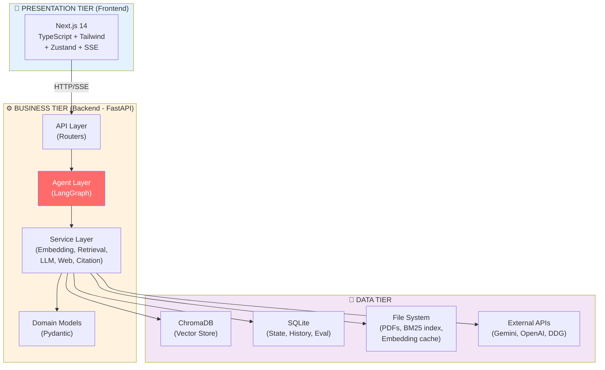
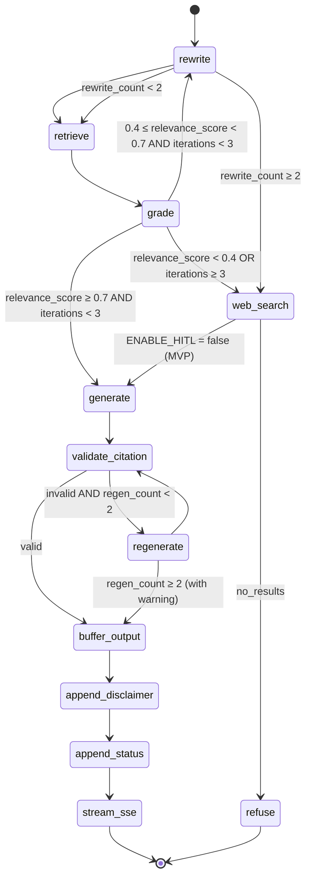
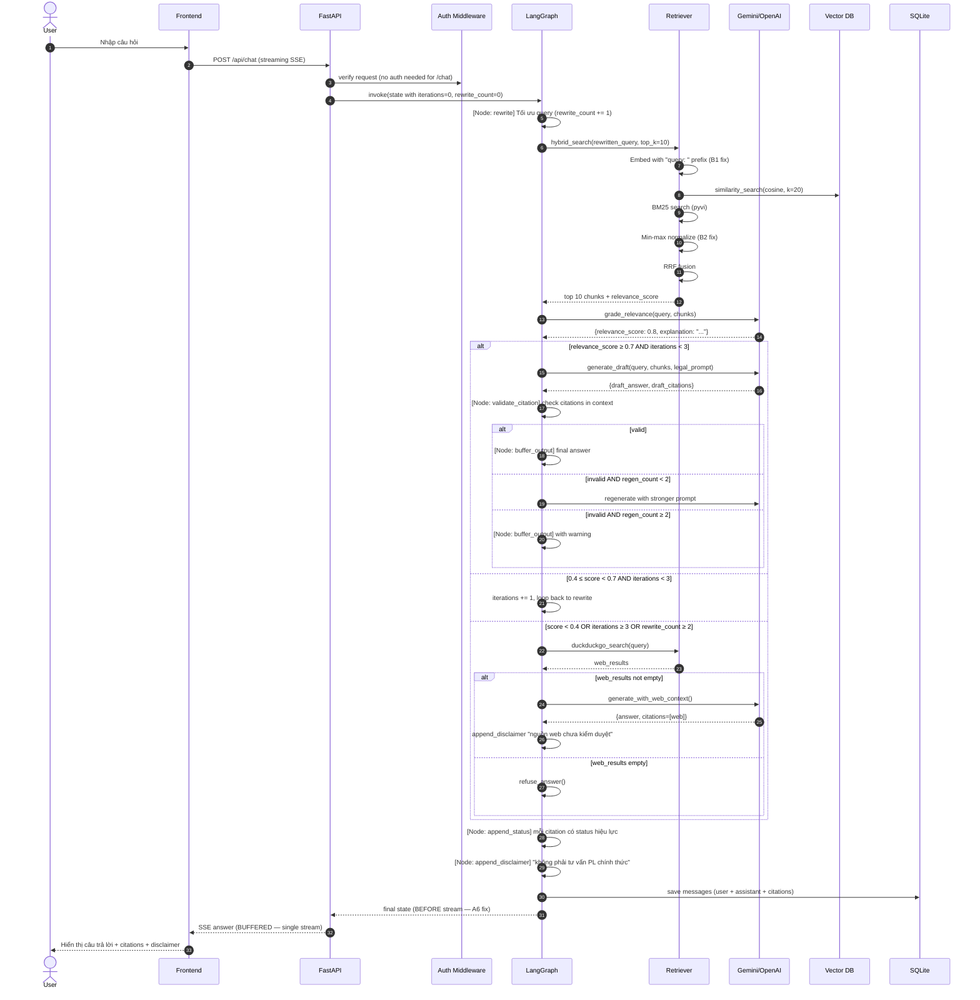
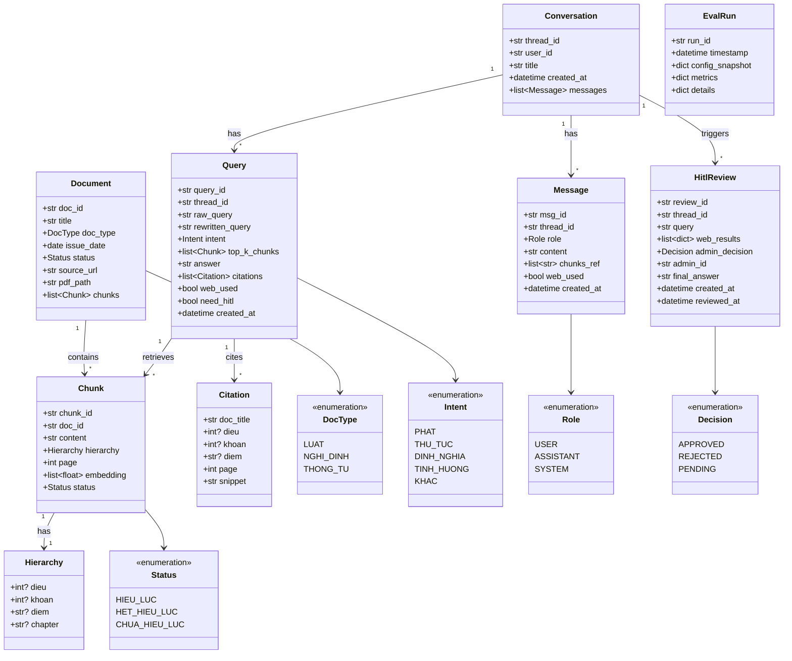
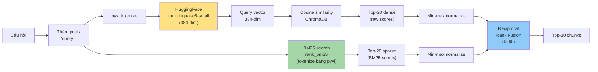
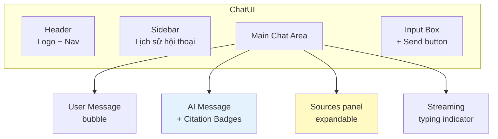
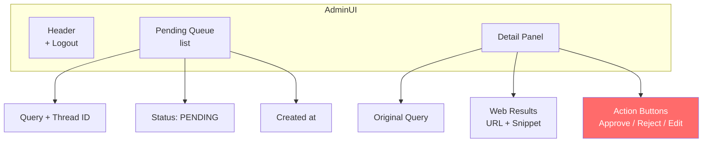

# 03. Thiết Kế Hệ Thống (System Design)

> **Giai đoạn SDLC**: 3 — Thiết kế
> **Ngày tạo**: 16/06/2026

---

## 3.1. Nguyên tắc thiết kế

1. **Kiến trúc đa tầng (N-tier)** — Tách rõ Presentation / Business / Data
2. **Single Responsibility** — Mỗi module 1 trách nhiệm
3. **Dependency Inversion** — Service interface, không phụ thuộc implementation cụ thể
4. **Open/Closed** — Dễ mở rộng (thêm LLM, thêm retrieval) không sửa code cũ
5. **Fail Fast** — Validate input ngay từ API layer
6. **Stateless API** — State lưu ở SQLite, không in-memory

---

## 3.2. Kiến trúc tổng quan (System Architecture)

### 3.2.1. Sơ đồ 3 tầng (Multi-tier)



### 3.2.2. Lý do chọn kiến trúc này

| Quyết định | Lý do |
|------------|-------|
| **Client-Server tập trung** (không microservices) | Hệ thống nhỏ, 1 SV quản lý được, triển khai nhanh |
| **3-tier architecture** | Tách rõ trách nhiệm, dễ test, dễ mở rộng |
| **Stateful Agent (LangGraph + SQLite)** | Cần state persistence cho tracing; HITL deferred Phase 2 |
| **Stateless API** | Dễ scale, dễ test |
| **Sync API + SSE streaming** | Phù hợp chat UX |

---

## 3.3. Kiến trúc chi tiết Backend

### 3.3.1. Sơ đồ package

```
backend/app/
├── main.py                 # FastAPI entry, mount routers
├── config.py               # Pydantic Settings (env)
├── api/                    # API Layer (Routers)
│   ├── chat.py             # /api/chat, /api/chat/stream
│   ├── search.py           # /api/search
│   ├── admin.py            # /api/admin/* (HITL)
│   ├── ingest.py           # /api/ingest (upload PDF)
│   └── eval.py             # /api/eval (run evaluation)
├── agents/                 # Agent Layer (LangGraph)
│   ├── graph.py            # StateGraph definition
│   ├── state.py            # AgentState TypedDict
│   └── nodes/
│       ├── rewrite.py      # Query rewrite
│       ├── retrieve.py     # Hybrid retrieval
│       ├── grade.py        # Document grading (LLM relevance score)
│       ├── generate.py     # Answer generation (JSON mode enforced)
│       ├── web_search.py   # Web fallback (DDG + SerpAPI fallback)
│       └── validate.py     # Citation validation + disclaimer + status
├── services/               # Service Layer
│   ├── embedding.py        # EmbeddingService (HuggingFace)
│   ├── llm.py              # LLMService (Gemini + OpenAI)
│   ├── retrieval.py        # HybridRetrieval (Dense + BM25 + RRF)
│   ├── web_search.py       # WebSearchService (DuckDuckGo)
│   ├── citation.py         # CitationValidator
│   ├── evaluation.py       # RAGAS-lite
│   └── prompts.py          # PromptLoader
├── db/                     # Data Access Layer
│   ├── vector_store.py     # ChromaDB wrapper
│   ├── sql_store.py        # SQLAlchemy + SQLite
│   └── bm25_index.py       # BM25 index manager
├── parsers/                # Document Processing
│   ├── pdf_parser.py       # PyMuPDF wrapper
│   ├── law_chunker.py      # Custom chunker for PLVN
│   └── cleaners/
│       ├── clean_luat.py
│       ├── clean_nghi_dinh.py
│       └── clean_thong_tu.py
├── models/                 # Pydantic schemas
│   ├── schemas.py          # Request/Response models
│   └── enums.py            # Intent, DocType, Status
└── utils/
    ├── logger.py           # Logging config
    └── text.py             # Text utilities
```

### 3.3.2. Concurrency & Thread Safety (POST-REVIEW C1 + Machine Update)

> **CRITICAL FIX (C1)**: ChromaDB `PersistentClient` + FastAPI multi-worker = demo hang/corruption. Reference: chroma-core/chroma#7040, #1584, #2325.
> 
> **Machine note (17/06)**: i5-1035G1 (4C/8T) — single worker la toi uu cho CPU nay. Khong can multi-worker vi LLM calls la remote API, khong phai CPU-bound.

**Vấn đề**:
- ChromaDB uses SQLite internally with 1000s busy_timeout, no WAL by default
- FastAPI default runs with `workers = (2 * CPU) + 1` (so 13 workers on i5-10400)
- Concurrent access from multiple workers → 16-min hangs, segfaults, or permanent DB corruption

**Giải pháp (chọn 1 trong 2)**:

**Option A: Single worker + WAL mode (Recommended cho MVP)**:

```python
# app/main.py — C1 fix
from chromadb import PersistentClient
from chromadb.config import Settings

# Initialize ONCE at module level (shared via import)
chroma_client = PersistentClient(
    path="./chroma_db",
    settings=Settings(
        anonymized_telemetry=False,
        allow_reset=False,
        # C1 fix: Enable WAL mode for SQLite
        is_persistent=True
    )
)

# C1 fix: Run WAL pragma after each connection
import sqlite3
def enable_wal():
    conn = sqlite3.connect("./chroma_db/chroma.sqlite3")
    conn.execute("PRAGMA journal_mode=WAL")
    conn.close()
```

```bash
# Run Uvicorn with EXACTLY 1 worker
# C1 fix: concurrency cap
uvicorn app.main:app --workers 1 --host 0.0.0.0 --port 8000
```

```yaml
# docker-compose.yml — C1 fix
services:
  backend:
    command: uvicorn app.main:app --workers 1 --host 0.0.0.0 --port 8000
```

**Option B: Switch to Qdrant (Docker-based, proper concurrency)**: 
- Pros: handles concurrency, faster
- Cons: needs Docker container, more complex setup
- Decision: **NOT in MVP** (deferred to Phase 2 if needed)

**Concurrent access for SQLite state DB (M2 fix)**: 
```python
# app/db/sql_store.py — M2 fix
from sqlalchemy import create_engine, event

engine = create_engine(
    "sqlite:///./data/state.db",
    connect_args={"check_same_thread": False, "timeout": 30}
)

@event.listens_for(engine, "connect")
def set_sqlite_pragma(dbapi_connection, connection_record):
    """M2 fix: WAL mode for concurrent access."""
    cursor = dbapi_connection.cursor()
    cursor.execute("PRAGMA journal_mode=WAL")
    cursor.execute("PRAGMA synchronous=NORMAL")
    cursor.close()
```

**Document this trade-off in thesis**:
> "Hệ thống chạy single-worker (--workers 1) để tránh ChromaDB concurrency issues. Trade-off: throughput thấp hơn multi-worker (~2.5 q/min vs 13 q/min theoretical), nhưng correctness được đảm bảo."

---

> **Đã thay đổi (A5, A6, A7)**: 
> - **HITL dropped** (không còn `hitl_review` node, deferred sang Phase 2)
> - **Single retry mechanism** với `iterations` counter + hard cap 3
> - **Buffer-validate-stream**: generate + validate TRƯỚC khi stream
> - **Disclaimer + Effectivity** luôn append ở cuối



> **Loop guards (A5 fix)**:
> - `iterations` cap ở 3 (nếu vượt → web_search hoặc refuse)
> - `rewrite_count` cap ở 2 (nếu vượt → web_search)
> - `regen_count` cap ở 2 (nếu vượt → buffer với warning)

### 3.3.3. AgentState Definition (POST-REVIEW A5)

```python
# agents/state.py
from typing import TypedDict, Annotated, Sequence
from langchain_core.messages import BaseMessage
import operator

class AgentState(TypedDict):
    # Input
    query: str                                    # Câu hỏi gốc
    query_id: str                                 # Unique per request (B9 audit)
    thread_id: str | None                         # Optional session ID
    
    # After rewrite
    rewritten_query: str
    rewrite_count: int                            # A5 fix: HARD CAP 2
    
    # After retrieve
    chunks: list[dict]                            # Top-10 retrieved chunks
    retrieval_method: str                         # "dense" | "bm25" | "hybrid"
    
    # After grade
    relevance_score: float                        # B3 fix: THE score for routing
    grade_explanation: str
    
    # For web search fallback
    web_results: list[dict] | None
    web_used: bool
    
    # After generate
    draft_answer: str | None                      # BUFFER before validate
    draft_citations: list[dict]
    
    # After validate_citation
    answer: str                                   # FINAL — only this is streamed
    citations: list[dict]                         # VALIDATED only
    validation_warnings: list[str]                # Citations that failed
    regen_count: int                              # A5 fix: HARD CAP 2
    
    # A8 fix: Disclaimer + status (always appended)
    disclaimer: str
    citation_statuses: dict                       # {citation_id: status_text}
    
    # Loop control
    iterations: int                               # A5 fix: HARD CAP 3
    
    # Metadata
    start_time: float
    latency_ms: int
    error: str | None
```

### 3.3.4. Luồng dữ liệu chi tiết (Sequence Diagram) — POST-REVIEW A5, A6, A8



---

## 3.4. Class Diagram (Domain Model)



---

## 3.5. Thiết kế cơ sở dữ liệu

### 3.5.1. ChromaDB Collection (POST-REVIEW C1, C5)

> **Đã fix (C1, C5)**:
> - `CHUABIEU` typo → `CHUA_HIEU_LUC` (sẽ có hiệu lực trong tương lai)
> - Date field standardized: `effective_date` (start) + `expiry_date` (end, nullable)

```python
# Collection: law_chunks
{
    "ids": ["nghi_dinh_168_2024__dieu_6__khoan_2__diem_a"],
    "documents": [
        "passage: Phạt tiền từ 4.000.000 đồng đến 6.000.000 đồng đối với người điều khiển xe mô tô, xe gắn máy không chấp hành tín hiệu đèn điều khiển giao thông..."
        # B1 fix: "passage: " prefix auto-prepended by embedding service
    ],
    "embeddings": [[0.012, -0.034, ...]],  # 384-dim
    "metadatas": [
        {
            "doc_id": "nghi_dinh_168_2024",
            "doc_title": "Nghị định 168/2024/NĐ-CP",
            "doc_type": "NGHI_DINH",       # Enum: LUAT | NGHI_DINH | THONG_TU
                                        # C2 fix: PHAP_DIEN removed (dead)
            "chapter": "Chương II",
            "dieu": 6,
            "khoan": 2,
            "diem": "a",
            "page": 3,
            "status": "HIEU_LUC",         # C1 fix: Enum HIEU_LUC | HET_HIEU_LUC | CHUA_HIEU_LUC
            "effective_date": "2025-01-01",  # C5 fix: standardized date field
            "expiry_date": null,             # C5 fix: nullable, filled when known
            "url": "https://..."
        }
    ]
}
```

### 3.5.2. SQLite Schema (SQLAlchemy) — POST-REVIEW C1, C2, C3, C4, C5

> **Đã fix (C1-C5)**:
> - **C1**: Status enum chuẩn: `HIEU_LUC | HET_HIEU_LUC | CHUA_HIEU_LUC` (đã sửa typo)
> - **C2**: PHAP_DIEN removed (dead enum value)
> - **C3**: Class diagram ↔ SQL schema aligned: Conversation, Message, EvalRun, Document
> - **C4**: Document table thêm `chunk_count` + `file_hash` để track ingest; Message có `query_id` (link to EvalRun nếu là eval)
> - **C5**: Date field standardized

```python
# db/sql_store.py
from sqlalchemy import Column, String, Text, Integer, DateTime, JSON, Boolean, ForeignKey, Enum, Index
from sqlalchemy.orm import relationship, declarative_base
import enum

Base = declarative_base()

class DocTypeEnum(str, enum.Enum):
    """C2 fix: PHAP_DIEN removed (no parser/cleaner for it)."""
    LUAT = "LUAT"
    NGHI_DINH = "NGHI_DINH"
    THONG_TU = "THONG_TU"

class StatusEnum(str, enum.Enum):
    """C1 fix: 3 values, no typo."""
    HIEU_LUC = "HIEU_LUC"             # Currently in effect
    HET_HIEU_LUC = "HET_HIEU_LUC"     # Expired
    CHUA_HIEU_LUC = "CHUA_HIEU_LUC"   # Not yet effective (future)

class DecisionEnum(str, enum.Enum):
    """HITL enum (kept for future use, A7 deferred)."""
    PENDING = "PENDING"
    APPROVED = "APPROVED"
    REJECTED = "REJECTED"

class Document(Base):
    """C3 fix: New table for tracking source documents (not just chunks)."""
    __tablename__ = "documents"
    
    doc_id = Column(String, primary_key=True)        # e.g., "nghi_dinh_168_2024"
    title = Column(String, nullable=False)
    doc_type = Column(Enum(DocTypeEnum), nullable=False)
    issue_date = Column(DateTime, nullable=True)        # When issued
    effective_date = Column(DateTime, nullable=True)    # C5 fix: standardized
    expiry_date = Column(DateTime, nullable=True)       # C5 fix: nullable
    status = Column(Enum(StatusEnum), default=StatusEnum.HIEU_LUC)
    source_url = Column(String, nullable=True)
    pdf_path = Column(String, nullable=True)
    file_hash = Column(String, nullable=True, index=True)  # Dedup
    chunk_count = Column(Integer, default=0)              # Updated on ingest
    created_at = Column(DateTime)
    updated_at = Column(DateTime)

class Conversation(Base):
    __tablename__ = "conversations"
    
    thread_id = Column(String, primary_key=True)
    user_id = Column(String, nullable=True, index=True)
    title = Column(String)
    created_at = Column(DateTime, index=True)  # C3 fix: index for retention purge
    updated_at = Column(DateTime)
    
    messages = relationship("Message", back_populates="conversation", cascade="all, delete-orphan")

class Message(Base):
    __tablename__ = "messages"
    
    msg_id = Column(String, primary_key=True)
    query_id = Column(String, nullable=True, index=True)  # A3 fix: link to eval/query
    thread_id = Column(String, ForeignKey("conversations.thread_id"), index=True)
    role = Column(String)  # user | assistant | system
    content = Column(Text)
    chunks_ref = Column(JSON)  # list of chunk_ids used
    citations = Column(JSON)   # A2 fix: structured citations {doc_id, dieu, khoan, diem, status}
    web_used = Column(Boolean, default=False)
    web_sources = Column(JSON, nullable=True)  # URLs if web_used=True
    intent = Column(String, nullable=True)
    relevance_score = Column(Integer, nullable=True)  # B3 fix: explicit field
    latency_ms = Column(Integer, nullable=True)
    created_at = Column(DateTime, index=True)
    
    conversation = relationship("Conversation", back_populates="messages")

class HitlReview(Base):
    """Kept for A7 future use; not active in MVP."""
    __tablename__ = "hitl_reviews"
    
    review_id = Column(String, primary_key=True)
    query_id = Column(String, ForeignKey("messages.query_id"), index=True)  # C4 fix: link via query_id
    thread_id = Column(String, ForeignKey("conversations.thread_id"), index=True)
    query = Column(Text)
    web_results = Column(JSON)
    admin_decision = Column(Enum(DecisionEnum), default=DecisionEnum.PENDING)
    admin_id = Column(String, nullable=True)
    final_answer = Column(Text, nullable=True)
    created_at = Column(DateTime, index=True)
    reviewed_at = Column(DateTime, nullable=True)

class EvalRun(Base):
    __tablename__ = "eval_runs"
    
    run_id = Column(String, primary_key=True)
    timestamp = Column(DateTime, index=True)
    variant = Column(String)  # V1_dense, V2_bm25, V3_hybrid
    generator_llm = Column(String)   # A3 fix: which LLM generated
    judge_llm = Column(String)       # A3 fix: which LLM judged
    config_snapshot = Column(JSON)
    metrics = Column(JSON)  # {citation_correctness, faithfulness, answer_relevancy, ...}
    details = Column(JSON)
    num_questions = Column(Integer)
    duration_seconds = Column(Integer)
```

---

## 3.6. Thiết kế Retrieval (Hybrid) — POST-REVIEW B1, B2, B5, H6

### Vietnamese Text Normalization (H6 fix)

> **H6 fix**: Văn bản pháp luật Việt Nam dùng hỗn hợp định dạng số (1., 1), a), (a)), dấu gạch ngang (–, -, —) và biến thể chữ hoa/chữ thường (Điều/điều/ĐIỀU). Nếu không normalize, BM25 và embedding sẽ degrade silent.

```python
# parsers/cleaners/normalize.py — H6 fix
import re
import unicodedata

class VietnameseNormalizer:
    """Normalize Vietnamese legal text for consistent BM25 tokenization."""
    
    @staticmethod
    def normalize(text: str) -> str:
        """Apply all normalization steps."""
        t = text
        t = VietnameseNormalizer.lowercase(t)
        t = VietnameseNormalizer.unify_dashes(t)
        t = VietnameseNormalizer.strip_punctuation(t)
        t = VietnameseNormalizer.normalize_unicode(t)
        return t
    
    @staticmethod
    def lowercase(t: str) -> str:
        """Normalize legal section labels: Điều → điều, Khoản → khoản, Điểm → điểm"""
        return t.replace("Điều", "điều").replace("Khoản", "khoản")\
                .replace("Điểm", "điểm").replace("Chương", "chương")\
                .replace("Phụ lục", "phụ lục").replace("Mục", "mục")
    
    @staticmethod
    def unify_dashes(t: str) -> str:
        """Unify dashes: – — ‒ → -"""
        for dash in ["–", "—", "‒", "−"]:
            t = t.replace(dash, "-")
        return t
    
    @staticmethod
    def strip_punctuation(t: str) -> str:
        """Normalize numbering: '1.' '1)' '1.' → ' 1 ' (space-padded for BM25)"""
        # Section labels like "1.", "1)", "a)" → " 1 ", " a "
        t = re.sub(r'\b(\d+|[a-z])[.)]\s', r' \1 ', t)
        return t
    
    @staticmethod
    def normalize_unicode(t: str) -> str:
        """NFC normalize to handle composite vs decomposed Vietnamese chars."""
        return unicodedata.normalize("NFC", t)
```

### 3.6.1. Pipeline (B1 fix: E5 prefix)

> **Đã thay đổi (B1, B5)**:
> - **E5 model yêu cầu prefix `query: ` và `passage: `** — silent degradation nếu thiếu
> - **Drop reranker** (V4) vì MX330 OOM; thay bằng dense + BM25 hybrid đơn thuần
> - **B2 fix (TODO Tier 3)**: Score normalization sẽ implement trong code



### 3.6.2. E5 Prefix Contract (B1 fix — CRITICAL)

> **multilingual-e5-small** yêu cầu prefix nghiêm ngặt:
> - **Query**: `"query: " + text` (khi encode câu hỏi)
> - **Passage**: `"passage: " + text` (khi encode chunk lúc ingest)
> 
> **Nếu thiếu prefix**: retrieval Recall giảm 20-40% (paper của Wang et al., 2024)

```python
# services/embedding.py — POST-REVIEW B1 + M5 (force CPU)
import torch
from sentence_transformers import SentenceTransformer

class EmbeddingService:
    MODEL_NAME = "intfloat/multilingual-e5-small"
    QUERY_PREFIX = "query: "
    PASSAGE_PREFIX = "passage: "
    
    def __init__(self):
        # M5 fix: force CPU — MX330 2GB VRAM may OOM with CUDA
        # sentence-transformers auto-detects CUDA, but MX330 is too weak
        # Machine (17/06): i5-1035G1 4C/8T — embedding on CPU ~300-500ms/passage
        self.model = SentenceTransformer(
            self.MODEL_NAME,
            device="cpu"  # M5 fix: explicit CPU, avoid OOM on MX330
        )
    
    def embed_query(self, text: str) -> list[float]:
        """B1 fix: MUST prepend 'query: ' for E5."""
        if not text.startswith(self.QUERY_PREFIX):
            text = self.QUERY_PREFIX + text
        return self.model.encode(text, normalize_embeddings=True).tolist()
    
    def embed_passages(self, texts: list[str]) -> list[list[float]]:
        """B1 fix: MUST prepend 'passage: ' for E5 at ingest time."""
        prefixed = [
            t if t.startswith(self.PASSAGE_PREFIX) else self.PASSAGE_PREFIX + t
            for t in texts
        ]
        return self.model.encode(prefixed, normalize_embeddings=True).tolist()
```

### 3.6.3. Reciprocal Rank Fusion (RRF) — POST-REVIEW B2 fix

```python
# Công thức RRF gốc (Cormack et al., 2009). k=60 là constant.
def rrf_score(rank_dense, rank_bm25, k=60):
    return 1.0 / (k + rank_dense) + 1.0 / (k + rank_bm25)

def normalize_scores(scores: list[float]) -> list[float]:
    """B2 fix: Min-max normalize to [0, 1] BEFORE combining."""
    if not scores:
        return []
    min_s, max_s = min(scores), max(scores)
    if max_s == min_s:
        return [0.5] * len(scores)
    return [(s - min_s) / (max_s - min_s) for s in scores]
```

> **B2 fix quan trọng**: Bỏ hẳn additive `apply_intent_boost()`. Boost bằng cách rerank (đẩy chunk có metadata khớp lên top) thay vì cộng score trực tiếp vào RRF.

### 3.6.4. Hybrid Retrieval (B2 + B4 fix)

```python
# services/retrieval.py
from rank_bm25 import BM25Okapi
import chromadb
from pyvi import ViTokenizer
import numpy as np
import pickle
from pathlib import Path

class HybridRetriever:
    def __init__(self, use_bm25=True, use_reranker=False):
        self.client = chromadb.PersistentClient(path="./chroma_db")
        self.collection = self.client.get_collection("law_chunks")
        self.bm25 = None
        self.bm25_corpus = []
        if use_bm25:
            self._load_bm25()  # B4 fix: load from pickle on disk
    
    def _load_bm25(self):
        """B4 fix: Load BM25 from disk pickle, rebuild if missing."""
        bm25_path = Path("./data/bm25_index.pkl")
        if bm25_path.exists():
            with open(bm25_path, "rb") as f:
                data = pickle.load(f)
                self.bm25 = data["bm25"]
                self.bm25_corpus = data["corpus"]
        else:
            self._rebuild_bm25()
    
    def _rebuild_bm25(self):
        """B4 fix: rank-bm25 is in-memory only, no incremental add.
        Must rebuild full from ChromaDB."""
        all_chunks = self.collection.get(include=["documents"])
        documents = all_chunks["documents"]
        tokenized = [ViTokenizer.tokenize(doc).split() for doc in documents]
        self.bm25 = BM25Okapi(tokenized)
        self.bm25_corpus = documents
        # Persist
        Path("./data").mkdir(parents=True, exist_ok=True)
        with open("./data/bm25_index.pkl", "wb") as f:
            pickle.dump({"bm25": self.bm25, "corpus": documents}, f)
    
    def retrieve(self, query: str, top_k: int = 10):
        # 1. Embed query (B1: "query: " prefix auto-added)
        query_emb = self.embedding.embed_query(query)
        
        # 2. Dense retrieval top-20
        dense_results = self.collection.query(
            query_embeddings=[query_emb], n_results=20,
            include=["documents", "metadatas", "distances"]
        )
        dense_chunks = self._format_results(dense_results)
        dense_scores = [1.0 - d for d in dense_results["distances"][0]]  # cosine sim
        
        if not self.bm25:
            return dense_chunks[:top_k]
        
        # 3. BM25 retrieval top-20
        tokenized_query = ViTokenizer.tokenize(query).split()
        bm25_scores_all = self.bm25.get_scores(tokenized_query)
        top_bm25_idx = np.argsort(bm25_scores_all)[-20:][::-1]
        bm25_chunks = [self._format_bm25(i) for i in top_bm25_idx]
        bm25_scores = [bm25_scores_all[i] for i in top_bm25_idx]
        
        # 4. B2 fix: Min-max normalize BEFORE RRF
        dense_norm = normalize_scores(dense_scores)
        bm25_norm = normalize_scores(bm25_scores)
        
        # 5. RRF fusion
        fused = {}
        for rank, (chunk, _) in enumerate(zip(dense_chunks, dense_norm)):
            fused[chunk["id"]] = {"chunk": chunk, "rrf": 1.0 / (60 + rank)}
        for rank, (chunk, _) in enumerate(zip(bm25_chunks, bm25_norm)):
            if chunk["id"] in fused:
                fused[chunk["id"]]["rrf"] += 1.0 / (60 + rank)
            else:
                fused[chunk["id"]] = {"chunk": chunk, "rrf": 1.0 / (60 + rank)}
        
        # 6. Sort and return top-k
        sorted_chunks = sorted(fused.values(), key=lambda x: x["rrf"], reverse=True)
        return [item["chunk"] for item in sorted_chunks[:top_k]]
```

### 3.6.5. Ingest Pipeline (POST-REVIEW B4)

```python
# scripts/ingest_corpus.py
def ingest_new_documents(pdf_paths: list[str], doc_type: str):
    """B4 fix: append to ChromaDB, FULL REBUILD BM25.
    Note: rank-bm25 doesn't support incremental add."""
    new_chunks = []
    for pdf_path in pdf_paths:
        chunks = parse_and_chunk(pdf_path, doc_type)
        new_chunks.extend(chunks)
    
    # Add to ChromaDB (true append)
    embeddings = embedding_service.embed_passages([c["content"] for c in new_chunks])
    collection.add(
        ids=[c["id"] for c in new_chunks],
        documents=[c["content"] for c in new_chunks],
        embeddings=embeddings,
        metadatas=[c["metadata"] for c in new_chunks]
    )
    
    # B4 fix: Full rebuild BM25
    retriever._rebuild_bm25()
    
    # Update Document table
    for pdf in pdf_paths:
        doc_id = Path(pdf).stem
        session.execute(
            update(Document).where(Document.doc_id == doc_id).values(
                chunk_count=len([c for c in new_chunks if c["metadata"]["doc_id"] == doc_id]),
                updated_at=datetime.now()
            )
        )
```

---

## 3.7. Thiết kế Prompts

### 3.7.1. Citation Extraction Pipeline (POST-REVIEW C3 — CRITICAL)

> **C3 fix (CRITICAL)**: Citation Correctness metric needs `generated_citations` as list[dict], nhưng Legal Reasoning Prompt returns free text. Không có parser → headline metric = 0% always.

**Pipeline định nghĩa rõ ràng**:

```python
# services/citation.py — POST-REVIEW C3
import re
import json
from typing import List, Dict

class CitationExtractor:
    """Extract structured citations from LLM output (JSON or text fallback)."""
    
    # Regex for Vietnamese legal citation format
    PATTERNS = {
        "nghi_dinh": r"Nghị\s*định\s*(?:số\s*)?(\d+)/(\d{4})/NĐ-CP",
        "luat": r"Luật\s*(?:số\s*)?(\d+)/(\d{4})/QH\d+",
        "thong_tu": r"Thông\s*tư\s*(?:số\s*)?(\d+)/(\d{4})/TT-[A-Z]+",
        "dieu": r"Điều\s*(\d+)",
        "khoan": r"Khoản\s*(\d+)",
        "diem": r"(?:Điểm|điểm)\s*([a-z\d]+)"
    }
    
    def extract(self, llm_output) -> List[Dict]:
        """Try JSON parse first, fallback to regex extraction."""
        if isinstance(llm_output, dict):
            return self._parse_json(llm_output)
        
        if isinstance(llm_output, str):
            try:
                json_match = re.search(r'\{[^{}]*"citations"[^{}]*\}', llm_output)
                if json_match:
                    return self._parse_json(json.loads(json_match.group()))
            except (json.JSONDecodeError, AttributeError):
                pass
            return self._extract_from_text(llm_output)
        return []
    
    def _parse_json(self, data: dict) -> List[Dict]:
        citations = []
        for c in data.get("citations", []):
            citations.append({
                "doc_id": self._normalize_doc_id(c.get("doc_title", "")),
                "dieu": c.get("dieu"),
                "khoan": c.get("khoan"),
                "diem": c.get("diem"),
                "raw": c
            })
        return citations
    
    def _extract_from_text(self, text: str) -> List[Dict]:
        citations = []
        pattern = (
            r"\[([^\]]*?(?:Nghị\s*định|Luật|Thông\s*tư)[^\]]*?"
            r"Điều\s*(\d+)(?:,\s*Khoản\s*(\d+))?(?:,\s*[ĐĐ]iểm\s*([a-z\d]))?[^\]]*)\]"
        )
        for match in re.finditer(pattern, text):
            full_text = match.group(1)
            citations.append({
                "doc_id": self._extract_doc_id(full_text),
                "dieu": int(match.group(2)) if match.group(2) else None,
                "khoan": int(match.group(3)) if match.group(3) else None,
                "diem": match.group(4),
                "raw_text": full_text
            })
        return citations
    
    # N2 fix: these were referenced but never defined — now added
    def _normalize_doc_id(self, doc_title: str) -> str | None:
        """e.g. 'Nghị định 168/2024/NĐ-CP' → 'nghi_dinh_168_2024'"""
        import re
        title_lower = doc_title.lower()
        doc_type_map = {"nghị định": "nghi_dinh", "luật": "luat", "thông tư": "thong_tu"}
        doc_type = None
        for vn, en in doc_type_map.items():
            if vn in title_lower:
                doc_type = en
                break
        num = re.search(r"(\d+)/(\d{4})", title_lower)
        if doc_type and num:
            return f"{doc_type}_{num.group(1)}_{num.group(2)}"
        return re.sub(r"[\s/]+", "_", title_lower.strip().replace("-", "_"))
    
    def _extract_doc_id(self, full_text: str) -> str | None:
        return self._normalize_doc_id(full_text)
```

### 3.7.2. Legal Reasoning Prompt (JSON mode enforced) — POST-REVIEW C3, M1

> **C3 + M1 fix**: Generator MUST output JSON with structured `answer` + `citations` fields. B11 JSON mode applies here too.

```text
Bạn là trợ lý AI chuyên về pháp luật giao thông Việt Nam.
Nhiệm vụ: Trả lời câu hỏi dựa trên CONTEXT được cung cấp.

# QUY TẮC BẮT BUỘC (14 quy tắc)

1. CHỈ sử dụng thông tin từ CONTEXT bên dưới. KHÔNG dùng kiến thức bên ngoài.
2. MỌI thông tin quan trọng phải có trích dẫn dạng:
   [Tên văn bản, Điều X, Khoản Y, Điểm Z]
3. TUYỆT ĐỐI KHÔNG bịa số tiền phạt, điểm trừ, điều khoản.
4. Nếu CONTEXT không đủ thông tin → trả lời: "Tôi không tìm thấy thông tin trong cơ sở dữ liệu hiện có."
5. (OVERRIDE cho câu hỏi tình huống "lỗi của ai"):
   Bước 1: Liệt kê các hành vi thực tế trong câu hỏi
   Bước 2: Đối chiếu từng hành vi với CONTEXT
   Bước 3: Kết luận: lỗi đơn / lỗi hỗn hợp / không xác định
   Bước 4: Lưu ý: "Tỷ lệ % lỗi cuối cùng phải do CSGT xác định tại hiện trường."
6. Trả lời ngắn gọn, rõ ràng, dùng bullet points khi liệt kê.
7. Sử dụng định dạng Markdown.
8. Giọng văn chuyên nghiệp, khách quan.
9. Nếu có nhiều văn bản liên quan, ưu tiên văn bản mới nhất còn hiệu lực.
10. Khi trích dẫn số tiền, ghi rõ đơn vị (đồng) và khoảng (từ X đến Y).
11. Khi câu hỏi liên quan đến thủ tục, liệt kê các bước theo thứ tự.
12. Nếu có thắc mắc về tính hiệu lực, ghi rõ "(văn bản còn hiệu lực)" hoặc "(văn bản đã hết hiệu lực)".
13. KHÔNG dùng từ ngữ không chắc chắn như "có thể", "chắc là" trong trích dẫn số liệu.
14. Cuối câu trả lời, LUÔN có phần "📚 Nguồn tham khảo:" liệt kê các citation.

# CONTEXT
{context}

# CÂU HỎI
{query}

# TRẢ LỜI
```

### 3.7.2. RAGAS-lite Prompts (4 metrics)

```text
# Faithfulness
Cho context và answer, đánh giá xem answer có trung thành với context không.
Trả lời chỉ một số 0-1.
Context: {context}
Answer: {answer}
Faithfulness: ?

# Answer Relevancy
Cho question và answer, đánh giá xem answer có liên quan đến question không.
Score 0-1.
Question: {question}
Answer: {answer}
Relevancy: ?

# Context Precision
Cho question và contexts, đánh giá xem các context có chứa đáp án đúng và xếp hạng đúng không.
Score 0-1.
Question: {question}
Contexts: {contexts}
Precision: ?

# Context Recall
Cho question, expected_answer, contexts, đánh giá xem contexts có chứa thông tin để trả lời expected_answer không.
Score 0-1.
Question: {question}
Expected: {expected_answer}
Contexts: {contexts}
Recall: ?
```

---

## 3.8. Thiết kế giao diện (UI/UX)

### 3.8.1. Trang chính (Chat)



### 3.8.2. Trang Admin (HITL)



### 3.8.3. Component chính

- `ChatWindow.tsx` — Khung chat với streaming
- `MessageBubble.tsx` — Tin nhắn user/assistant
- `CitationBadge.tsx` — Badge cho mỗi citation `[NĐ 168, Điều 6]`
- `StreamingResponse.tsx` — Xử lý SSE
- `AdminQueue.tsx` — Queue HITL

---

## 3.9. Cấu trúc thư mục dự án

```
vnlaw-agentic-rag/
├── README.md
├── LICENSE
├── docker-compose.yml
├── .env.example
├── .github/
│   └── workflows/
│       ├── ci.yml                  # Lint + test
│       └── deploy.yml              # Build + deploy
├── backend/
│   ├── pyproject.toml              # uv / PEP 621
│   ├── Dockerfile
│   ├── poetry.lock
│   ├── app/
│   │   ├── main.py
│   │   ├── config.py
│   │   ├── api/
│   │   ├── agents/
│   │   ├── services/
│   │   ├── db/
│   │   ├── parsers/
│   │   ├── models/
│   │   ├── prompts/
│   │   └── utils/
│   ├── data/
│   │   ├── pdfs/                   # 30 PDFs gốc
│   │   ├── corpus/                 # JSON đã parse
│   │   └── gold_set.json           # 30-50 câu test
│   ├── tests/
│   │   ├── conftest.py
│   │   ├── test_parsers.py
│   │   ├── test_retrieval.py
│   │   ├── test_agents.py
│   │   ├── test_api.py
│   │   └── test_retrieval_regression.py
│   └── scripts/
│       ├── crawl_pdfs.py
│       ├── ingest_corpus.py
│       └── run_eval.py
├── frontend/
│   ├── package.json
│   ├── next.config.js
│   ├── tailwind.config.ts
│   ├── tsconfig.json
│   ├── app/
│   │   ├── layout.tsx
│   │   ├── page.tsx
│   │   ├── chat/page.tsx
│   │   ├── search/page.tsx
│   │   ├── admin/page.tsx
│   │   └── docs/page.tsx
│   ├── components/
│   ├── lib/
│   └── store/
└── docs/                            # ← Tài liệu thiết kế (file này)
    ├── 01-phan-tich-kha-thi.md
    ├── 02-yeu-cau-he-thong.md
    ├── 03-thiet-ke-he-thong.md
    ├── ...
    └── images/
```

---

## 3.10. API Design

### 3.10.1. REST API Endpoints

| Method | Path | Mô tả | Auth |
|--------|------|-------|------|
| POST | `/api/chat` | Gửi câu hỏi, trả về streaming | - |
| POST | `/api/chat/stream` | SSE streaming response | - |
| GET | `/api/conversations/{thread_id}` | Lấy lịch sử | - |
| GET | `/api/search?q=...` | Tìm kiếm từ khóa | - |
| POST | `/api/ingest` | Upload PDF (multipart) | Admin |
| GET | `/api/admin/pending` | List HITL pending | Admin |
| POST | `/api/admin/approve/{review_id}` | Approve HITL | Admin |
| POST | `/api/admin/reject/{review_id}` | Reject HITL | Admin |
| POST | `/api/eval/run` | Chạy evaluation | Admin |
| GET | `/api/eval/results` | Xem kết quả | - |
| GET | `/api/health` | Health check | - |
| GET | `/api/docs` | Swagger UI (auto) | - |

### 3.10.2. Request/Response Schema (Ví dụ)

```python
# POST /api/chat — POST-REVIEW N5 (remove intent/confidence, add disclaimer/statuses)
class ChatRequest(BaseModel):
    query: str
    thread_id: str | None = None
    user_id: str | None = None

class Citation(BaseModel):
    doc_title: str
    doc_id: str | None = None         # N2: for Citation Correctness metric
    dieu: int | None = None
    khoan: int | None = None
    diem: str | None = None
    page: int
    snippet: str
    status: str = "HIEU_LUC"           # FR-10: effectivity status
    warning: str | None = None         # For expired/invalid citations

class ValidationWarning(BaseModel):
    severity: str  # "error" | "warning"
    message: str
    detail: str | None = None

class ChatResponse(BaseModel):
    thread_id: str
    query_id: str
    answer: str
    citations: list[Citation]
    disclaimer: str = "Đây không phải tư vấn pháp lý chính thức. Vui lòng liên hệ cơ quan có thẩm quyền để được tư vấn chính thức."  # FR-09
    citation_statuses: dict[str, str] = {}   # FR-10: {citation_id: "HIEU_LUC"}
    validation_warnings: list[ValidationWarning] = []
    web_used: bool = False
    latency_ms: int
    # N5 fix: intent/confidence removed — classify node not in MVP state machine
```

---

## 3.11. Tóm tắt thiết kế

| Thành phần | Quyết định thiết kế | Lý do |
|------------|---------------------|-------|
| Kiến trúc | 3-tier (Presentation/Business/Data) | Đơn giản, phù hợp 1 SV |
| Agent | LangGraph state machine | Stateful, loop guards, HITL deferred to Phase 2 |
| Retrieval | Hybrid (Dense + BM25 + RRF) | Tối ưu cho tiếng Việt |
| Vector DB | ChromaDB | Nhẹ, local, không cần Docker |
| Embedding | multilingual-e5-small | Đa ngôn ngữ, 384d |
| LLM chính | Gemini 2.5 Flash | Free tier, 1M context, tiếng Việt tốt |
| LLM eval | OpenAI GPT-4o-mini | $5 credit, JSON mode |
| State | SQLite | Đơn giản, file-based |
| Web Search | DuckDuckGo | Free, no API key |
| Streaming | SSE | Real-time cho chat |
| Deploy | Docker Compose | 1 lệnh deploy |
