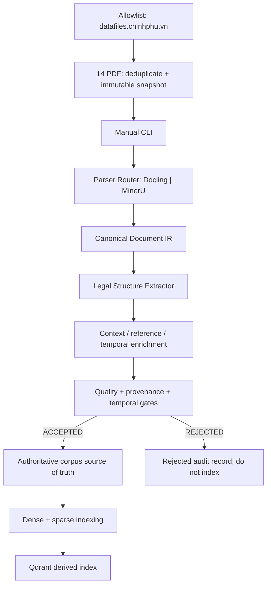
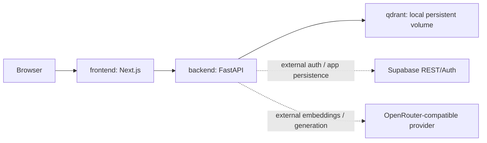

# 03. Thiết kế hệ thống

> **Audit kiến trúc , 14/09/2026**
>
> Nguồn quyết định phạm vi: [00-scope-and-decisions.md](00-scope-and-decisions.md)
> **Trạng thái release:** **RELEASE-READY FOR COVERED CORPUS / MVP RUNTIME**.
> Trạng thái này áp dụng cho runtime MVP và 34 case có căn cứ; sáu case thiếu
> corpus được ghi rõ, không tính vào denominator.
>
> Tài liệu này tách biệt tuyệt đối kiến trúc mục tiêu với runtime hiện tại. Sơ đồ trong phần TARGET là thiết kế nghiên cứu, khác với danh sách tính năng đã triển khai.

## 1. TARGET ARCHITECTURE (thiết kế mục tiêu, chưa coi là runtime)

Mục tiêu là RAG nhận biết cấu trúc và thời gian hiệu lực, chỉ trả claim có căn cứ và citation dựng từ identity ổn định. Các nguyên tắc frozen gồm: corpus 14 PDF allowlist `datafiles.chinhphu.vn`, deduplicate/hash và snapshot bất biến; ingestion manual CLI, fail-closed, không upload/admin/reviewer approval; truy vấn không open-web phương án dự phòng; Qdrant là index dẫn xuất; evidence completeness trước generation; verified-or-từ chối trả lời; workflow controlled, không autonomous multi-agent. Chi tiết và yêu cầu P0 nằm tại [00-scope-and-decisions.md](00-scope-and-decisions.md) (mục 4, 10).

### 1.1. Ingestion mục tiêu



Pipeline target: snapshot → parse → parser-neutral IR → Chương/Mục/Điều/Khoản/Điểm extraction (including Vietnamese `đ)`) → parent context and legal relations → amendment/effective-date resolution → automatic gates → accepted corpus → dense/sparse index. Publish a new index only after every gate passes; otherwise retain the serving index. The target relation model includes provision/document relations such as `PARENT_OF`, `REFERS_TO`, `SIBLING_OF`, `PENALTY_COMPANION`, `AMENDS`, `REPEALS`, and `SUPERSEDES`.

### 1.2. Query mục tiêu

```text
Question
 → intent / exact reference / requested date / evidence plan
 → temporal resolution
 → exact + dense + sparse retrieval
 → fusion + reranking
 → bounded sibling / cross-reference expansion
 → Evidence Completeness Gate
 → structured claims
 → deterministic citation, temporal, numeric and claim verification
 → verified answer | bounded repair | abstention
```

Original wording remains available during expansion. Every expansion is bounded and records its provenance (`added_by`, `source_id`, `depth`). Missing mandatory evidence, unsupported claims, schema errors, and temporal conflicts have separate repair branches; finite repair exhaustion ends in từ chối trả lời. The target citation contract is identity-based (`provision_id`/trusted metadata), never free-form identifiers invented by the bộ sinh câu trả lời.

### 1.3. Target deployment concept

The research design may include a canonical source of truth, relation storage, parser adapters, queue/object storage, reranking, workflow orchestration, and observability. Those are **target decisions only** unless implementation and deployment evidence proves otherwise. In particular, PostgreSQL legal source-of-truth, Redis/Dramatiq, MinIO, LangGraph, Langfuse, Docling/MinerU, production bộ xếp hạng lại, and a complete six-layer verifier are not to be presented as active services in this document.

## 2. CURRENT RUNTIME AUDIT (code-backed, not target)

### 2.1. Request, authentication, persistence, and answer flow

`backend/app/main.py` registers the RAG, auth, chats, and legal routers and exposes liveness/readiness checks. The active chat route is `backend/app/rag/api.py` (`POST /api/v1/chat`):

```text
Bearer token / Supabase Auth
 → resolve user identity
 → create or touch user-owned session
 → load follow-up history
 → persist user message via Supabase REST
 → synchronous RAGService.answer(...)
 → persist assistant answer, status, response and citations
 → return session/message IDs and result
```

Runtime persistence is user-scoped Supabase REST/Auth; it is not an app-owned PostgreSQL deployment claimed by the target model. Generation is free-form Markdown through the configured OpenRouter-compatible nhà cung cấp mô hình (`backend/app/rag/generator.py`), while the API maps a complete result to `VERIFIED` and preserves từ chối trả lời/status responses. There is no active upload endpoint, reviewer queue, approval UI, background worker, or human approval step.

### 2.2. Retrieval and evidence flow

`backend/app/rag/retrieval.py` dùng Qdrant hybrid dense+sparse, còn
`backend/app/rag/service.py` chạy đồng bộ trong Python. Luồng runtime thực là:

```text
FastAPI nhận câu hỏi + history
 → analyze_request
   (LLM-first, strict JSON: category / intent / vehicle_type /
    standalone_query + tối đa 3 expanded_queries; fallback tất định)
 → retrieval top_k=8 cho từng expanded query (Qdrant dense+sparse)
 → hợp nhất bằng RRF 1/(60+rank)
 → chọn 12, 25 chunk, tối đa 3 chunk cho mỗi Điều/Khoản
 → enrichment sibling / chế tài / cross-reference
   (Retriever.complete_family)
 → relevance filter, có graceful fallback
 → generate_answer
 → sanitize_response
   (parse citation từ answer, đối chiếu metadata đã retrieve; loại citation
    hoặc claim không khớp, không loại toàn bộ answer)
```

History chỉ được đưa vào bộ phân tích yêu cầu, không nối vào truy xuất truy vấn. `references.py`
phân tích chuỗi như `Điều 7 Khoản 3 Nghị định 168/2024` thành một reference;
enrichment còn dùng `cross_refs.py`. `evidence.py` hiện chỉ còn
`ABSTENTION_MESSAGE`; `assess_evidence` và `required_intents` đã bị xoá, nên
runtime không có evidence-completeness gate trước generation. Abstention trước
generation chỉ xảy ra khi không có tài liệu, explicit-reference mismatch,
temporal mismatch, ngữ cảnh chỉ railway, out-of-scope hoặc chitchat. Sau
generation, runtime từ chối trả lời khi bộ sinh câu trả lời trả `CANONICAL_REFUSAL`.

Đây Đây là workflow khác với target: audit không thấy active LangGraph graph,
production bộ xếp hạng lại, complete six-independent-verifier stack hay failure-aware
repair graph. `sanitize_response` chỉ loại citation/claim không khớp metadata
đã tìm kiếm căn cứ, không loại toàn bộ answer.

### 2.3. Ingestion and data model actually used

`backend/app/ingestion/markdown.py` is the active Markdown/JSONL loader. It parses simple front matter, recognizes Điều/Khoản/Điểm with regex (including `đ`), creates LangChain `Document` objects, and attaches `document_id`, document metadata, effective interval/status, structural fields, `provision_family`, deterministic `chunk_id`, and `content_sha256`. `load_manifest()` reads [data/sources/manifest.json](../data/sources/manifest.json) and loads Markdown files below `data/corpus/mds`; the manifest currently has **17 entries**. Active scripts are [scripts/ingest.py](../scripts/ingest.py), [scripts/fetch_sources.py](../scripts/fetch_sources.py), and [scripts/index.py](../scripts/index.py). The repository itself states that PDF extraction is unavailable in `scripts/ingest.py`.

Therefore the runtime does not demonstrate the target 14-PDF immutable snapshot, Parser Router, Canonical IR, legal relation database, accepted-publish gate, or PostgreSQL legal source-of-truth. The 17-entry Markdown manifest is runtime input only, not the target 14-PDF snapshot or a release/evaluation gate artifact.

### 2.4. Release topology and caveats

The authoritative release file is [deploy/compose/compose.release.yml](../deploy/compose/compose.release.yml). It defines exactly three container services:



The compose file has `frontend`, `backend`, and `qdrant`; Supabase and OpenRouter are external/configured dependencies, not compose services. Ingestion runs through manual scripts outside request handlers. Readiness checks both Supabase and Qdrant (`backend/app/main.py`), but a healthy dependency check is not release-quality evidence. Deployment is localhost/private-network oriented; CORS defaults to local frontend origins, credentials/secrets arrive through environment configuration, and the release compose does not provide TLS, backups, external service provisioning, corpus snapshot publication, worker scaling, or a reviewer workflow.

### 2.5. Known gaps and evidence status

Release/evaluation evidence is a **40-case gate across exactly eight categories**.
The current release report records 34 covered cases, six
`CORPUS_NOT_COVERED` cases, zero covered-case request errors, tỉ lệ trích dẫn hợp lệ
1.0 and the disclosed automatic metrics. Full human semantic review remains
N/A; target parser/IR/source-of-truth and publish gates remain outside active
runtime.

## 3. Source map

- Scope, frozen requirements, target/runtime distinction: [docs/00-scope-and-decisions.md](00-scope-and-decisions.md)
- Runtime entrypoint and readiness: [backend/app/main.py](../backend/app/main.py)
- Chat/auth/persistence flow: [backend/app/rag/api.py](../backend/app/rag/api.py), [backend/app/auth/](../backend/app/auth/), [backend/app/chats/](../backend/app/chats/)
- Retrieval and expansion: [backend/app/rag/truy xuất.py](../backend/app/rag/truy xuất.py), [backend/app/rag/service.py](../backend/app/rag/service.py), [backend/app/rag/evidence.py](../backend/app/rag/evidence.py)
- Markdown ingestion: [backend/app/ingestion/markdown.py](../backend/app/ingestion/markdown.py)
- Corpus manifest: [data/sources/manifest.json](../data/sources/manifest.json)
- Active ingestion/index scripts: [scripts/ingest.py](../scripts/ingest.py), [scripts/fetch_sources.py](../scripts/fetch_sources.py), [scripts/index.py](../scripts/index.py)
- Release topology: [deploy/compose/compose.release.yml](../deploy/compose/compose.release.yml)
- Evaluation evidence and eight-category gate: [release-candidate-20260914.md](evaluation/release-candidate-20260914.md)
